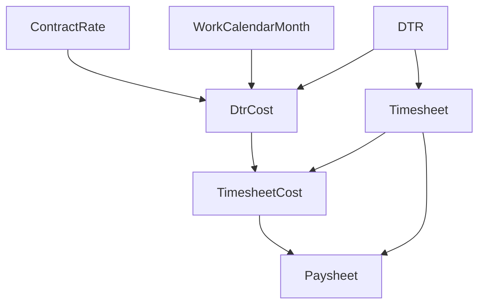

# Payroll System Documentation

## End-to-End Data Flow Implementation

### Table of Contents

1. [System Overview](#system-overview)
2. [Database Schema Changes](#database-schema-changes)
3. [Reference Data Setup](#reference-data-setup)
4. [Core Data Flow](#core-data-flow)
5. [Rate Calculations](#rate-calculations)
6. [Implementation Scripts](#implementation-scripts)
7. [Data Verification](#data-verification)
8. [Next Steps](#next-steps)

---

## System Overview

We have successfully implemented a complete end-to-end payroll system that flows
from clock events to final paysheet generation. The system uses a multi-schema
PostgreSQL database with clear separation of concerns:

- **catalog**: Reference data (locations, positions, shifts, contract rates)
- **admin**: User and system management
- **timekeeper**: Time tracking (clock events, timelogs, DTRs, timesheets)
- **payroll**: Cost calculations (DtrCost, TimesheetCost, Paysheet)
- **workflow**: Approval processes
- **audit**: Change tracking

### Complete Data Flow

```
ClockEvent → TimeLog → DTR → Timesheet → Paysheet
                        ↓        ↓
                    DtrCost → TimesheetCost
```

---

## Database Schema Changes

### 1. **DTR Model Updates**

- Added `contract_rate_version_id` field to link DTR with contract rates
- Made hours columns nullable (`hours_8h`, `hours_ot`, `hours_night`)
- Maintains time tracking in `timekeeper` schema

### 2. **New DtrCost Model**

```prisma
model DtrCost {
  @@schema("payroll")
  id                        String   @id @default(uuid())
  company_id                String
  dtr_id                    String   @unique   // 1:1 with DTR
  contract_rate_version_id  String

  // Calendar basis
  calendar_year             Int
  calendar_month            Int
  working_days_used         Int
  hours_per_day_used        Int

  // Derived hourly rates
  derived_hourly_base       Decimal  @db.Decimal(14,4)
  derived_hourly_ot         Decimal  @db.Decimal(14,4)
  derived_hourly_night      Decimal  @db.Decimal(14,4)

  // Calculated amounts
  amount_8h                 Decimal  @db.Decimal(14,2)
  amount_ot                 Decimal  @db.Decimal(14,2)
  amount_night              Decimal  @db.Decimal(14,2)
}
```

### 3. **Simplified TimesheetCost Model**

- Now only stores aggregated amounts from DtrCost records
- Removed duplicate rate calculations
- Maintains 1:1 relationship with Timesheet

### 4. **Paysheet Model**

- Final payroll record with all earnings and deductions
- Links to timesheet IDs
- Stores government contributions (SSS, PhilHealth, HDMF)

---

## Reference Data Setup

### Hierarchical Location Structure

```
Area (Luzon)
  └── SubArea (Central Luzon)
      └── Location (Clark)
```

### Position and Shift Data

- **Position**: Guard (e566a75d-98fb-443e-bf51-6b2333c58024)
- **Shift**: Day Shift (96b87284-8119-4998-87cd-310607d1f9bd)
  - Start: 07:00, End: 19:00 (12 hours)

### Guard Profile

- **Name**: Juan Santos
- **Code**: G001
- **ID**: 86af2887-cc85-45ab-ba7e-96d25f2d6fac

### Pay Period

- **September 1-15, 2025**
- **ID**: a8846618-4cf1-4d1f-9f33-7a66fe636e4b
- 15 working days

---

## Core Data Flow

### Level 1: Clock Events & TimeLogs

- Clock In/Out events captured
- Converted to TimeLogs with actual times

### Level 2: DTR (Daily Time Records)

- **15 DTR records** created (Sept 1-15, 2025)
- Each day: 8 hours regular + 4 hours OT
- Total: 120 hours regular + 60 hours OT

### Level 3: DtrCost (Daily Cost Calculation)

- **1:1 relationship with DTR**
- Uses contract rate and work calendar month
- Calculates daily costs based on hourly rates

### Level 4: Timesheet (Hours Aggregation)

- Aggregates hours from all DTRs
- Total: 120h regular + 60h OT + 0h night

### Level 5: TimesheetCost (Cost Aggregation)

- Aggregates amounts from all DtrCosts
- Total: ₱15,000 regular + ₱9,375 OT = ₱24,375

### Level 6: Paysheet (Final Payroll)

- Combines hours from Timesheet
- Combines amounts from TimesheetCost
- Adds deductions and calculates net pay

---

## Rate Calculations

### Critical Components

#### 1. ContractRate

```
Location: Clark
Position: Guard
Shift: Day Shift
Base Monthly Rate: ₱20,000
OT Multiplier: 1.25x
Night Diff Multiplier: 1.10x
Effectivity: June 1, 2025 - September 9, 2025
```

#### 2. WorkCalendarMonth

```
September 2025:
- Working Days: 20
- Hours per Day: 8
- Total Monthly Hours: 160
```

### Hourly Rate Formula

```
Base Hourly Rate = Base Monthly Rate ÷ (Working Days × Hours per Day)
                 = ₱20,000 ÷ (20 × 8)
                 = ₱20,000 ÷ 160
                 = ₱125.00/hour

OT Hourly Rate = Base Hourly Rate × OT Multiplier
               = ₱125.00 × 1.25
               = ₱156.25/hour

Night Diff Rate = Base Hourly Rate × (Night Multiplier - 1)
                = ₱125.00 × (1.10 - 1)
                = ₱12.50/hour
```

### Sample Daily Calculation

```
Day 1 (Sept 1, 2025):
- Hours: 8h regular + 4h OT
- Regular Pay: 8 × ₱125.00 = ₱1,000.00
- OT Pay: 4 × ₱156.25 = ₱625.00
- Daily Total: ₱1,625.00
```

### Total Payroll Calculation

```
15 Days × ₱1,625.00 = ₱24,375.00
```

---

## Implementation Scripts

### Setup Scripts

1. `setup-reference-data.ts` - Areas, SubAreas, Locations, Positions, Shifts
2. `setup-guards.ts` - Guard profiles
3. `setup-pay-periods.ts` - Pay period configuration
4. `setup-workcalendar-month.ts` - Working days configuration

### Data Creation Scripts

1. `create-clockevents-timelogs.ts` - Time tracking data
2. `create-dtrs.ts` - Daily time records
3. `create-timesheet.ts` - Timesheet aggregation
4. `create-dtrcost-records.ts` - Cost calculations per DTR
5. `create-timesheetcost-records.ts` - Cost aggregation
6. `create-contract-rate.ts` - Contract rate setup
7. `create-paysheet.ts` - Final payroll generation

### Calculation Scripts

1. `calculate-dtrcost-amounts.ts` - Initial calculation
2. `recalculate-dtrcost-with-workcalendar.ts` - Corrected calculation using
   WorkCalendarMonth

### Verification Scripts

1. `verify-dtr-preservation.ts` - DTR data integrity
2. `verify-dtr-dtrcost-relationship.ts` - 1:1 relationship verification
3. `verify-complete-cost-relationships.ts` - Full hierarchy verification
4. `verify-paysheet-data-flow.ts` - End-to-end data flow verification

---

## Data Verification

### Relationship Integrity

- ✅ DTR ↔ DtrCost: 1:1 relationship (15 records each)
- ✅ Timesheet ↔ TimesheetCost: 1:1 relationship
- ✅ All DTRs linked to Timesheet
- ✅ All DtrCosts aggregated to TimesheetCost
- ✅ Paysheet linked to Timesheet and TimesheetCost

### Calculation Accuracy

- ✅ Hours aggregation: DTR → Timesheet → Paysheet
- ✅ Cost aggregation: DtrCost → TimesheetCost → Paysheet
- ✅ Hourly rates based on WorkCalendarMonth
- ✅ OT rates calculated at 1.25x base rate

### Final Results

```
Guard: Juan Santos (G001)
Period: September 1-15, 2025
Hours: 120 regular + 60 OT = 180 total
Gross Pay: ₱24,375.00
Deductions: ₱0.00 (pending)
Net Pay: ₱24,375.00
```

---

## Next Steps

### 1. Guard Associations

- [ ] GuardAllowances - Associate allowances with guards
- [ ] GuardDeductions - Link deductions to specific guards
- [ ] GuardGovernmentContributions - Set up SSS, PhilHealth, HDMF

### 2. Loan Management

- [ ] GuardLoans - Track loan balances
- [ ] LoanSchedule - Set up payment schedules
- [ ] PayPeriodInstallments - Configure installments per pay period
- [ ] Activate first installment for current pay period

### 3. Government Contributions

- [ ] Calculate SSS contributions based on salary bracket
- [ ] Calculate PhilHealth contributions (percentage-based)
- [ ] Calculate HDMF/Pag-IBIG contributions
- [ ] Update Paysheet with actual deductions

### 4. Final Paysheet Updates

- [ ] Apply all deductions to Paysheet
- [ ] Recalculate net pay
- [ ] Generate payslip PDF
- [ ] Create audit trail

### 5. System Enhancements

- [ ] Add approval workflow for timesheets
- [ ] Implement batch processing for multiple guards
- [ ] Create reporting module
- [ ] Add data export functionality

---

## Key Formulas Summary

### Hourly Rate Calculation

```
Hourly Rate = Monthly Rate ÷ (Working Days × Hours per Day)
```

**Critical**: Must use WorkCalendarMonth for accurate divisor

### Overtime Calculation

```
OT Rate = Hourly Rate × OT Multiplier (typically 1.25)
```

### Night Differential

```
Night Diff = Hourly Rate × (Night Multiplier - 1)
```

Note: Night diff is additional, not total rate

### Gross Pay

```
Gross Pay = Regular Pay + OT Pay + Night Diff + Allowances
```

### Net Pay

```
Net Pay = Gross Pay - (Mandatory Deductions + Voluntary Deductions + Loans)
```

---

## Database Relationships



---

## Conclusion

The payroll system successfully implements a complete data flow from time
tracking to payroll generation. All calculations are based on configurable rates
and calendars, ensuring flexibility and accuracy. The system maintains data
integrity through 1:1 relationships and proper aggregation at each level.

The modular design allows for easy extension with additional features like
government contributions, loans, and allowances. The verification scripts ensure
data consistency throughout the entire pipeline.
