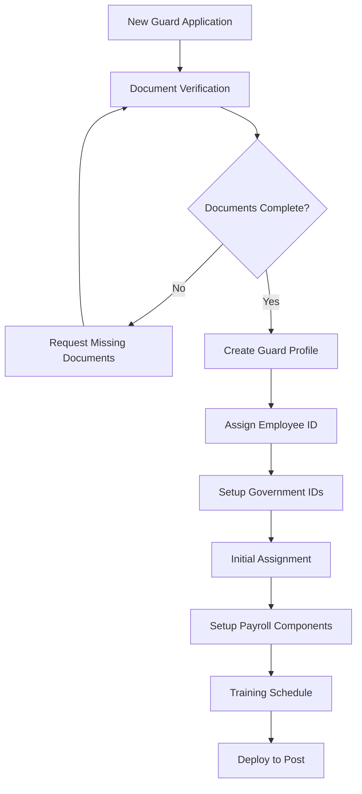
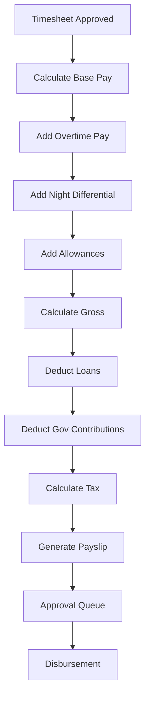
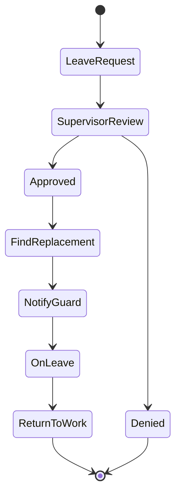
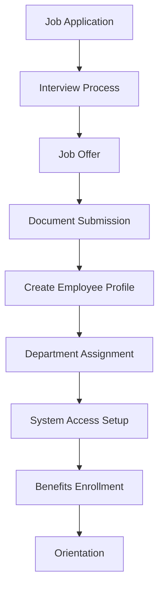
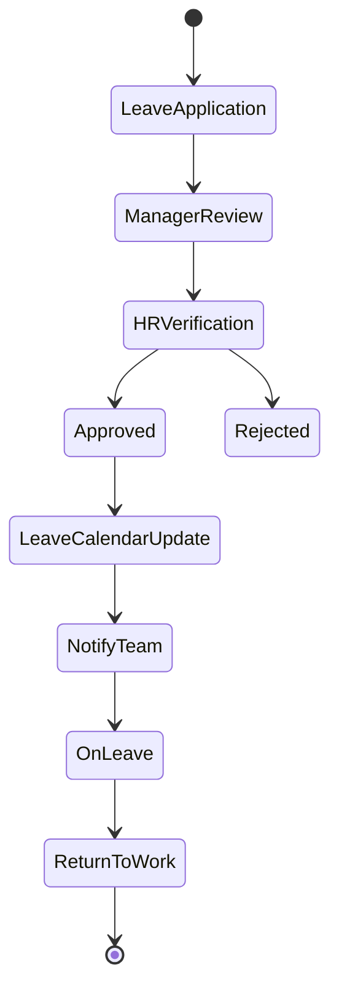
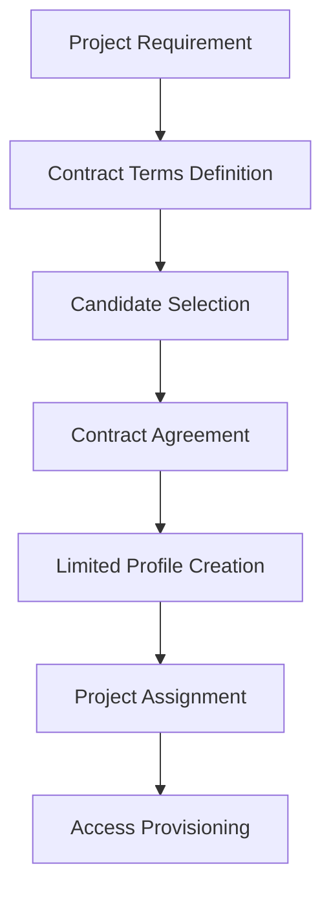
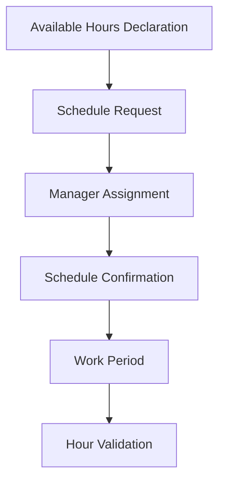

# Employee Type Workflows

## Overview

This document defines comprehensive workflows for different employee types in
the payroll system. Each workflow covers the complete employee lifecycle from
onboarding to offboarding.

## Employee Classifications

### 1. Security Guards

**Characteristics:**

- Primary field workforce
- Rotational shifts (Day/Night/Swing)
- Multiple detachment assignments
- Contract-based billing rates
- Government contribution requirements
- Loan and allowance eligibility

### 2. Non-Guard Employees

**Characteristics:**

- Administrative and support staff
- Fixed regular hours
- Office-based locations
- Salary-based compensation
- Standard benefits package
- Limited overtime eligibility

### 3. Contractual Employees

**Characteristics:**

- Project-based engagement
- Fixed-term contracts
- No government contributions
- No loan eligibility
- Simplified compensation structure

### 4. Part-Time Employees

**Characteristics:**

- Limited hours per period
- Hourly rate based
- Minimal benefits
- Flexible scheduling

## Detailed Workflows by Employee Type

## 1. Security Guard Workflow

### 1.1 Onboarding Process



**Steps:**

1. **Document Collection**
   - NBI Clearance
   - Police Clearance
   - Medical Certificate
   - Training Certificates
   - Government IDs (SSS, PhilHealth, Pag-IBIG)

2. **Profile Creation**

   ```typescript
   interface GuardProfile {
   	employeeId: string
   	firstName: string
   	lastName: string
   	middleName?: string
   	status: 'ACTIVE' | 'TRAINING'
   	hireDate: Date
   	position: 'Security Guard I' | 'Security Guard II' | 'Supervisor'
   }
   ```

3. **Assignment Process**
   - Location selection
   - Detachment assignment
   - Shift schedule setup
   - Contract rate application

4. **Payroll Setup**
   - Base salary configuration
   - Government contribution enrollment
   - Allowance eligibility
   - Loan application access

### 1.2 Attendance and Timesheet Workflow

```mermaid
flowchart LR
    A[Clock In] --> B[Biometric/Manual Entry]
    B --> C[Location Verification]
    C --> D[Create TimeLog]
    D --> E[Clock Out]
    E --> F[Calculate Hours]
    F --> G[Apply Differentials]
    G --> H[Submit for Approval]
    H --> I[Supervisor Review]
    I --> J[Final Timesheet]
```



**Validation Rules:**

- Maximum 12 hours per shift
- Minimum 30-minute break after 6 hours
- Night differential: 10PM - 6AM
- Overtime after 8 hours
- Double time on holidays

### 1.3 Payroll Processing Workflow



**Components:**

```typescript
interface GuardPayrollCalculation {
	basePay: number // Regular hours × hourly rate
	overtimePay: number // OT hours × (rate × 1.25)
	nightDiff: number // Night hours × (rate × 0.10)
	allowances: {
		transportation: number
		meal: number
		hazard?: number
	}
	deductions: {
		sss: number
		philHealth: number
		pagIbig: number
		loans: number[]
		tax: number
	}
	netPay: number
}
```

### 1.4 Leave Management



**Leave Types:**

- Vacation Leave (5 days/year)
- Sick Leave (5 days/year)
- Emergency Leave (3 days/year)
- Paternity/Maternity Leave
- Service Incentive Leave

### 1.5 Performance Tracking

```typescript
interface GuardPerformance {
	guardId: string
	evaluationPeriod: string
	metrics: {
		attendance: number // Percentage
		punctuality: number // Percentage
		uniformCompliance: number
		incidentReports: number
		commendations: number
		violations: number
	}
	rating: 'Excellent' | 'Satisfactory' | 'Needs Improvement'
	recommendations: string[]
}
```

## 2. Non-Guard Employee Workflow

### 2.1 Onboarding Process



**Profile Structure:**

```typescript
interface NonGuardEmployee {
	employeeId: string
	personalInfo: {
		name: string
		email: string
		phone: string
	}
	employment: {
		position: string
		department: string
		level: string
		salary: number
		startDate: Date
	}
	benefits: {
		healthInsurance: boolean
		lifeInsurance: boolean
		sss: string
		philHealth: string
		pagIbig: string
	}
}
```

### 2.2 Time and Attendance


**Standard Work Schedule:**

- Monday to Friday: 9:00 AM - 6:00 PM
- Lunch Break: 12:00 PM - 1:00 PM
- Flexible Time: ±30 minutes
- Work from Home: As approved

### 2.3 Payroll Processing

```typescript
interface NonGuardPayroll {
	monthlySalary: number
	allowances: {
		transportation: number
		communication: number
		rice: number
	}
	overtime: {
		hours: number
		rate: number // 1.25x for regular OT
		amount: number
	}
	deductions: {
		sss: number
		philHealth: number
		pagIbig: number
		tax: number
		absences: number
		tardiness: number
	}
	bonuses: {
		thirteenthMonth: number
		performance: number
	}
}
```

### 2.4 Leave Management



**Leave Entitlements:**

- Vacation Leave: 15 days/year
- Sick Leave: 15 days/year
- Birthday Leave: 1 day/year
- Bereavement Leave: 3 days
- Study Leave: As approved

## 3. Contractual Employee Workflow

### 3.1 Contract Initiation



**Contract Structure:**

```typescript
interface ContractEmployee {
	contractId: string
	employeeInfo: {
		name: string
		email: string
		phone: string
	}
	contract: {
		startDate: Date
		endDate: Date
		projectName: string
		dailyRate: number
		deliverables: string[]
	}
	billing: {
		frequency: 'Weekly' | 'Bi-Weekly' | 'Monthly'
		method: 'Bank Transfer' | 'Check'
	}
}
```

### 3.2 Time Tracking

- Project-based milestones
- Daily log submissions
- Weekly progress reports
- Deliverable tracking

### 3.3 Payment Processing


## 4. Part-Time Employee Workflow

### 4.1 Scheduling



**Part-Time Constraints:**

```typescript
interface PartTimeSchedule {
	employeeId: string
	weeklyHours: {
		minimum: 10
		maximum: 20
	}
	availability: {
		monday: TimeSlot[]
		tuesday: TimeSlot[]
		// ... other days
	}
	hourlyRate: number
	overtime: {
		allowed: boolean
		rate: number // 1.25x if allowed
	}
}
```

### 4.2 Compensation

- Hourly rate basis
- No guaranteed hours
- Pro-rated benefits (if eligible)
- Simplified deductions

## Workflow Automation Rules

### 1. Automatic Triggers

```typescript
interface WorkflowTriggers {
	onboarding: {
		documentExpiry: 'Send reminder 30 days before'
		trainingDue: 'Alert supervisor 7 days before'
		probationEnd: 'Trigger evaluation 15 days before'
	}
	attendance: {
		noShowAlert: 'After 15 minutes late'
		overtimeApproval: 'When exceeding 2 hours'
		absenceNotification: 'Immediate supervisor alert'
	}
	payroll: {
		cutoffReminder: '3 days before cutoff'
		approvalDeadline: '1 day before processing'
		disbursementNotice: 'On payment release'
	}
}
```

### 2. Escalation Matrix

```typescript
interface EscalationRules {
	level1: {
		trigger: 'Initial request/issue'
		handler: 'Immediate Supervisor'
		sla: '4 hours'
	}
	level2: {
		trigger: 'Unresolved after Level 1 SLA'
		handler: 'Department Manager'
		sla: '8 hours'
	}
	level3: {
		trigger: 'Critical/Unresolved after Level 2'
		handler: 'HR Manager'
		sla: '24 hours'
	}
}
```

## System Integration Points

### 1. Biometric Systems

- Real-time attendance capture
- Location-based validation
- Shift verification

### 2. Banking Systems

- Automated payroll disbursement
- Loan payment processing
- Account verification

### 3. Government Portals

- SSS contribution filing
- PhilHealth updates
- Pag-IBIG remittance
- BIR tax filing

### 4. Client Billing Systems

- Guard deployment tracking
- Invoice generation
- Contract rate management

## Compliance Requirements

### 1. Labor Law Compliance

- Minimum wage verification
- Overtime limit enforcement
- Rest day management
- Holiday pay calculation

### 2. Data Privacy

- Personal information protection
- Access control implementation
- Audit trail maintenance
- Consent management

### 3. Financial Regulations

- Tax withholding accuracy
- Government remittance timeliness
- Financial reporting standards
- Audit readiness

## Performance Metrics

### 1. Workflow Efficiency

```typescript
interface WorkflowMetrics {
	onboarding: {
		averageCompletionTime: number // days
		documentCompletionRate: number // percentage
		dropoutRate: number
	}
	attendance: {
		captureAccuracy: number
		disputeRate: number
		processingTime: number // minutes
	}
	payroll: {
		errorRate: number
		onTimePaymentRate: number
		queryResolutionTime: number // hours
	}
}
```

### 2. Employee Satisfaction

- Onboarding experience score
- Payroll accuracy satisfaction
- System usability rating
- Support responsiveness score

## Implementation Roadmap

### Phase 1: Core Workflows (Month 1-2)

- Basic employee profiles
- Attendance tracking
- Simple payroll calculation

### Phase 2: Advanced Features (Month 3-4)

- Government contributions
- Loan management
- Leave management

### Phase 3: Automation (Month 5-6)

- Workflow triggers
- Approval chains
- Notification system

### Phase 4: Integration (Month 7-8)

- Biometric integration
- Banking connectivity
- Government portal APIs

### Phase 5: Optimization (Month 9-12)

- Performance tuning
- Advanced analytics
- Mobile capabilities
- Self-service portal

## Support and Maintenance

### 1. User Training

- Role-based training modules
- Video tutorials
- Quick reference guides
- Regular refresher sessions

### 2. System Maintenance

- Weekly data backups
- Monthly performance reviews
- Quarterly security audits
- Annual compliance checks

### 3. Continuous Improvement

- User feedback collection
- Process optimization
- Feature enhancement
- Technology updates
