# MSW (Mock Service Worker) Deep Dive in Epic Stack

## What is MSW?

Mock Service Worker (MSW) is an API mocking library that intercepts network
requests at the network level using Service Workers (in browsers) and node
request interception (in Node.js).

## MSW Architecture in Epic Stack

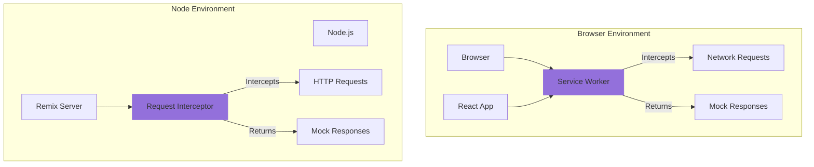

## MSW Request Flow

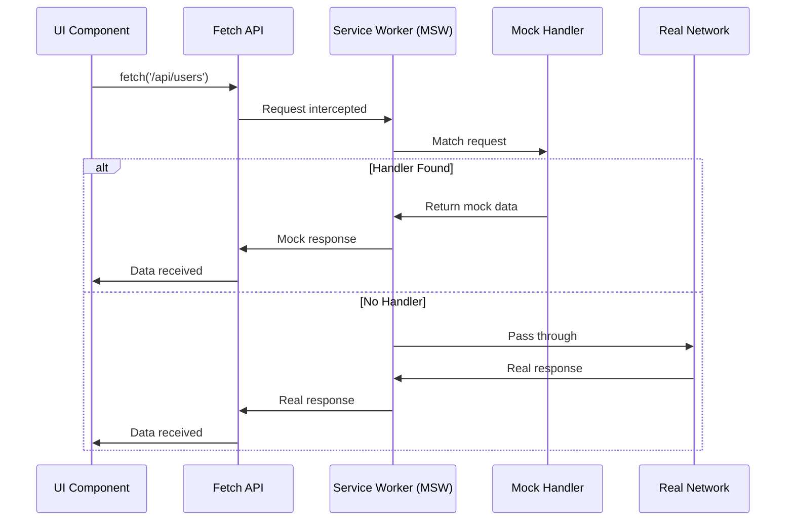

## Epic Stack MSW File Structure

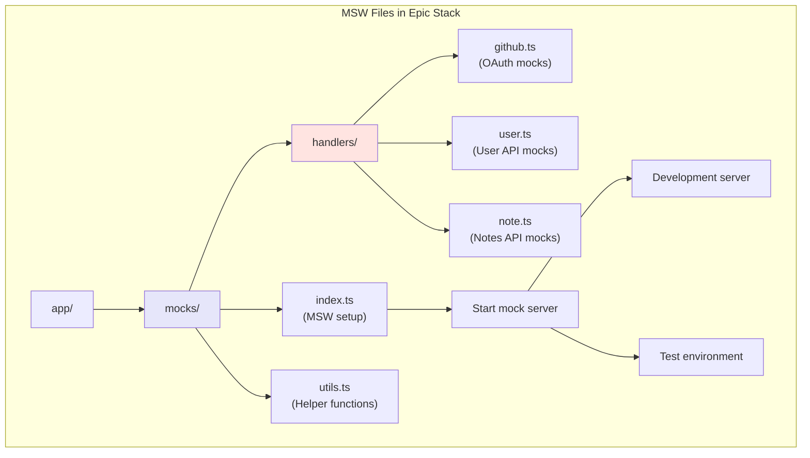

## MSW Handler Example

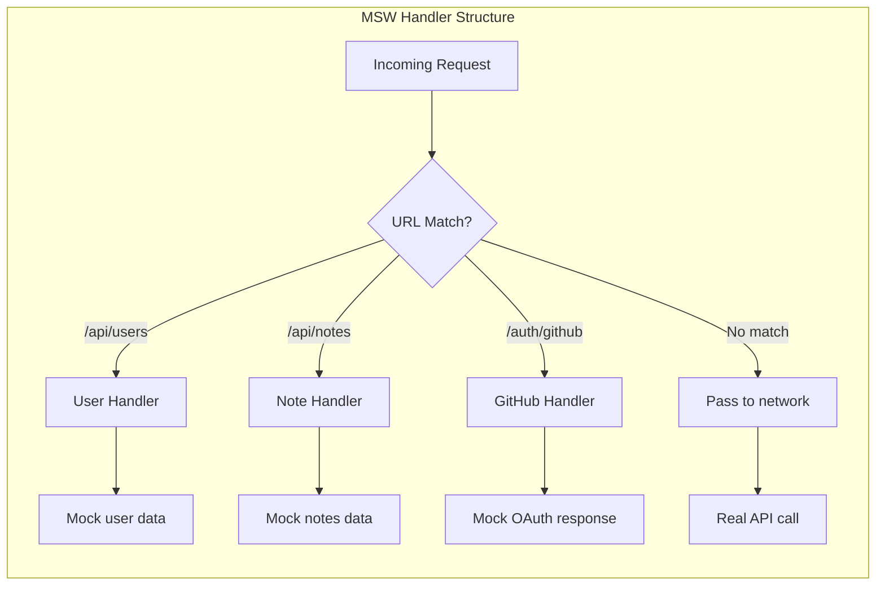

## MSW in Different Environments

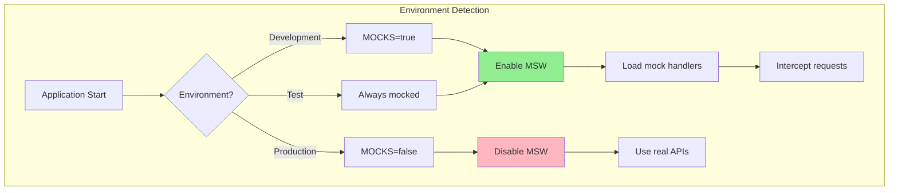

## MSW vs Traditional Mocking

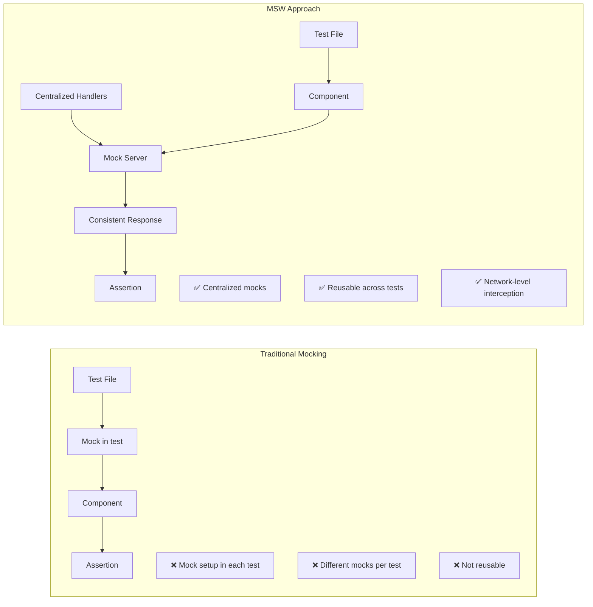

## MSW Handler Types

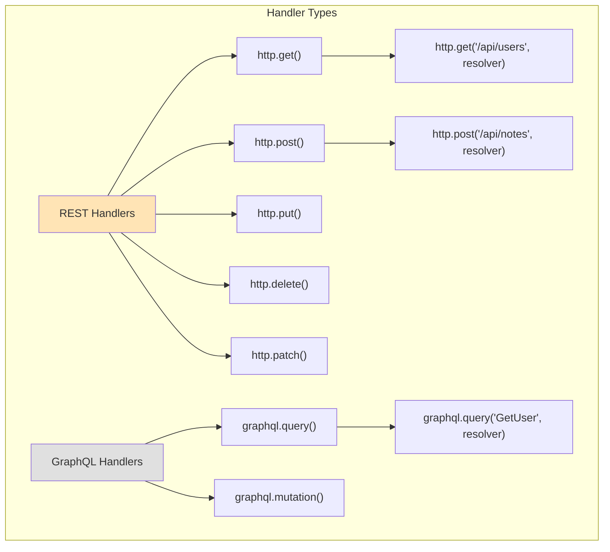

## MSW Response Resolver Flow

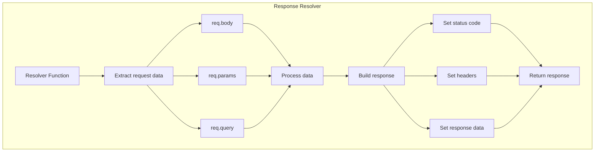

## MSW in Epic Stack Commands

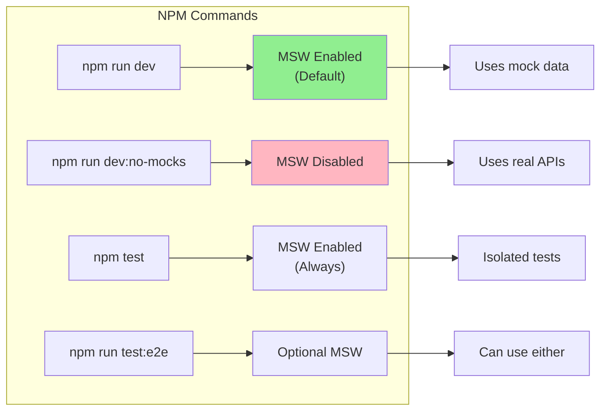

## MSW Benefits in Epic Stack

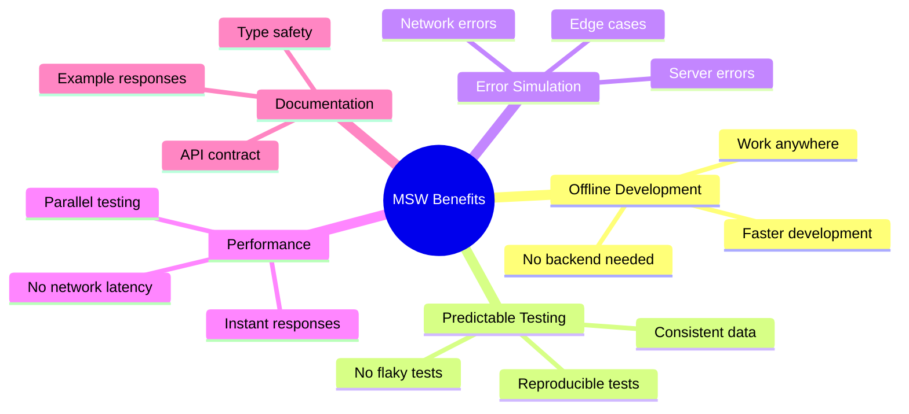

## MSW Integration Points

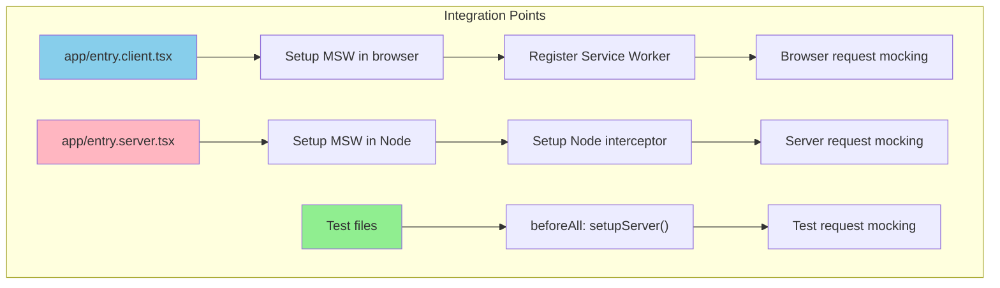

## MSW Debug Flow

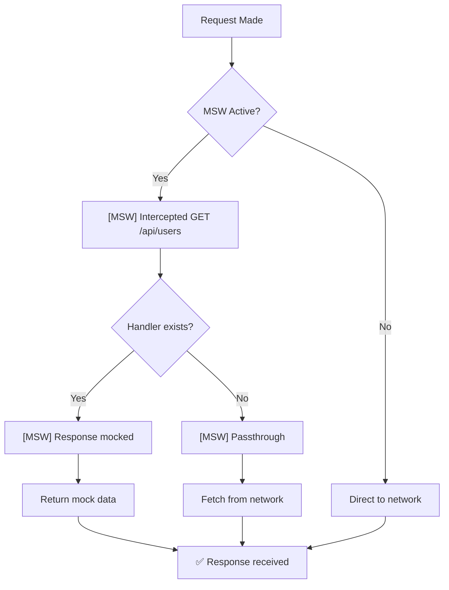

## Common MSW Patterns in Epic Stack

### 1. Authentication Mock

```javascript
http.post('/auth/login', async ({ request }) => {
	const { username, password } = await request.json()
	if (username === 'kody' && password === 'kodylovesyou') {
		return HttpResponse.json({ user: mockUser })
	}
	return HttpResponse.json({ error: 'Invalid credentials' }, { status: 401 })
})
```

### 2. CRUD Operations Mock

```javascript
http.get('/api/notes', () => {
	return HttpResponse.json({ notes: mockNotes })
})

http.post('/api/notes', async ({ request }) => {
	const note = await request.json()
	return HttpResponse.json({ note: { ...note, id: nanoid() } })
})
```

### 3. Error Simulation

```javascript
http.get('/api/error', () => {
	return HttpResponse.json({ error: 'Internal Server Error' }, { status: 500 })
})
```

## MSW vs Other Tools

| Feature                    | MSW     | Sinon    | Nock    | JSON Server |
| -------------------------- | ------- | -------- | ------- | ----------- |
| **Level**                  | Network | Function | Network | Server      |
| **Browser Support**        | ✅      | ❌       | ❌      | ✅          |
| **Node Support**           | ✅      | ✅       | ✅      | ✅          |
| **Type Safety**            | ✅      | ⚠️       | ⚠️      | ❌          |
| **Reusability**            | High    | Low      | Medium  | High        |
| **Setup Complexity**       | Medium  | Low      | Low     | Medium      |
| **Epic Stack Integration** | Native  | Manual   | Manual  | External    |

## Debugging MSW in Epic Stack

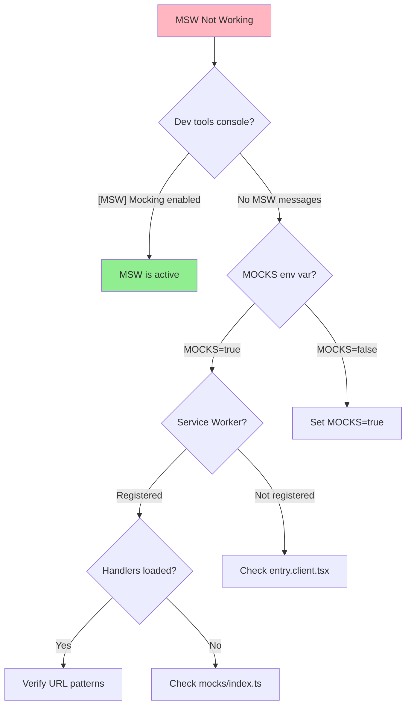

## Summary

MSW in Epic Stack provides:

1. **Unified mocking** across development and testing
2. **Network-level interception** for realistic mocking
3. **Shared handlers** between environments
4. **Type-safe** mock responses
5. **Easy toggle** between mocked and real APIs

The integration with Epic Stack is seamless, with MSW being a first-class
citizen in the development workflow, making it easy to develop offline and test
reliably.
