# Selenium and MSW Integration Guide

## Overview

This guide explains how Selenium WebDriver and MSW (Mock Service Worker) work
together in the Epic Stack testing ecosystem.

## Integration Architecture

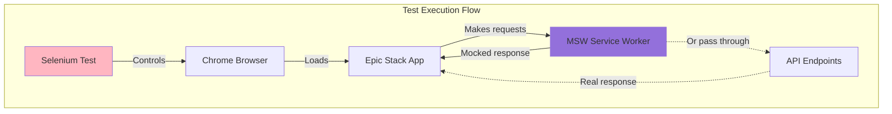

## How They Work Together

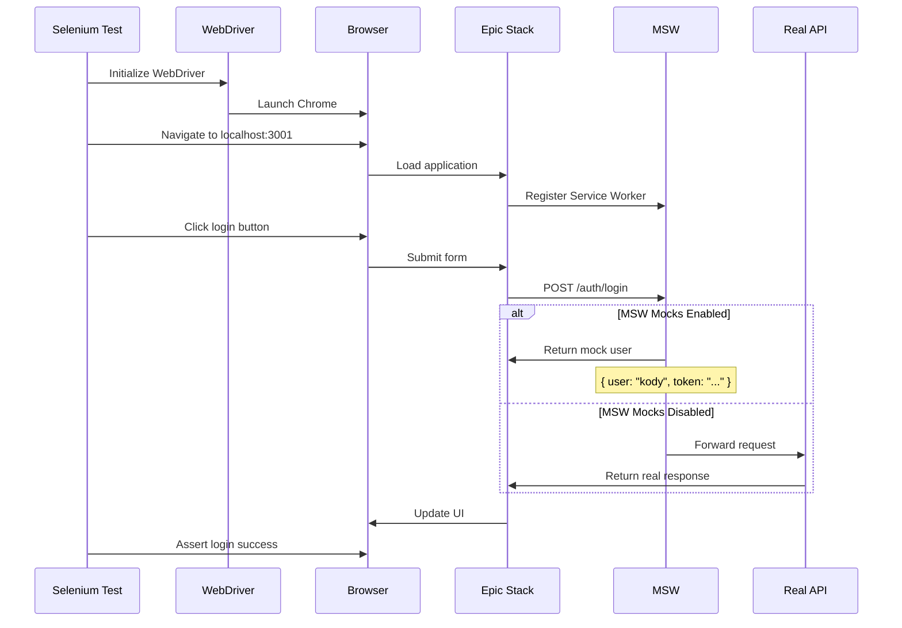

## Configuration Options

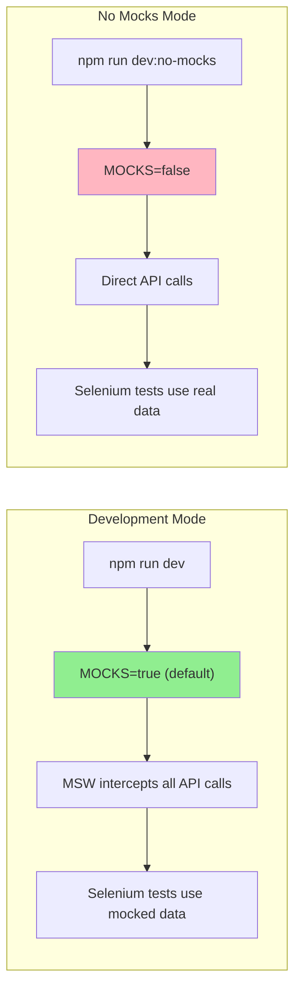

## Selenium Test with MSW

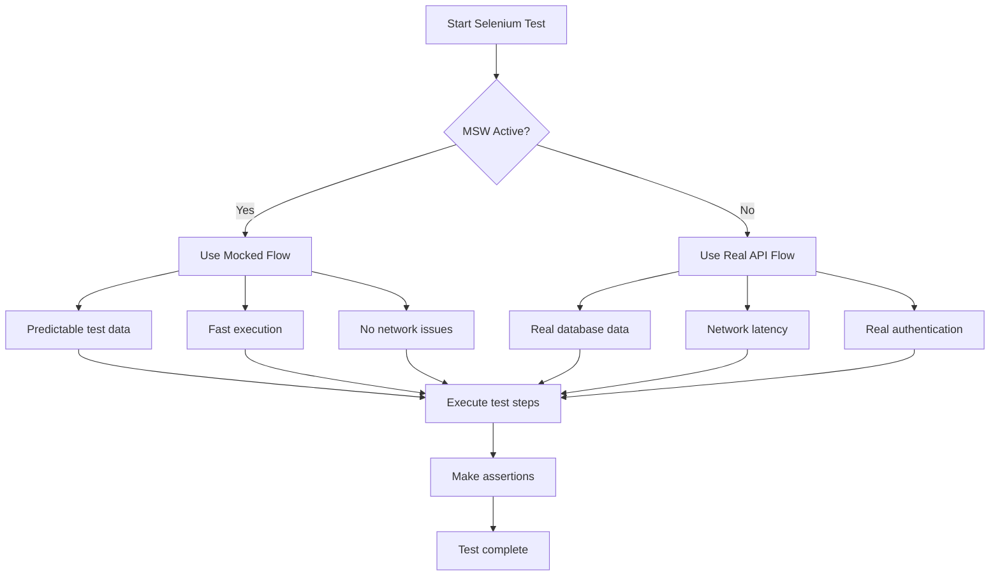

## MSW Handlers Used by Selenium Tests

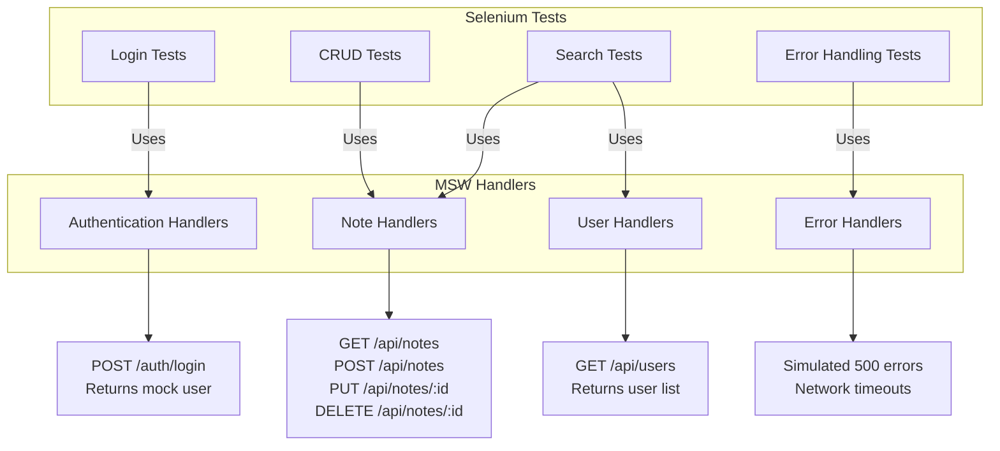

## Benefits of Selenium + MSW

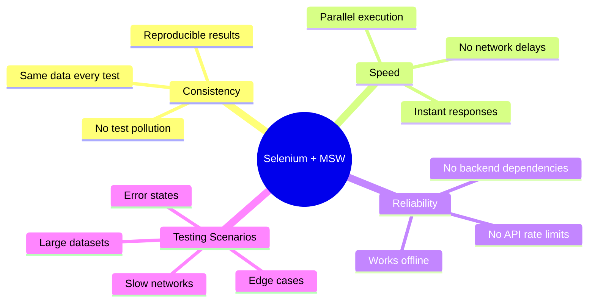

## Test Data Flow Comparison

```mermaid
graph TD
    subgraph "Without MSW"
        S1["Selenium Test"] --> B1["Browser"]
        B1 --> A1["App"]
        A1 --> DB1["Real Database"]
        DB1 --> Cleanup1["Test cleanup required"]
        Cleanup1 --> Issues1["Data pollution risk"]
    end

    subgraph "With MSW"
        S2["Selenium Test"] --> B2["Browser"]
        B2 --> A2["App"]
        A2 --> MSW2["MSW"]
        MSW2 --> Mock2["Mock data"]
        Mock2 --> Clean2["Always clean state"]
    end

    style Issues1 fill:#FFB6C1
    style Clean2 fill:#90EE90
```

## Selenium Test Example with MSW

```javascript
// Selenium test that relies on MSW mocks
const { Builder, By, until } = require('selenium-webdriver')

async function testWithMSW() {
	const driver = await new Builder().forBrowser('chrome').build()

	try {
		// Navigate to app (MSW is already active)
		await driver.get('http://localhost:3001')

		// Login - MSW will mock the response
		await driver.findElement(By.id('username')).sendKeys('kody')
		await driver.findElement(By.id('password')).sendKeys('kodylovesyou')
		await driver.findElement(By.css('button[type="submit"]')).click()

		// MSW returns mock user, no real auth needed
		await driver.wait(until.urlContains('/dashboard'), 5000)

		// Fetch notes - MSW returns mock notes
		await driver.get('http://localhost:3001/notes')

		// Mock notes are instantly available
		const notes = await driver.findElements(By.css('.note-item'))
		console.log(`Found ${notes.length} mock notes`)
	} finally {
		await driver.quit()
	}
}
```

## MSW Mock Verification in Selenium

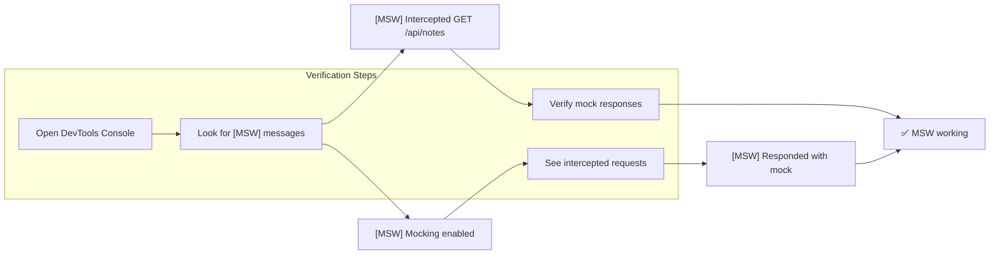

## Common Patterns

### 1. Authentication Testing

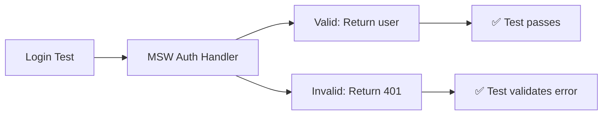

### 2. CRUD Operations

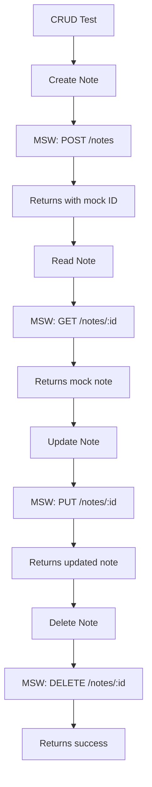

### 3. Error Handling

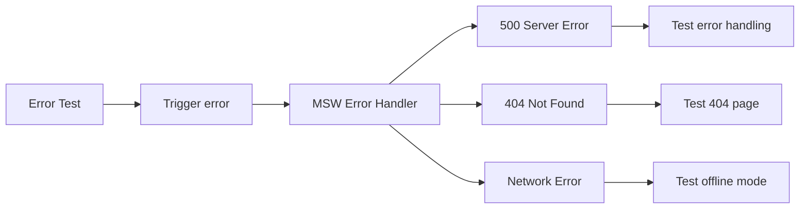

## Selenium + MSW Best Practices

| Practice                    | Description                   | Example                                 |
| --------------------------- | ----------------------------- | --------------------------------------- |
| **Use MSW for consistency** | Always run with mocks in CI   | `MOCKS=true npm test`                   |
| **Test both modes**         | Verify with and without mocks | Run tests with `dev` and `dev:no-mocks` |
| **Mock edge cases**         | Test error states with MSW    | 500 errors, timeouts, empty responses   |
| **Keep mocks updated**      | Sync mocks with real API      | Update handlers when API changes        |
| **Use realistic data**      | Make mocks believable         | Use faker.js for mock data              |

## Debugging Selenium + MSW Issues

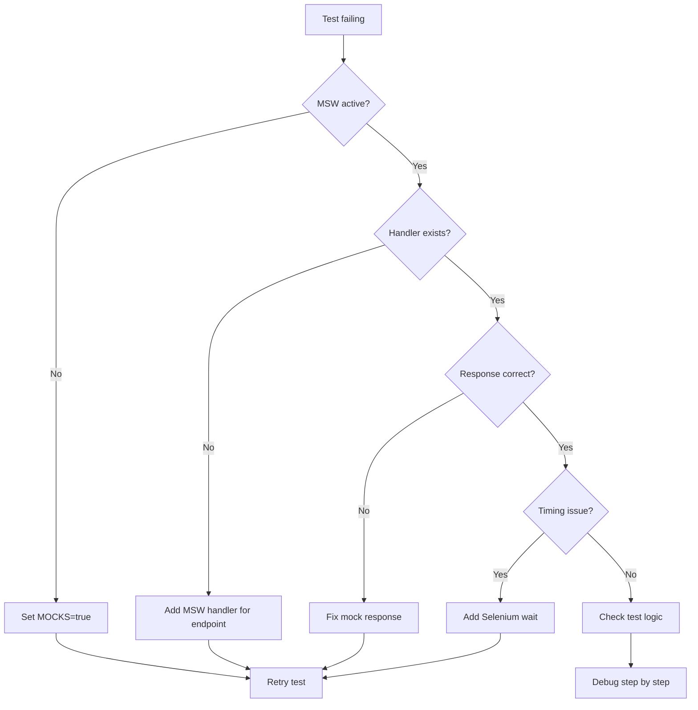

## Summary

The integration of Selenium and MSW in Epic Stack provides:

1. **Predictable Testing**: MSW ensures consistent data for Selenium tests
2. **Fast Execution**: No network latency with mocked responses
3. **Offline Development**: Tests run without backend services
4. **Error Simulation**: Easy testing of error states and edge cases
5. **Parallel Testing**: No database conflicts with mocked data

This combination makes E2E testing more reliable and maintainable while keeping
the flexibility to test against real APIs when needed.
