# Testing Architecture in Epic Stack

## Overview

Epic Stack uses a comprehensive testing strategy that combines multiple tools
and frameworks for different testing needs. This document explains how MSW,
Selenium, Playwright, Mocha, and other testing tools relate and work together.

## Testing Layers

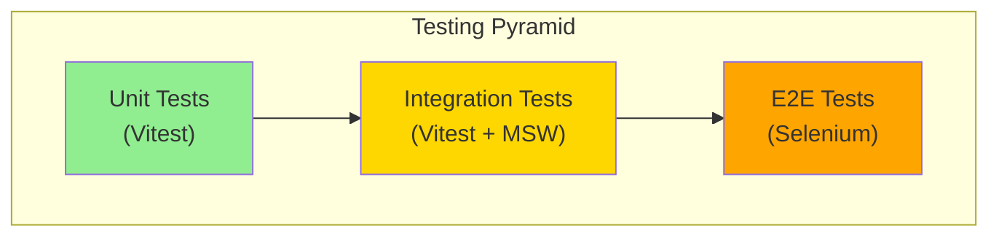

## Tool Relationships

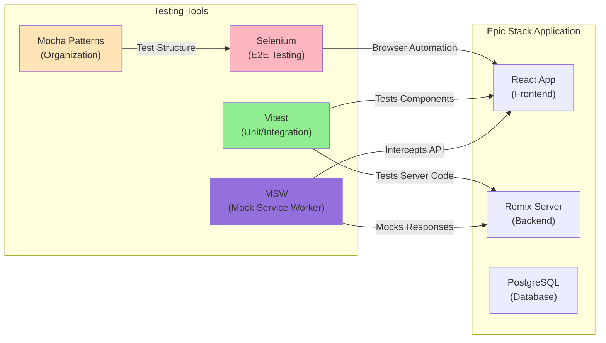

## MSW (Mock Service Worker) Architecture

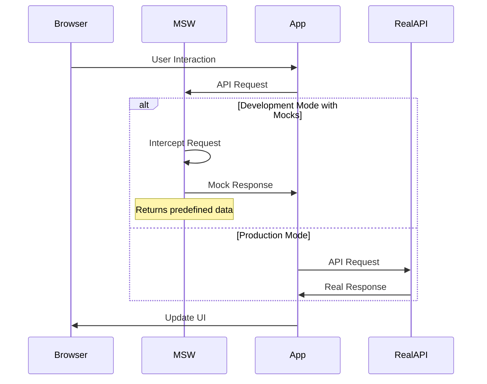

## Testing Tool Comparison

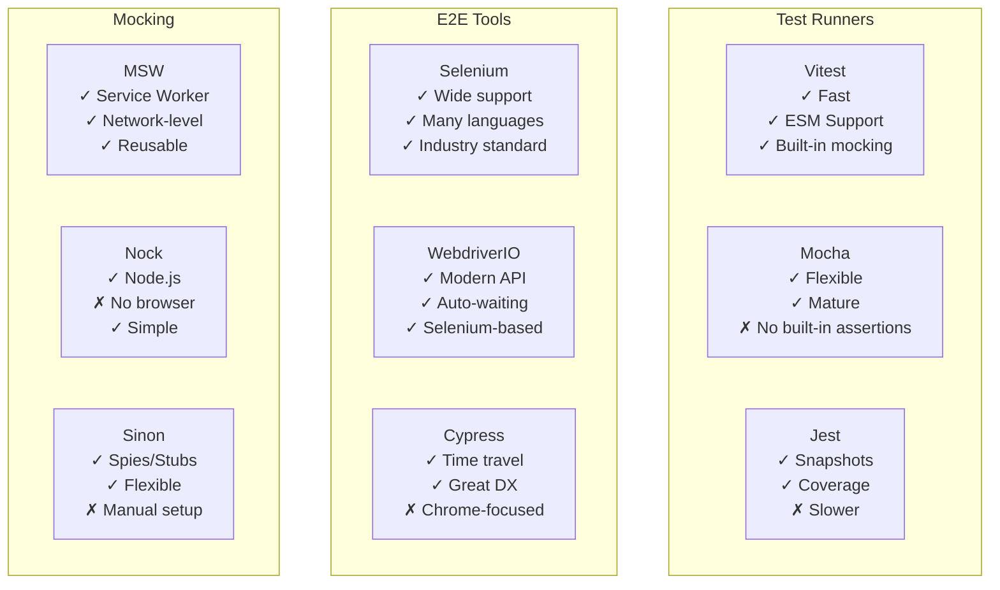

## Test Execution Flow

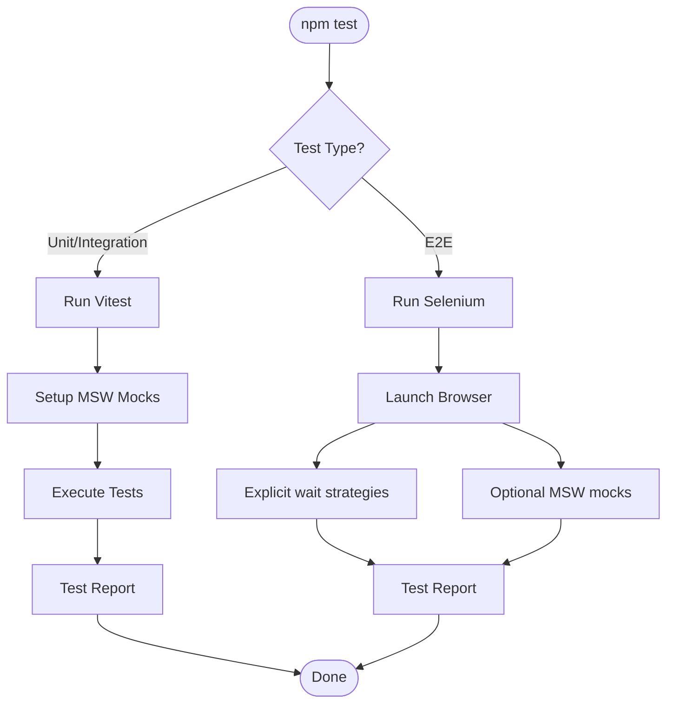

## MSW in Epic Stack Development

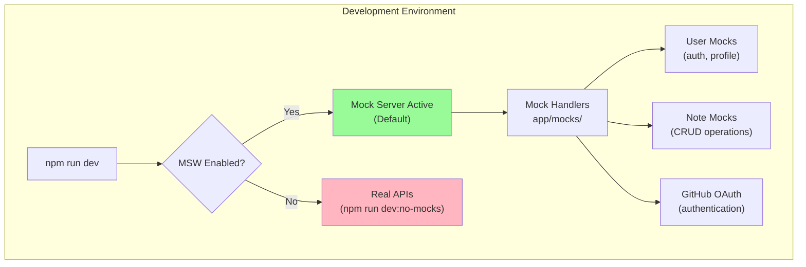

## Selenium in Epic Stack

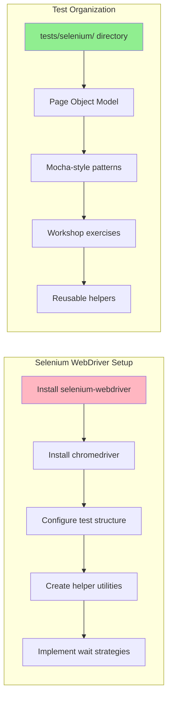

## Testing Data Flow

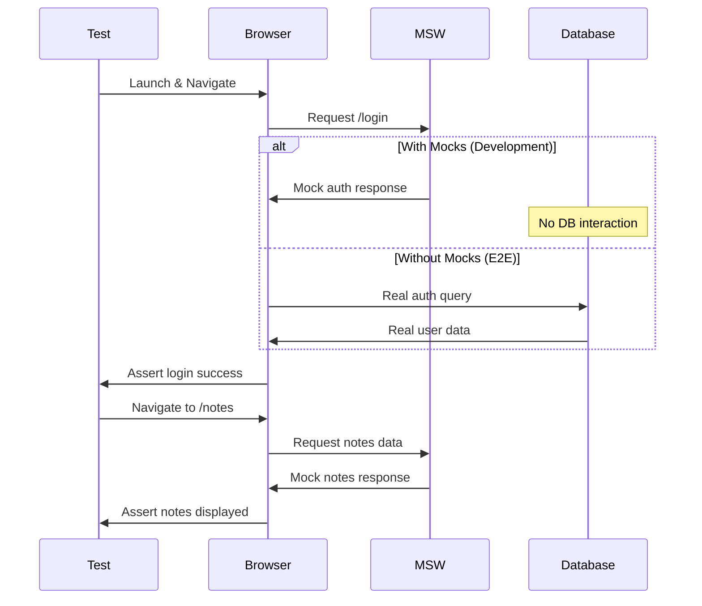

## Test Organization Structure

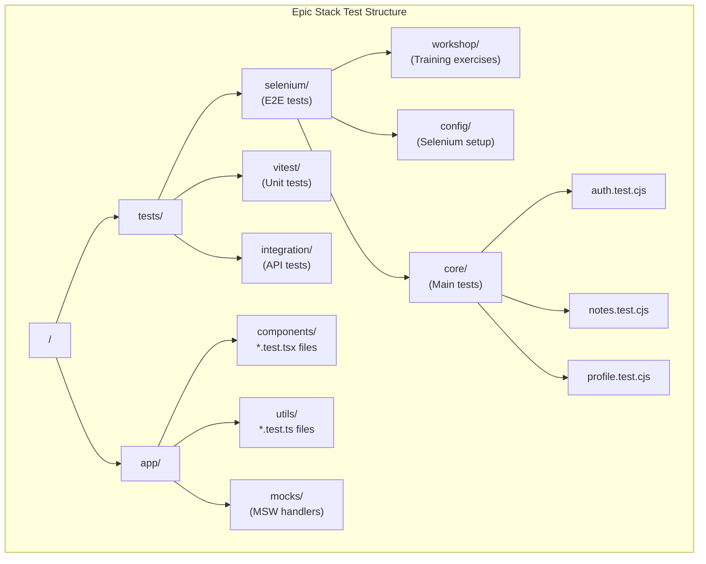

## Mocha-style Organization (Without Mocha)

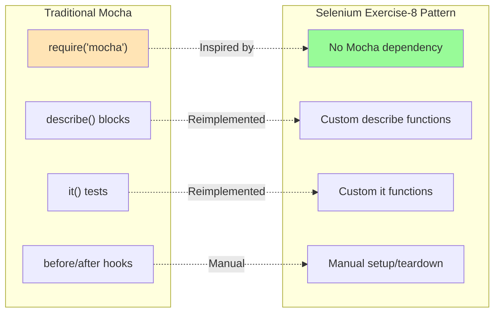

## Key Relationships Summary

| Tool           | Purpose                   | Relationship to Others                                      |
| -------------- | ------------------------- | ----------------------------------------------------------- |
| **MSW**        | Mock API responses        | Intercepts network requests during development and testing  |
| **Vitest**     | Unit/Integration tests    | Uses MSW for API mocking, runs component tests              |
| **Playwright** | E2E testing (primary)     | Can use MSW or real APIs, auto-waits for elements           |
| **Selenium**   | E2E testing (alternative) | Manual waits, requires explicit setup, training tool        |
| **Mocha**      | Test organization pattern | Not used directly, but pattern copied in Selenium exercises |

## When to Use Each Tool

### Use MSW when:

- Developing without backend
- Testing API interactions
- Creating consistent test data
- Simulating error states

### Use Selenium WebDriver when:

- Running E2E tests in CI/CD
- Need cross-browser testing
- Want explicit control over waits
- Testing any web application
- Training test automation

### Use Selenium when:

- Training new developers
- Need wide language support
- Testing legacy applications
- Require explicit control

### Use Vitest when:

- Unit testing components
- Testing utilities
- Integration testing
- Need fast test execution

## Environment Variables

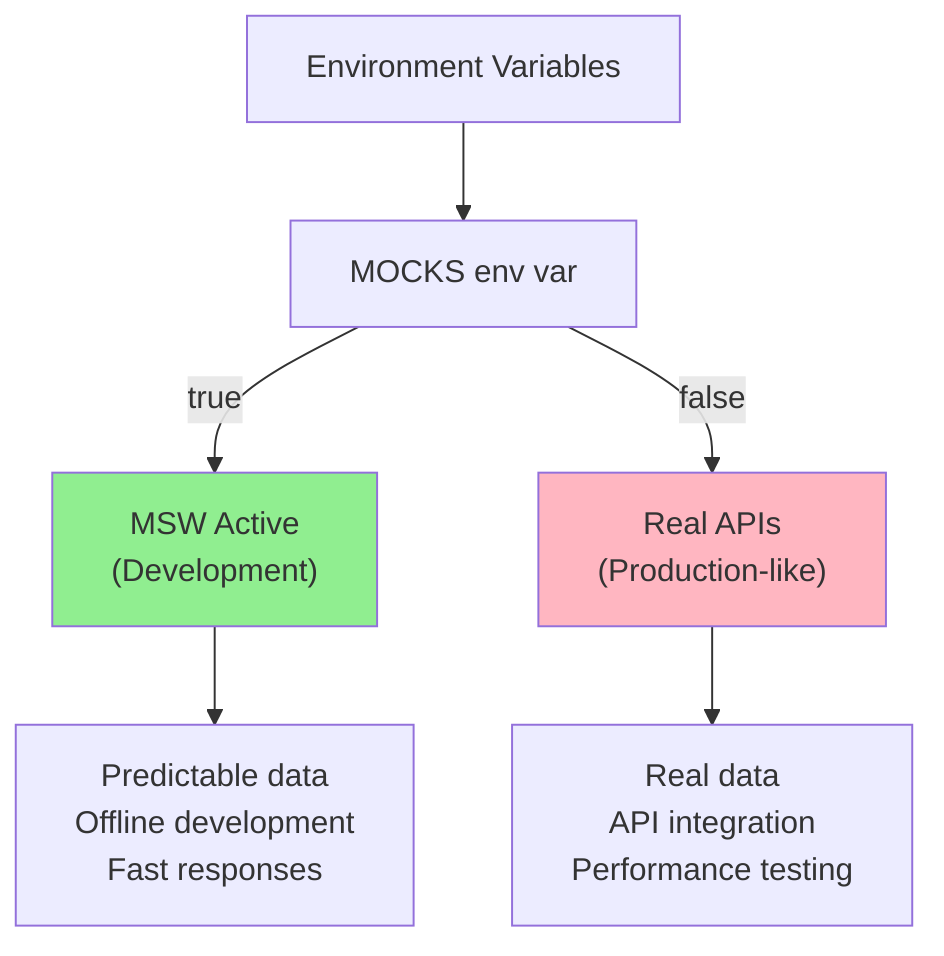

## Testing Best Practices

1. **Unit Tests**: Use Vitest with MSW for isolated component testing
2. **Integration Tests**: Combine Vitest and MSW to test features
3. **E2E Tests**: Use Selenium for critical user paths
4. **Training**: Use Selenium workshop exercises for learning
5. **Mocking**: Use MSW for consistent, reusable mocks across all test types

## Conclusion

Epic Stack's testing architecture leverages:

- **MSW** for API mocking across development and testing
- **Vitest** for fast unit and integration tests
- **Selenium WebDriver** for E2E testing and browser automation
- **Mocha-style patterns** for test organization (without the dependency)
- **Page Object Model** for maintainable test structure

This multi-layered approach ensures comprehensive test coverage while
maintaining development speed and reliability.
