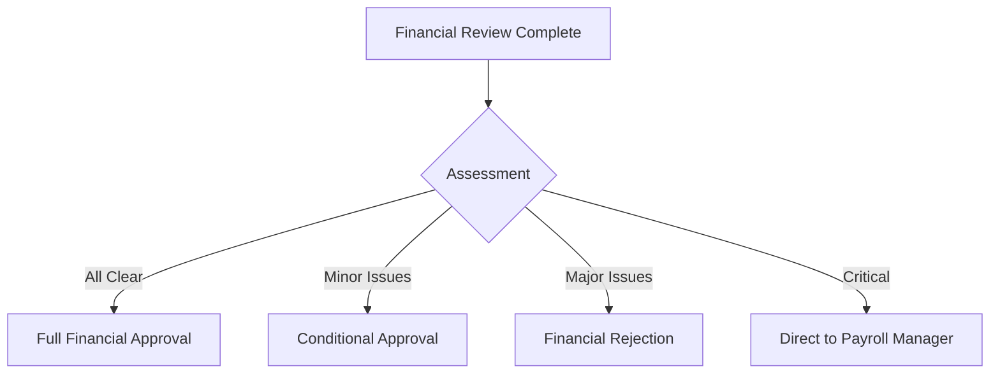

# Time & Attendance and Payroll System

## Controller Role Presentation

---

# Slide 1: Title Slide

## **Financial Control & Validation in Payroll Processing**

### Controller Role in the Time & Attendance and Payroll System

**Presentation to:** Controller Group  
**Date:** 3 September **Prepared by:** The BU2 Special Projects Team

---

# Slide 2: Agenda

## **Today's Presentation**

1. **System Context** - Overview of the Complete Workflow
2. **Controller Objectives** - Your Role and Responsibilities
3. **How Objectives Are Met** - Tools, Processes, and Standards
4. **Key Relationships** - Working with Verifier & Payroll Officer
5. **Decision Framework** - Approval Matrix and Escalation
6. **Integration with Payroll Manager** - Final Approval Process
7. **Live Demo** - System Walkthrough
8. **Q&A Session**

---

# Slide 3: System Context - Complete Workflow

## **End-to-End Payroll Process Flow**

```
Guards → Operations → Timekeeper → HR Manager → Payroll Officer → Verifier → **CONTROLLER** → Payroll Manager


```

### **Key Stages:**

- **Time Collection:** Guards clock in/out via biometric/mobile
- **Processing:** Timekeeper creates timesheets, HR approves
- **Calculation:** Payroll Officer computes contracted rates & base pay &
  prepares/manages scheduled allowances, deductions, govt contributions
- **Verification:** Verifier checks non-contracted items & deductions
- **Financial Review:** **Controller validates budget & funds**
- **Final Approval:** Payroll Manager authorizes disbursement

---

# Slide 4: Where the Controller Fits

## **Controller's Strategic Position**

### **You Receive From Verifier:**

- ✅ Verified paysheets with all calculations reviewed
- ✅ Flagged issues and discrepancies
- ✅ Deductions, allowances, and government contributions validated

### **You Provide to Payroll Manager:**

- 📊 Financial validation and budget impact analysis
- 💰 Fund availability confirmation
- 📈 Cost trends and projections
- ⚠️ Risk assessment and recommendations
- ✓ Financial approval or conditional notes

**Your Role:** Financial Gatekeeper ensuring fiscal responsibility

---

# Slide 5: Controller Objectives

## **Primary Objectives**

### **1. Budget Compliance**

- Ensure payroll stays within approved budgets
- Monitor department and cost center allocations
- Project month-end and year-end positions

### **2. Fund Management**

- Verify cash availability for disbursement
- Coordinate with Treasury for liquidity
- Optimize payment timing

### **3. Cost Control**

- Analyze payroll cost trends
- Identify savings opportunities
- Monitor overtime and special payments

### **4. Risk Management**

- Assess financial and compliance risks
- Detect fraud indicators
- Ensure regulatory adherence

---

# Slide 6: How These Objectives Are Met - Tools

## **Controller Dashboard & Tools**

### **Financial Analytics Platform**

- Real-time budget utilization tracking
- Department-wise cost breakdowns
- Variance analysis reports
- Trend charts and projections

### **Integration Systems**

- **Budget System:** Live budget vs. actual comparison
- **Banking Portal:** Real-time balance checking
- **Treasury System:** Cash flow management
- **ERP Integration:** Financial data synchronization

### **Validation Engine**

- Automated compliance checks ... and later on,
  - Risk scoring algorithms
  - Anomaly detection
  - Audit trail generation

---

# Slide 7: How These Objectives Are Met - Process

## **Controller Review Process**

### **Step-by-Step Workflow:**

1. **Initial Assessment (10 min)**
   - Review Verifier notes
   - Check total payroll amount
   - Identify high-risk items

2. **Budget Compliance (20 min)**
   - Compare to approved budget
   - Calculate utilization %
   - Document variances

3. **Fund Availability (15 min)**
   - Check bank balances
   - Review cash position
   - Coordinate with Treasury

4. **Cost Analysis (30 min)**
   - Analyze trends
   - Compare periods
   - Calculate metrics

5. **Risk Assessment (15 min)**
   - Evaluate compliance
   - Check fraud indicators
   - Review audit findings

6. **Documentation (10 min)**
   - Prepare recommendations
   - Apply validation stamp

---

# Slide 8: Key Performance Standards

## **Controller Review Standards**

| Component             | Standard                | Tolerance | Action if Exceeded     |
| --------------------- | ----------------------- | --------- | ---------------------- |
| **Budget Compliance** | Within approved         | ±5%       | Require justification  |
| **Cash Requirement**  | Funds available         | 100%      | Defer non-critical     |
| **Cost Increase**     | <3% month-over-month    | ±1%       | Investigation required |
| **Overtime Costs**    | <10% of base            | ±2%       | Management review      |
| **Error Rate**        | 0% for amounts >₱10,000 | 0%        | Return for correction  |
| **Compliance**        | 100% regulatory         | 0%        | Immediate escalation   |

### **Quality Metrics:**

- Review completion time: Average 8 hours per payroll
- SLA compliance: 100% within deadline
- Error detection rate: >98%

---

# Slide 9: Relationship with Verifier

## **Controller ← Verifier Interface**

### **What You Receive from Verifier:**

#### **Verified Components:**

- ✓ All deductions calculated and validated
- ✓ Government contributions checked against tables
- ✓ Allowances verified per policy
- ✓ Special adjustments documented

#### **Verifier's Focus Areas:**

- Non-contracted hours validation
- Loan payment schedules
- SSS, PhilHealth, Pag-IBIG calculations
- Tax withholding accuracy

### **Your Added Value:**

- **Financial perspective** vs. operational accuracy
- **Budget impact** vs. calculation correctness
- **Strategic view** vs. detailed validation

---

# Slide 10: Relationship with Payroll Officer

## **Controller ← Payroll Officer (via Verifier)**

### **Payroll Officer's Foundation Work:**

#### **Configuration & Setup:**

- Tax tables maintenance
- Government contribution rates
- Loan program management
- Allowance structures

#### **Processing:**

- Timesheet data entry
- Base pay calculation
- Contracted rates application
- Deduction scheduling

### **How This Supports Your Review:**

- Provides the base calculations you validate financially
- Ensures data completeness before your review
- Handles operational details so you focus on financial control

### **When You Need to Return to PO:**

- Major calculation errors
- Missing critical data
- System configuration issues

---

# Slide 11: Decision Framework

## **Controller Decision Matrix**

### **Your Decision Options:**



### **Decision Criteria:**

| Scenario        | Budget    | Funds        | Risk     | Your Decision        |
| --------------- | --------- | ------------ | -------- | -------------------- |
| **Ideal**       | Within    | Available    | Low      | **Approve** → PM     |
| **Acceptable**  | <5% over  | Available    | Low-Med  | **Conditional** → PM |
| **Problematic** | >10% over | Limited      | High     | **Partial** approval |
| **Critical**    | Way over  | Insufficient | Critical | **Reject** → Return  |

---

# Slide 12: Escalation Triggers

## **When to Escalate to Payroll Manager**

### **Automatic Escalation Triggers:**

#### **1. Budget Overrun**

- Threshold: >110% of approved budget
- Action: Immediate PM alert with variance report

#### **2. Fund Shortfall**

- Trigger: Insufficient funds for full payroll
- Action: Treasury & PM notification with prioritization plan

#### **3. Compliance Violation**

- Trigger: Any regulatory breach
- Action: Legal & PM notification - CRITICAL priority

#### **4. Material Error**

- Threshold: Error >₱100,000
- Action: Stop processing, investigate, notify all

### **Your Authority:**

- Approve within budget & compliance
- Flag issues for executive attention
- Recommend payment prioritization
- Enforce financial controls

---

# Slide 13: Integration with Payroll Manager

## **Controller → Payroll Manager Handoff**

### **What You Provide:**

#### **Financial Validation Package:**

1. **Validated Paysheet** with your approval stamp
2. **Financial Assessment Report**
   - Budget utilization analysis
   - Cash flow impact
   - Cost trend analysis
3. **Risk Analysis**
   - Identified risks and mitigation
   - Compliance status
4. **Recommendations**
   - Payment prioritization if needed
   - Cost optimization opportunities

### **Payroll Manager's Final Review:**

- Reviews your financial assessment
- Makes final disbursement decision
- Can approve, reject, or apply conditions
- Has ultimate authority for payment release

---

# Slide 14: Financial Analysis Tools

## **Your Analytics Toolkit**

### **1. Trend Analysis**

- 12-month rolling cost trends
- Seasonal pattern identification
- Growth trajectory monitoring

### **2. Ratio Analysis**

- Labor Cost Ratio: Payroll/Revenue
- Overtime Ratio: OT/Regular hours
- Benefits Ratio: Benefits/Base salary
- Efficiency metrics

### **3. Variance Analysis**

- Budget vs. Actual
- Prior period comparison
- YTD variance tracking
- Investigation threshold: >5%

### **4. Scenario Analysis**

- Best/Likely/Worst case projections
- Sensitivity analysis
- What-if modeling

---

# Slide 15: Compliance & Audit

## **Controller's Compliance Responsibilities**

### **Regulatory Compliance:**

- ✓ Tax calculation verification
- ✓ Government contribution limits
- ✓ Minimum wage compliance
- ✓ Maximum deduction rules

### **Audit Readiness:**

- Complete audit trail maintenance
- Documentation of all decisions
- Exception tracking and resolution
- Supporting document verification

### **Financial Controls:**

- Segregation of duties enforcement
- Authorization limit monitoring
- Fraud detection protocols
- Internal control testing

### **Reporting Requirements:**

- Daily financial review reports
- Weekly executive summaries
- Monthly variance analysis
- Quarterly compliance attestation

---

# Slide 16: Exception Handling

## **Managing Financial Exceptions**

### **Common Exceptions You'll Handle:**

#### **Budget Exceptions:**

- **Overrun >5%:** Require justification
- **Unbudgeted items:** Special approval needed
- **Misallocation:** Reallocation required

#### **Cash Exceptions:**

- **Insufficient funds:** Payment prioritization
- **Banking limits:** Batch splitting
- **Timing issues:** Schedule optimization

#### **Compliance Exceptions:**

- **Regulatory breach:** Immediate escalation
- **Tax issues:** Recalculation required
- **Audit findings:** Enhanced review

### **Your Response Framework:**

1. **Identify** the exception type
2. **Assess** the impact
3. **Decide** on action
4. **Document** the resolution
5. **Monitor** for recurrence

---

# Slide 17: Key Performance Metrics

## **Controller Performance Dashboard**

### **Efficiency Metrics:**

- ⏱️ Average review time: 4 hours per payroll
- 📊 SLA compliance: >95% on-time
- 🔄 Automation rate: 70% automated checks

### **Accuracy Metrics:**

- 🎯 Error detection rate: >98%
- ✓ Validation accuracy: 99.5%
- 📈 Projection accuracy: ±3%

### **Financial Metrics:**

- 💰 Budget variance: <5%
- 💵 Cost savings identified: Monthly target
- 📉 Risk mitigation value: Tracked quarterly

### **Quality Metrics:**

- 📝 Documentation completeness: 100%
- 👍 Recommendation adoption: >80%
- ⭐ Stakeholder satisfaction: >4.5/5

---

# Slide 18: Best Practices

## **Controller Excellence Standards**

### **Financial Review Best Practices:**

#### **1. Systematic Approach**

- Use standardized checklists
- Follow consistent review sequence
- Document all findings
- Maintain version control

#### **2. Proactive Analysis**

- Identify trends early
- Flag potential issues
- Recommend preventive measures
- Share insights with team

#### **3. Clear Communication**

- Specific, actionable feedback
- Timely escalation
- Professional documentation
- Regular status updates

#### **4. Continuous Improvement**

- Track recurring issues
- Suggest process enhancements
- Share knowledge
- Update procedures

---

# Slide 19: System Demo Points

## **Live System Walkthrough**

### **We Will Demonstrate:**

1. **Controller Dashboard**
   - Real-time budget monitoring
   - Alert management
   - Trend visualization

2. **Review Workflow**
   - Receiving from Verifier
   - Financial validation process
   - Decision documentation

3. **Analytics Tools**
   - Variance analysis
   - Cost projections
   - Risk scoring

4. **Integration Points**
   - Banking portal access
   - Treasury coordination
   - ERP synchronization

5. **Approval Process**
   - Applying validation stamp
   - Adding conditions
   - Escalation procedures

---

# Slide 20: Summary - Your Critical Role

## **The Controller as Financial Gatekeeper**

### **Your Unique Value:**

#### **Strategic Financial Oversight**

- Bridge between operations and finance
- Guardian of organizational resources
- Enabler of informed decisions

#### **Risk Management**

- First line of financial defense
- Compliance assurance
- Fraud prevention

#### **Cost Optimization**

- Efficiency driver
- Savings identifier
- Process improver

### **Key Success Factors:**

- ✓ Strong financial acumen
- ✓ Analytical mindset
- ✓ Quick decision-making
- ✓ Clear communication
- ✓ Attention to detail

**Your approval gives confidence that every peso is properly validated and
accounted for.**

---

# Slide 21: Questions & Discussion

## **Open Forum**

### **Common Questions We Can Address:**

1. **Budget Management**
   - How do we handle budget overruns?
   - What's the escalation process?

2. **System Access**
   - What systems will I have access to?
   - How real-time is the data?

3. **Decision Authority**
   - What can I approve independently?
   - When must I escalate?

4. **Support & Training**
   - What training is provided?
   - Who can I contact for help?

5. **Performance Expectations**
   - What are the KPIs?
   - How is performance measured?

### **Your Questions?**

---

# Slide 22: Next Steps

## **Implementation Roadmap**

### **Immediate Actions:**

1. **System Access Setup** - Week 1
2. **Training Sessions** - Week 1-2
3. **Shadow Current Process** - Week 2
4. **Practice Reviews** - Week 2-3
5. **Go-Live** - Week 4

### **Support Structure:**

- Dedicated implementation team
- Daily check-ins first week
- Weekly reviews first month
- 24/7 help desk support

### **Documentation Available:**

- Detailed workflow guides
- Decision matrices
- Escalation procedures
- System user manuals

### **Contact Information:**

- Implementation Lead: [Contact]
- Technical Support: [Contact]
- Process Questions: [Contact]

---

# Slide 23: Thank You

## **Thank You for Your Time**

### **We Look Forward to Working Together**

**Building a robust financial control framework for our payroll system**

### **Key Takeaways:**

- Controllers provide essential financial validation
- Your review ensures budget compliance and fund availability
- You're the bridge between operations and executive approval
- The system provides comprehensive tools for your success

### **Questions?**

Contact: MPM, Ms Faye, Myself

---

# Appendix: Quick Reference

## **Controller Quick Reference Card**

### **Review Checklist:**

☐ Budget compliance check  
☐ Fund availability verified  
☐ Cost trend analyzed  
☐ Risks assessed  
☐ Compliance confirmed  
☐ Documentation complete

### **Escalation Thresholds:**

- Budget: >105% = Flag, >110% = Escalate
- Errors: >₱10,000 = Return, >₱100,000 = Stop
- Compliance: Any violation = Immediate escalation

### **Key Contacts:**

- Verifier Team: [ext]
- Payroll Manager: [ext]
- Treasury: [ext]
- IT Support: [ext]

### **System URLs:**

- Controller Dashboard: [URL]
- Banking Portal: [URL]
- Help Documentation: [URL]
