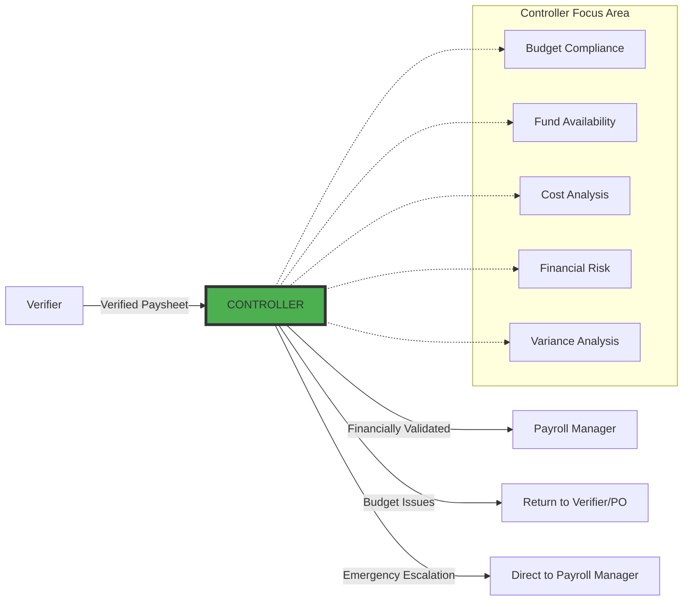
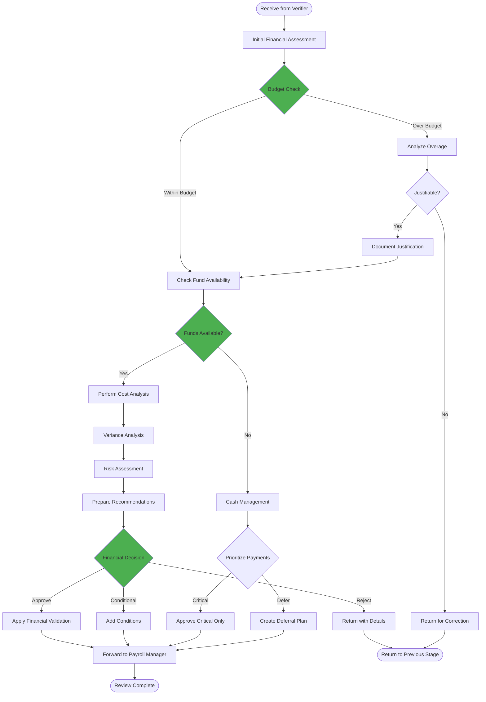
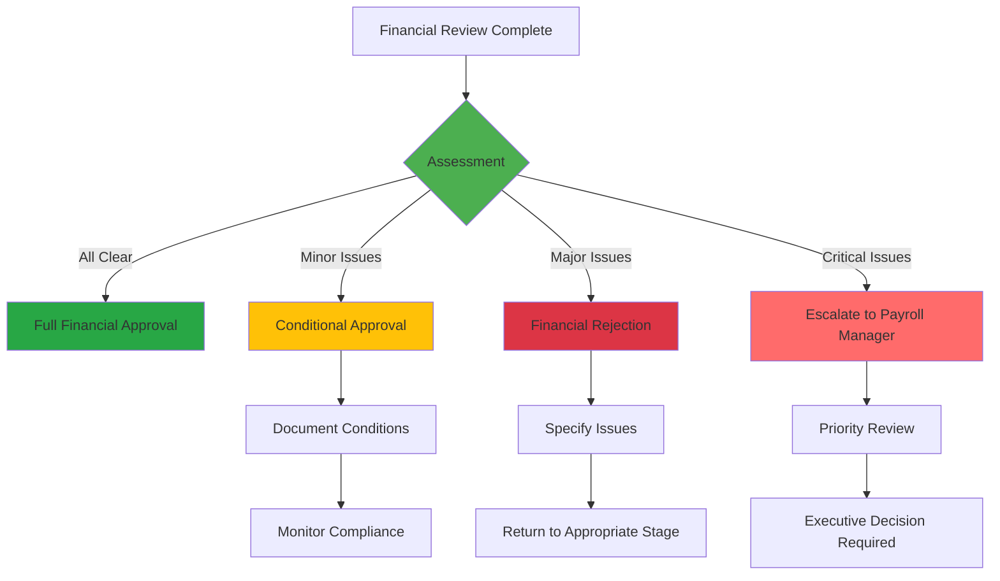
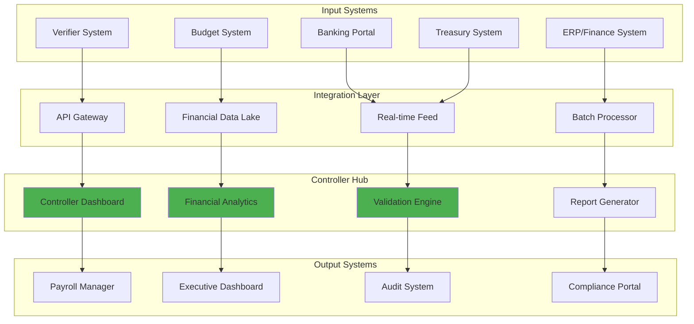
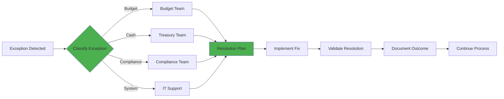

# Controller Role - Comprehensive Workflow Documentation

## Executive Summary

The Controller serves as the **financial review and validation authority** in
the payroll process, positioned between the Verifier and Payroll Manager. This
role provides critical financial oversight, ensuring budget compliance, fund
availability, and overall financial accuracy before the Payroll Manager's final
approval. The Controller acts as the financial gatekeeper who validates the
entire payroll from a budgetary and financial perspective.

## Table of Contents

1. [Role Definition](#role-definition)
2. [Workflow Position](#workflow-position)
3. [Core Responsibilities](#core-responsibilities)
4. [Detailed Workflow Process](#detailed-workflow-process)
5. [Financial Review Criteria](#financial-review-criteria)
6. [Decision Matrix](#decision-matrix)
7. [Integration Points](#integration-points)
8. [Exception Handling](#exception-handling)

## 1. Role Definition

### 1.1 Controller Overview

```typescript
interface ControllerRole {
	position: 'Between Verifier and Payroll Manager'
	focus: 'Financial validation and budget compliance'
	authority: 'Financial review and conditional approval'

	primaryFunction: 'Financial oversight and risk management'

	keyAttributes: {
		financialAcumen: 'Deep understanding of budgets and costs'
		analytical: 'Identifies financial trends and risks'
		strategic: 'Considers organizational financial impact'
		compliant: 'Ensures financial regulatory adherence'
		decisive: 'Makes clear financial recommendations'
	}

	scope: {
		reviews: [
			'Total payroll costs',
			'Budget compliance',
			'Fund availability',
			'Cost trends',
		]
		validates: [
			'Financial calculations',
			'Budget allocations',
			'Cost centers',
			'Financial risks',
		]
		approves: [
			'Budget-compliant payrolls',
			'Emergency payments',
			'Special disbursements',
		]
		flags: [
			'Budget overruns',
			'Unusual costs',
			'Financial risks',
			'Compliance issues',
		]
	}
}
```

### 1.2 Controller Competencies

| Competency                | Description                             | Criticality |
| ------------------------- | --------------------------------------- | ----------- |
| **Financial Analysis**    | Analyze payroll costs and trends        | Critical    |
| **Budget Management**     | Monitor and control budget utilization  | Critical    |
| **Risk Assessment**       | Identify financial risks and exposures  | Critical    |
| **Regulatory Compliance** | Ensure financial regulatory adherence   | High        |
| **Cost Optimization**     | Identify cost-saving opportunities      | High        |
| **Strategic Planning**    | Align payroll with financial strategy   | Medium      |
| **Communication**         | Clear financial reporting to management | High        |

## 2. Workflow Position

### 2.1 Controller in the Payroll Chain



### 2.2 Timing in the Process

```typescript
interface ControllerTiming {
	receives: {
		from: 'Verifier'
		when: 'After verification complete'
		format: 'Verified paysheet with all calculations reviewed'
		includes: 'Verifier notes and flagged issues'
		sla: 'Within 1 hour of Verifier completion'
	}

	processes: {
		duration: '4 hours standard, 2 hours priority'
		scope: 'Complete financial review'
		depth: 'Department and cost center analysis'
		tools: 'Financial dashboards and analytics'
	}

	delivers: {
		to: 'Payroll Manager'
		when: 'After financial validation'
		format: 'Financially validated paysheet with assessment'
		includes: 'Budget impact analysis and recommendations'
		sla: 'Within 4 hours of receipt'
	}
}
```

## 3. Core Responsibilities

### 3.1 Primary Review Areas

```typescript
interface ControllerResponsibilities {
	budgetCompliance: {
		departmentalBudgets: {
			monitor: 'Budget utilization by department'
			compare: 'Actual vs budgeted amounts'
			project: 'Month-end and year-end projections'
			flag: 'Overruns and unusual variances'
		}

		costCenterAnalysis: {
			breakdown: 'Costs by location/project/division'
			allocation: 'Proper cost center charging'
			trends: 'Historical cost patterns'
			optimization: 'Cost reduction opportunities'
		}

		varianceAnalysis: {
			periodComparison: 'Current vs previous periods'
			budgetVariance: 'Actual vs budget variance'
			forecastVariance: 'Actual vs forecast'
			explanation: 'Document variance reasons'
		}
	}

	fundManagement: {
		cashAvailability: {
			verify: 'Sufficient funds for disbursement'
			timing: 'Cash flow considerations'
			prioritize: 'Payment priorities if limited'
			coordinate: 'With treasury/finance team'
		}

		bankingRequirements: {
			limits: 'Daily transfer limits'
			schedules: 'Banking cut-off times'
			accounts: 'Proper account allocation'
			reconciliation: 'Bank reconciliation readiness'
		}

		liquidityManagement: {
			forecast: 'Cash requirements projection'
			optimize: 'Payment timing optimization'
			reserve: 'Maintain required reserves'
			report: 'Liquidity status to management'
		}
	}

	financialRiskAssessment: {
		complianceRisks: {
			tax: 'Tax calculation accuracy'
			regulatory: 'Labor law compliance'
			audit: 'Audit trail completeness'
			documentation: 'Supporting document adequacy'
		}

		operationalRisks: {
			errors: 'Material error exposure'
			fraud: 'Fraud risk indicators'
			duplication: 'Duplicate payment risk'
			unauthorized: 'Unauthorized payment risk'
		}

		strategicRisks: {
			reputation: 'Payment delay impact'
			employee: 'Employee satisfaction risk'
			legal: 'Legal exposure assessment'
			business: 'Business continuity impact'
		}
	}

	costControl: {
		overtimeManagement: {
			monitor: 'Overtime cost trends'
			analyze: 'Department overtime patterns'
			recommend: 'Cost reduction strategies'
			approve: 'High overtime situations'
		}

		allowanceOptimization: {
			review: 'Allowance utilization'
			benchmark: 'Industry comparisons'
			recommend: 'Policy adjustments'
			validate: 'Special allowances'
		}

		deductionMonitoring: {
			track: 'Loan recovery rates'
			analyze: 'Deduction patterns'
			identify: 'Collection issues'
			recommend: 'Collection strategies'
		}
	}
}
```

### 3.2 Financial Validation Process

```typescript
interface FinancialValidation {
	level1_Completeness: {
		checks: [
			'All departments included',
			'All employees accounted for',
			'All components calculated',
			'All deductions applied',
		]
		outcome: 'Complete or flag missing items'
	}

	level2_Accuracy: {
		verifies: [
			'Mathematical accuracy of totals',
			'Correct application of rates',
			'Proper tax calculations',
			'Accurate government contributions',
		]
		tools: 'Automated validation scripts'
	}

	level3_Compliance: {
		ensures: [
			'Within approved budget',
			'Meets regulatory requirements',
			'Follows company policies',
			'Audit trail complete',
		]
		documentation: 'Compliance checklist'
	}

	level4_Strategic: {
		assesses: [
			'Impact on cash flow',
			'Effect on financial ratios',
			'Budget reforecast needs',
			'Strategic implications',
		]
		output: 'Executive summary'
	}
}
```

## 4. Detailed Workflow Process

### 4.1 Financial Review Workflow



### 4.2 Step-by-Step Process

```typescript
interface ControllerWorkflowSteps {
	step1_InitialAssessment: {
		duration: '10 minutes'
		activities: [
			'Review Verifier notes',
			'Check total payroll amount',
			'Identify high-risk items',
			'Note flagged issues',
		]
		tools: ['Executive dashboard', 'Verifier report']
		output: 'Initial risk assessment'
	}

	step2_BudgetCompliance: {
		duration: '20 minutes'
		activities: [
			'Compare to approved budget',
			'Calculate utilization percentage',
			'Identify variances by department',
			'Project month-end position',
			'Document overruns',
		]
		tools: ['Budget tracking system', 'Variance reports']
		thresholds: {
			green: 'Within 95% of budget'
			yellow: '95-105% of budget'
			red: 'Over 105% of budget'
		}
	}

	step3_FundAvailability: {
		duration: '15 minutes'
		activities: [
			'Check bank account balances',
			'Review cash position',
			'Consider pending receipts',
			'Evaluate payment timing',
			'Coordinate with Treasury',
		]
		systems: ['Banking portal', 'Cash management system']
		output: 'Fund availability confirmation'
	}

	step4_CostAnalysis: {
		duration: '30 minutes'
		activities: [
			'Analyze cost trends',
			'Compare period-over-period',
			'Review overtime costs',
			'Examine special payments',
			'Identify anomalies',
			'Calculate cost ratios',
		]
		metrics: [
			'Cost per employee',
			'Overtime percentage',
			'Benefits ratio',
			'Department cost distribution',
		]
	}

	step5_RiskAssessment: {
		duration: '15 minutes'
		activities: [
			'Evaluate compliance risks',
			'Assess financial risks',
			'Consider operational risks',
			'Review audit findings',
			'Check for fraud indicators',
		]
		output: 'Risk assessment matrix'
	}

	step6_Documentation: {
		duration: '10 minutes'
		activities: [
			'Document findings',
			'Prepare recommendations',
			'Create executive summary',
			'Apply validation stamp',
			'Add conditional notes',
		]
		deliverables: [
			'Financial review report',
			'Recommendations memo',
			'Approval certificate',
		]
	}
}
```

### 4.3 Financial Analysis Techniques

```typescript
interface FinancialAnalysisTechniques {
	trendAnalysis: {
		method: 'Time series analysis'
		periods: 'Last 12 months rolling'
		identifies: [
			'Seasonal patterns',
			'Growth trends',
			'Unusual spikes',
			'Cyclical variations',
		]
		visualization: 'Trend charts and graphs'
	}

	ratioAnalysis: {
		laborCostRatio: 'Payroll / Revenue'
		overtimeRatio: 'Overtime / Regular hours'
		benefitsRatio: 'Benefits / Base salary'
		efficiencyRatio: 'Output / Labor cost'
		benchmarks: 'Industry standards'
	}

	varianceAnalysis: {
		types: [
			'Budget variance',
			'Forecast variance',
			'Prior period variance',
			'YTD variance',
		]
		investigation: 'Variances > 5%'
		documentation: 'Explanation required'
	}

	scenarioAnalysis: {
		bestCase: 'Minimum probable cost'
		likelyCase: 'Most probable cost'
		worstCase: 'Maximum probable cost'
		sensitivity: 'Impact of variable changes'
	}
}
```

## 5. Financial Review Criteria

### 5.1 Review Standards

| Component             | Standard                | Tolerance | Action if Exceeded     |
| --------------------- | ----------------------- | --------- | ---------------------- |
| **Budget Compliance** | Within approved         | ±5%       | Require justification  |
| **Cash Requirement**  | Funds available         | 100%      | Defer non-critical     |
| **Cost Increase**     | <3% month-over-month    | ±1%       | Investigation required |
| **Overtime Costs**    | <10% of base            | ±2%       | Management review      |
| **Error Rate**        | 0% for amounts >₱10,000 | 0%        | Return for correction  |
| **Compliance**        | 100% regulatory         | 0%        | Immediate escalation   |

### 5.2 Financial Checklist

```typescript
interface ControllerChecklist {
  budgetReview: {
    □ 'Total within budget allocation'
    □ 'Department budgets checked'
    □ 'Cost center allocations verified'
    □ 'YTD budget utilization calculated'
    □ 'Projections updated'
  }

  fundManagement: {
    □ 'Bank balances verified'
    □ 'Cash flow impact assessed'
    □ 'Payment timing optimized'
    □ 'Banking limits considered'
    □ 'Treasury coordinated'
  }

  costControl: {
    □ 'Overtime costs analyzed'
    □ 'Allowances reviewed'
    □ 'Deductions validated'
    □ 'Cost trends identified'
    □ 'Savings opportunities noted'
  }

  compliance: {
    □ 'Tax calculations verified'
    □ 'Government contributions checked'
    □ 'Regulatory requirements met'
    □ 'Audit trail complete'
    □ 'Documentation adequate'
  }

  riskManagement: {
    □ 'Financial risks assessed'
    □ 'Compliance risks evaluated'
    □ 'Fraud indicators checked'
    □ 'Control weaknesses identified'
    □ 'Mitigation measures proposed'
  }
}
```

## 6. Decision Matrix

### 6.1 Financial Approval Decisions



### 6.2 Decision Criteria Matrix

| Scenario        | Budget Status        | Fund Status        | Risk Level | Decision    | Action                |
| --------------- | -------------------- | ------------------ | ---------- | ----------- | --------------------- |
| **Ideal**       | Within budget        | Funds available    | Low        | Approve     | Forward to PM         |
| **Acceptable**  | <5% over             | Funds available    | Low-Medium | Conditional | Add notes, forward    |
| **Manageable**  | 5-10% over           | Funds available    | Medium     | Review      | Require justification |
| **Problematic** | >10% over            | Funds limited      | High       | Partial     | Approve critical only |
| **Critical**    | Significantly over   | Insufficient funds | Critical   | Reject      | Return for reduction  |
| **Emergency**   | Special circumstance | Emergency fund     | Variable   | Escalate    | Direct to PM          |

### 6.3 Escalation Triggers

```typescript
interface EscalationTriggers {
	automatic: {
		budgetOverrun: {
			threshold: '>110% of budget'
			action: 'Immediate Payroll Manager alert'
			documentation: 'Detailed variance report'
		}

		fundShortfall: {
			trigger: 'Insufficient funds for full payroll'
			action: 'Treasury and PM notification'
			options: 'Payment prioritization plan'
		}

		complianceViolation: {
			trigger: 'Any regulatory breach'
			action: 'Legal and PM notification'
			priority: 'CRITICAL'
		}

		materialError: {
			threshold: 'Error >₱100,000'
			action: 'Stop processing, investigate'
			notification: 'All stakeholders'
		}
	}

	discretionary: {
		unusualPattern: {
			trigger: 'Significant deviation from normal'
			action: 'Flag for executive review'
			documentation: 'Pattern analysis report'
		}

		specialCircumstance: {
			examples: ['Natural disaster', 'Emergency bonus', 'Restructuring']
			action: 'Executive approval required'
			process: 'Fast-track review'
		}

		auditFinding: {
			trigger: 'Recent audit issue'
			action: 'Enhanced review'
			documentation: 'Audit compliance check'
		}
	}
}
```

## 7. Integration Points

### 7.1 System Integration Architecture



### 7.2 Data Flow Specifications

```typescript
interface ControllerDataFlow {
	inbound: {
		fromVerifier: {
			data: 'Verified paysheets with review notes'
			format: 'Structured JSON with attachments'
			frequency: 'Real-time as completed'
			validation: 'Schema validation on receipt'
		}

		fromFinanceSystems: {
			budgetData: {
				source: 'ERP/Budget system'
				frequency: 'Real-time sync'
				includes: 'Approved budgets, YTD actuals'
			}
			bankingData: {
				source: 'Banking APIs'
				frequency: 'Every 15 minutes'
				includes: 'Account balances, pending transactions'
			}
			treasuryData: {
				source: 'Treasury management system'
				frequency: 'Real-time'
				includes: 'Cash position, forecasts'
			}
		}

		fromCompliance: {
			regulations: 'Latest regulatory requirements'
			taxTables: 'Current tax rates and brackets'
			auditFindings: 'Recent audit observations'
			policies: 'Updated company policies'
		}
	}

	processing: {
		validation: [
			'Data integrity checks',
			'Cross-system reconciliation',
			'Duplicate detection',
			'Anomaly identification',
		]

		analysis: [
			'Budget comparison',
			'Trend analysis',
			'Variance calculation',
			'Risk scoring',
		]

		documentation: [
			'Findings summary',
			'Recommendation generation',
			'Audit trail creation',
			'Report compilation',
		]
	}

	outbound: {
		toPayrollManager: {
			package: 'Complete financial validation package'
			includes: [
				'Validated paysheet',
				'Financial assessment',
				'Risk analysis',
				'Recommendations',
			]
			format: 'Structured report with dashboards'
		}

		toManagement: {
			executiveSummary: 'High-level financial overview'
			costAnalysis: 'Detailed cost breakdown'
			projections: 'Updated forecasts'
			alerts: 'Critical issues requiring attention'
		}

		toAudit: {
			trail: 'Complete audit trail'
			validations: 'All validation results'
			exceptions: 'Documented exceptions'
			approvals: 'Approval hierarchy'
		}
	}
}
```

## 8. Exception Handling

### 8.1 Common Financial Exceptions

```typescript
interface FinancialExceptions {
	budgetExceptions: {
		overrun: {
			detection: 'Automated budget monitoring'
			threshold: '>105% of approved'
			response: 'Require justification and approval'
			mitigation: 'Identify offsetting savings'
		}

		unbudgeted: {
			detection: 'Item not in budget'
			response: 'Special approval required'
			documentation: 'Business case needed'
			approval: 'Executive level required'
		}

		misallocation: {
			detection: 'Wrong cost center charged'
			response: 'Reallocation required'
			correction: 'Journal entry preparation'
			prevention: 'Update mapping tables'
		}
	}

	cashExceptions: {
		insufficient: {
			detection: 'Balance < payroll requirement'
			response: 'Payment prioritization'
			action: 'Coordinate with Treasury'
			communication: 'Notify all stakeholders'
		}

		bankingLimit: {
			detection: 'Exceeds daily transfer limit'
			response: 'Split into multiple batches'
			coordination: 'Bank pre-notification'
			documentation: 'Special handling memo'
		}

		timing: {
			detection: 'After banking hours'
			response: 'Schedule for next window'
			notification: 'Inform affected parties'
			mitigation: 'Expedite processing'
		}
	}

	complianceExceptions: {
		regulatoryBreach: {
			detection: 'Compliance check failure'
			response: 'Immediate escalation'
			action: 'Stop processing'
			remediation: 'Corrective action plan'
		}

		taxIssue: {
			detection: 'Tax calculation error'
			response: 'Recalculation required'
			verification: 'Tax expert review'
			documentation: 'Amendment preparation'
		}

		auditFinding: {
			detection: 'Audit point raised'
			response: 'Enhanced review'
			action: 'Implement controls'
			tracking: 'Resolution monitoring'
		}
	}
}
```

### 8.2 Exception Resolution Framework



### 8.3 Crisis Management Protocol

```typescript
interface CrisisManagementProtocol {
	levels: {
		level1_Operational: {
			trigger: 'Minor variance or delay'
			response: 'Controller handles internally'
			timeline: 'Resolution within 2 hours'
			escalation: 'If not resolved in 2 hours'
		}

		level2_Tactical: {
			trigger: 'Significant budget/cash issue'
			response: 'Involve department heads'
			timeline: 'Resolution within 4 hours'
			escalation: 'CFO notification'
		}

		level3_Strategic: {
			trigger: 'Major financial crisis'
			response: 'Executive team activation'
			timeline: 'Immediate response required'
			communication: 'All stakeholders informed'
		}
	}

	communicationPlan: {
		internal: [
			'Payroll Manager - Immediate',
			'CFO - Within 30 minutes',
			'CEO - If strategic level',
			'Department Heads - As affected',
		]

		external: [
			'Banks - If payment delay',
			'Regulators - If compliance issue',
			'Auditors - If material error',
			'Employees - If payment affected',
		]
	}

	actionPlan: {
		immediate: [
			'Stop further processing',
			'Assess impact',
			'Identify root cause',
			'Develop solution options',
		]

		shortTerm: [
			'Implement workaround',
			'Process critical payments',
			'Communicate status',
			'Monitor resolution',
		]

		longTerm: [
			'Root cause analysis',
			'Process improvement',
			'Control enhancement',
			'Policy update',
		]
	}
}
```

## 9. Performance Metrics

### 9.1 Controller KPIs

```typescript
interface ControllerKPIs {
	efficiency: {
		reviewCompletionTime: 'Average time per payroll review'
		slaCompliance: 'Reviews completed within SLA'
		batchProcessingRate: 'Payrolls per day'
		automationRate: 'Automated vs manual validations'
	}

	accuracy: {
		errorDetectionRate: 'Financial errors caught'
		validationAccuracy: 'Correct financial assessments'
		projectionAccuracy: 'Budget projection accuracy'
		complianceRate: 'Regulatory compliance score'
	}

	financial: {
		budgetVariance: 'Actual vs budget variance'
		costSavings: 'Identified savings'
		cashOptimization: 'Cash utilization efficiency'
		riskMitigation: 'Risks prevented value'
	}

	quality: {
		documentationQuality: 'Complete documentation rate'
		recommendationAdoption: 'Recommendations implemented'
		stakeholderSatisfaction: 'Feedback score'
		auditReadiness: 'Audit preparedness score'
	}
}
```

### 9.2 Financial Dashboard Metrics

```typescript
interface FinancialDashboardMetrics {
	realTime: {
		currentPayrollValue: number
		budgetUtilization: number
		cashPosition: number
		pendingReviews: number
		riskScore: 'LOW' | 'MEDIUM' | 'HIGH'
	}

	daily: {
		payrollsReviewed: number
		totalValueProcessed: number
		issuesIdentified: number
		savingsAchieved: number
		complianceScore: number
	}

	trends: {
		costTrend: 'Chart: 12-month rolling'
		budgetTrend: 'Chart: YTD vs budget'
		efficiencyTrend: 'Chart: Processing time'
		qualityTrend: 'Chart: Error rates'
	}

	alerts: {
		budgetWarning: 'When >95% utilized'
		cashAlert: 'When insufficient funds'
		complianceFlag: 'Any violation'
		trendAnomaly: 'Unusual patterns'
	}
}
```

## 10. Reporting Framework

### 10.1 Controller Reports

```typescript
interface ControllerReports {
	operationalReports: {
		dailyFinancialReview: {
			frequency: 'Daily'
			content: 'All payrolls reviewed, issues, decisions'
			distribution: 'Payroll Manager, CFO'
			format: 'Dashboard + PDF'
		}

		weeklyFinancialSummary: {
			frequency: 'Weekly'
			content: 'Week totals, trends, projections'
			distribution: 'Executive team'
			format: 'Executive dashboard'
		}

		monthlyFinancialAnalysis: {
			frequency: 'Monthly'
			content: 'Detailed analysis, variances, recommendations'
			distribution: 'Board, Management'
			format: 'Comprehensive report'
		}
	}

	managementReports: {
		budgetUtilization: {
			shows: 'Department budgets vs actuals'
			highlights: 'Variances and projections'
			recommendations: 'Cost optimization opportunities'
		}

		cashFlowImpact: {
			shows: 'Payroll impact on cash position'
			forecasts: 'Future cash requirements'
			strategies: 'Cash optimization plans'
		}

		riskAssessment: {
			identifies: 'Financial and compliance risks'
			quantifies: 'Potential impact'
			proposes: 'Mitigation strategies'
		}
	}

	complianceReports: {
		regulatoryCompliance: {
			demonstrates: 'Adherence to regulations'
			documents: 'Any exceptions'
			tracks: 'Resolution status'
		}

		auditReadiness: {
			shows: 'Audit trail completeness'
			identifies: 'Potential audit issues'
			prepares: 'Supporting documentation'
		}
	}
}
```

## Conclusion

The Controller role is essential for maintaining financial integrity and
strategic oversight in the payroll process. By providing comprehensive financial
validation, budget control, and risk assessment, the Controller ensures that
payroll disbursements are not only accurate but also financially sound and
strategically aligned with organizational objectives.

Key success factors for the Controller include:

- Strong financial acumen and analytical skills
- Deep understanding of organizational budgets and strategies
- Ability to make quick, informed financial decisions
- Effective communication with senior management
- Proactive risk identification and mitigation
- Commitment to financial compliance and controls

The Controller serves as the financial gatekeeper, ensuring that every payroll
disbursement is financially validated, budget-compliant, and strategically sound
before reaching the Payroll Manager for final approval.

---

_Document Version: 1.0_ _Role: Controller (Payroll Context)_ _Last Updated:
[Current Date]_ _Process Owner: Finance Department_
