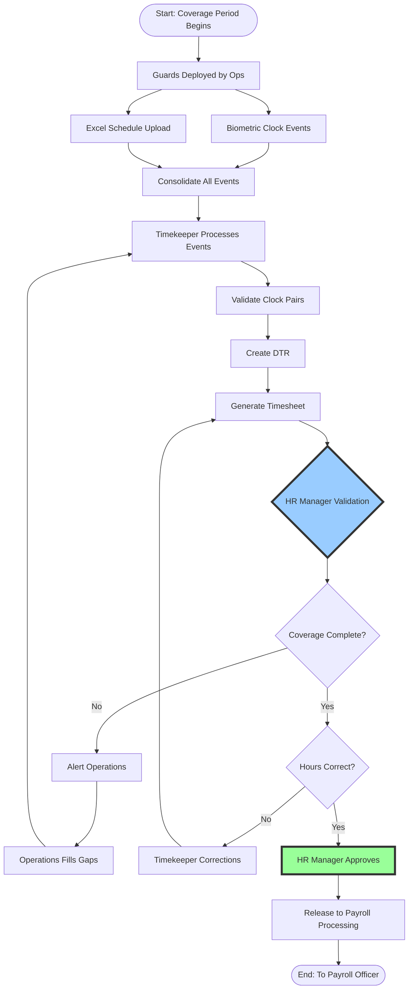
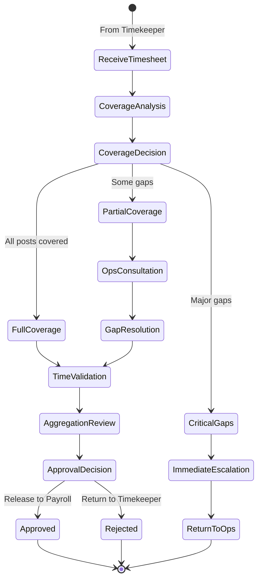
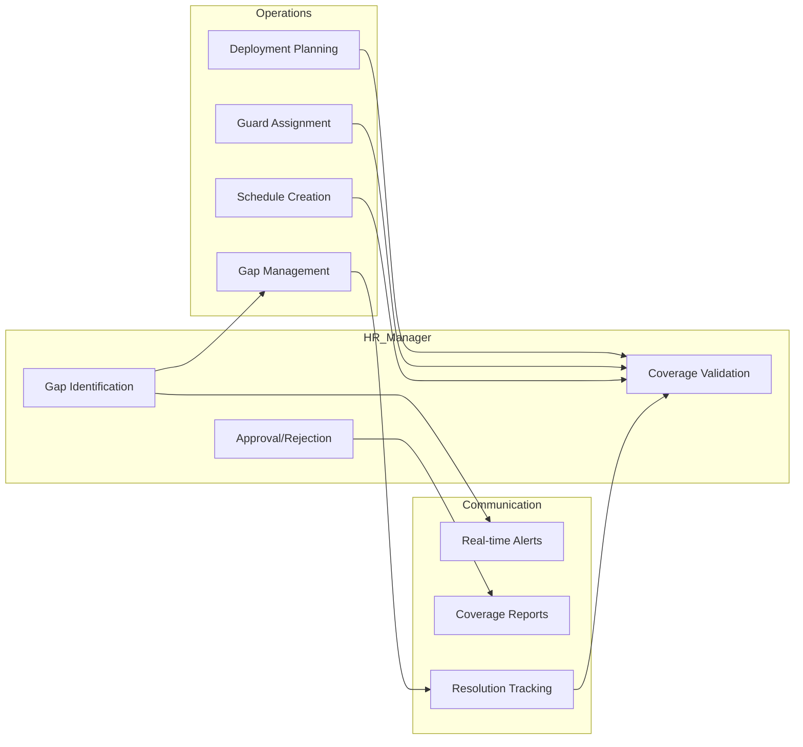
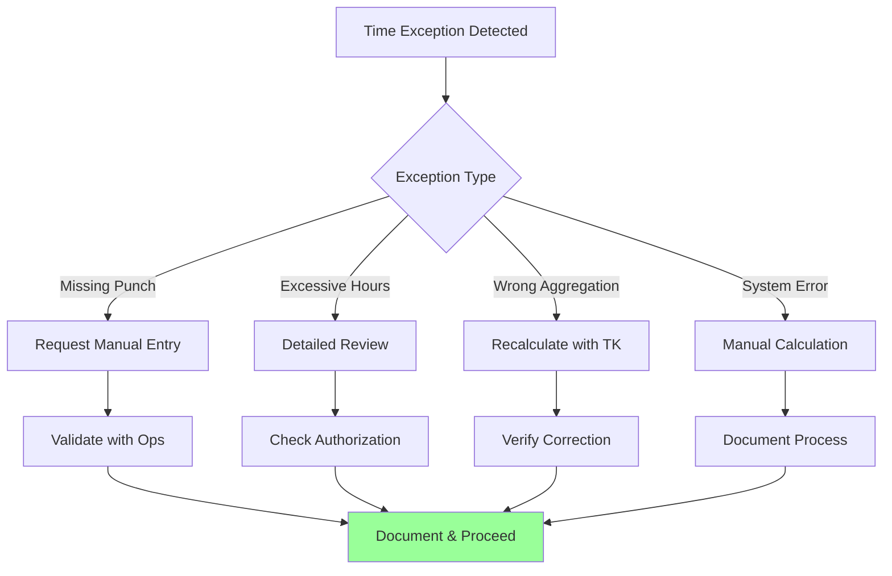
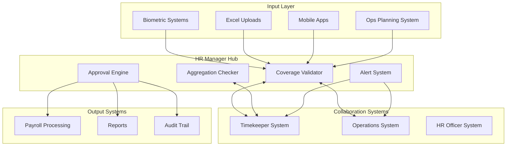

# HR Manager Approval Workflow

## Executive Overview

This document defines the HR Manager's approval workflow for timesheet
management, focusing on coverage validation and time event accuracy. The HR
Manager ensures that all guard posts are adequately covered by Operations and
that clock events (from biometric devices or Excel interfaces) form complete
coverage records. Unlike the Payroll Manager role (which the same person
performs later in the process), the HR Manager role focuses exclusively on
operational coverage and time accuracy, not financial aspects.

## Table of Contents

1. [Workflow Overview](#workflow-overview)
2. [Stage-by-Stage Process](#stage-by-stage-process)
3. [Approval Gates and Decision Points](#approval-gates-and-decision-points)
4. [Coverage Validation Matrix](#coverage-validation-matrix)
5. [Integration with Operations and Timekeeper](#integration-with-operations-and-timekeeper)
6. [Exception Handling](#exception-handling)
7. [SLA and Performance Metrics](#sla-and-performance-metrics)
8. [System Integration](#system-integration)

## 1. Workflow Overview

### 1.1 Complete HR Manager Process Flow



### 1.2 HR Manager Focus Areas

| Focus Area              | Responsibility               | Validation Criteria              | Authority             |
| ----------------------- | ---------------------------- | -------------------------------- | --------------------- |
| **Coverage Validation** | Ensure all posts covered     | Match deployment to clock events | Reject if gaps exist  |
| **Time Accuracy**       | Verify clock events accurate | Complete IN/OUT pairs            | Return for correction |
| **Schedule Compliance** | Confirm schedule adherence   | Match actual vs planned          | Flag deviations       |
| **Aggregation Review**  | Check hour calculations      | Regular, OT, ND totals           | Approve calculations  |

## 2. Stage-by-Stage Process

### 2.1 Stage 1: Coverage Planning & Deployment

```typescript
interface CoverageValidation {
	opsDeployment: {
		plannedCoverage: {
			ships: string[]
			detachments: string[]
			posts: string[]
			shifts: ShiftPattern[]
		}
		actualDeployment: {
			guardsAssigned: Guard[]
			postsStaffed: Post[]
			gapsIdentified: Gap[]
		}
	}

	dataCollection: {
		biometricEvents: ClockEvent[]
		excelUploads: ManualEntry[]
		mobileSync: MobileData[]
	}

	validation: {
		coverageCompleteness: boolean
		allPostsStaffed: boolean
		reliefProvided: boolean
		emergencyCovered: boolean
	}

	output: 'Coverage validation report'
	sla: '4 hours after shift end'
}
```

### 2.2 Stage 2: Clock Event Consolidation

```typescript
interface ClockEventConsolidation {
	responsible: 'HR Manager with Timekeeper'

	sources: {
		biometric: {
			devices: BiometricDevice[]
			events: ClockEvent[]
			syncStatus: 'real-time' | 'batch'
		}
		excel: {
			uploads: ExcelFile[]
			entries: ManualClockEntry[]
			approver: 'Operations Officer'
		}
	}

	consolidation: {
		mergeStrategy: 'Combine all sources'
		duplicateHandling: 'Keep earliest valid'
		gapIdentification: 'Flag missing events'
		pairMatching: 'Create IN/OUT pairs'
	}

	output: 'Consolidated clock events'
	sla: '2 hours after data receipt'
}
```

### 2.3 Stage 3: HR Manager Coverage Review

```typescript
interface HRManagerCoverageReview {
	reviewer: 'HR Manager'

	coverageValidation: {
		ships: {
			checkAllShipsCovered: boolean
			verifyGuardPresence: boolean
			validateShiftHandover: boolean
		}
		detachments: {
			checkAllDetachmentsCovered: boolean
			verifyMinimumStaffing: boolean
			confirmReliefAvailable: boolean
		}
		specialPosts: {
			validateCriticalPosts: boolean
			checkQualifiedGuards: boolean
			verifyBackupCoverage: boolean
		}
	}

	actions: {
		fullCoverage: {
			action: 'Proceed to hour validation'
			documentation: 'Coverage certificate'
		}
		gapsFound: {
			action: 'Alert Operations immediately'
			requirement: 'List specific gaps'
			escalation: 'Operations Manager'
			sla: '30 minutes'
		}
	}

	collaborationWithOps: {
		communication: 'Real-time updates'
		gapResolution: 'Joint problem solving'
		documentation: 'Coverage decisions'
	}
}
```

### 2.4 Stage 4: Time Aggregation Validation

```typescript
interface TimeAggregationValidation {
	reviewer: 'HR Manager'

	aggregationChecks: {
		regularHours: {
			validation: 'Within normal shift hours'
			maximum: '8-12 hours per day'
			calculation: 'Based on schedule'
		}
		overtime: {
			validation: 'Authorized overtime only'
			documentation: 'OT authorization required'
			limits: 'Per company policy'
		}
		nightDifferential: {
			validation: '10PM-6AM hours'
			calculation: 'Automatic based on clock'
			verification: 'Cross-check with schedule'
		}
		holidays: {
			validation: 'Holiday schedule compliance'
			premium: 'Holiday rate applicable'
			coverage: 'Essential services maintained'
		}
	}

	collaborationWithTimekeeper: {
		corrections: 'Direct feedback loop'
		clarifications: 'Quick resolution'
		documentation: 'Change justification'
	}

	decision: {
		approve: 'Release to payroll processing'
		reject: 'Return with specific issues'
		conditional: 'Approve with noted exceptions'
	}
}
```

## 3. Approval Gates and Decision Points

### 3.1 HR Manager Decision Matrix

| Scenario                     | Auto-Approve | Review Required | Reject | Alert Ops |
| ---------------------------- | ------------ | --------------- | ------ | --------- |
| All posts covered            | ✓            |                 |        |           |
| Minor gap (<2 hrs)           |              | ✓               |        | ✓         |
| Major gap (>2 hrs)           |              |                 | ✓      | ✓         |
| Complete clock pairs         | ✓            |                 |        |           |
| Missing punches documented   |              | ✓               |        |           |
| Missing punches undocumented |              |                 | ✓      |           |
| Normal hour aggregation      | ✓            |                 |        |           |
| Excessive OT (>20 hrs/week)  |              | ✓               |        | ✓         |
| Unauthorized OT              |              |                 | ✓      | ✓         |

### 3.2 Coverage Validation Workflow



## 4. Coverage Validation Matrix

### 4.1 Coverage Requirements by Location

| Location Type               | Minimum Coverage | Relief Required | Critical Hours | Escalation Time |
| --------------------------- | ---------------- | --------------- | -------------- | --------------- |
| Ships - Active              | 24/7             | Every 8 hours   | All hours      | Immediate       |
| Ships - Docked              | 24/7             | Every 12 hours  | Night hours    | 30 minutes      |
| Detachments - High Security | 24/7             | Every 8 hours   | All hours      | Immediate       |
| Detachments - Standard      | Business hours   | As scheduled    | Peak hours     | 1 hour          |
| Special Posts               | As designated    | Per contract    | Varies         | 30 minutes      |

### 4.2 Clock Event Validation Rules

```typescript
interface ClockEventValidationRules {
	pairValidation: {
		complete: 'Every IN has matching OUT'
		sequence: 'IN before OUT chronologically'
		duration: 'Shift length within limits'
		gaps: 'No unexplained gaps > 30 min'
	}

	coverageValidation: {
		overlap: 'Minimum 15 min handover'
		continuous: 'No post left unmanned'
		backup: 'Relief guard available'
		emergency: 'Contingency activated'
	}

	exceptionHandling: {
		missingIN: 'Check previous shift OUT'
		missingOUT: 'Check next shift IN'
		deviceFailure: 'Accept manual entry'
		powerOutage: 'Excel backup required'
	}
}
```

## 5. Integration with Operations and Timekeeper

### 5.1 HR Manager ↔ Operations Integration



### 5.2 HR Manager ↔ Timekeeper Collaboration

```typescript
interface HRTimekeeperCollaboration {
	dataFlow: {
		fromTimekeeper: {
			timesheets: ProcessedTimesheet[]
			dtrs: DailyTimeRecord[]
			aggregations: HourSummary[]
			anomalies: AnomalyReport[]
		}
		toTimekeeper: {
			corrections: CorrectionRequest[]
			clarifications: InformationRequest[]
			approvals: ApprovalCertificate[]
			rejections: RejectionNotice[]
		}
	}

	communicationProtocol: {
		regularReview: 'Daily at shift end'
		urgentIssues: 'Immediate notification'
		corrections: 'Within 2 hours'
		escalation: 'If unresolved > 4 hours'
	}

	sharedResponsibilities: {
		accuracy: 'Joint accountability'
		timeliness: 'Meet SLA together'
		documentation: 'Complete audit trail'
		improvement: 'Process optimization'
	}
}
```

### 5.3 HR Manager ↔ HR Officer Coordination

```typescript
interface HRManagerOfficerCoordination {
	hrOfficerSupport: {
		leaveManagement: 'Validate approved leaves'
		scheduleUpdates: 'Communicate changes'
		specialArrangements: 'Document exceptions'
		employeeQueries: 'Resolve time disputes'
	}

	hrManagerOversight: {
		policyCompliance: 'Ensure adherence'
		exceptionApproval: 'Authorize deviations'
		disputeResolution: 'Final decision'
		processImprovement: 'Drive optimization'
	}

	collaboration: {
		dailySync: 'Morning briefing'
		issueResolution: 'Joint problem solving'
		documentation: 'Shared repository'
		reporting: 'Consolidated metrics'
	}
}
```

## 6. Exception Handling

### 6.1 Coverage Exception Protocols

```typescript
interface CoverageExceptionProtocols {
	criticalGaps: {
		definition: 'Post unmanned > 30 minutes'
		action: 'Immediate Ops alert'
		resolution: 'Deploy nearest available'
		documentation: 'Incident report required'
		escalation: 'Operations Manager + Security'
	}

	minorGaps: {
		definition: 'Brief unmanned periods < 30 min'
		action: 'Note in approval'
		resolution: 'Adjust next schedule'
		documentation: 'Log occurrence'
		pattern: 'Track for trends'
	}

	deviceFailures: {
		biometricDown: 'Switch to manual immediately'
		excelBackup: 'Ops Officer validates'
		mobileOffline: 'Accept paper logs'
		systemOutage: 'Emergency protocol activated'
	}

	staffingIssues: {
		noShow: 'Alert Ops for replacement'
		sickLeave: 'Activate standby guard'
		emergency: 'Pull from other posts'
		insufficient: 'Overtime authorization'
	}
}
```

### 6.2 Time Aggregation Exceptions



## 7. SLA and Performance Metrics

### 7.1 Service Level Agreements

| Process Stage           | Responsible     | Standard SLA | Critical SLA | Escalation  |
| ----------------------- | --------------- | ------------ | ------------ | ----------- |
| Coverage Validation     | HR Manager      | 4 hours      | 1 hour       | Ops Manager |
| Gap Identification      | HR Manager      | 30 minutes   | Immediate    | Ops Manager |
| Time Aggregation Review | HR Manager      | 2 hours      | 1 hour       | Auto-alert  |
| Timesheet Approval      | HR Manager      | 24 hours     | 8 hours      | Payroll Mgr |
| Correction Processing   | HR Manager + TK | 4 hours      | 2 hours      | Ops Manager |
| Final Release           | HR Manager      | 1 hour       | 30 minutes   | System      |

### 7.2 HR Manager KPIs

```typescript
interface HRManagerKPIs {
	coverage: {
		postsFullyCovered: 'Percentage with no gaps'
		gapResponseTime: 'Average time to fill gaps'
		coverageContinuity: 'Uninterrupted coverage rate'
		emergencyResponse: 'Critical post protection'
	}

	accuracy: {
		firstPassApproval: 'Timesheets approved without correction'
		aggregationAccuracy: 'Correct hour calculations'
		scheduleCompliance: 'Actual vs planned adherence'
		documentationComplete: 'All events documented'
	}

	collaboration: {
		opsCoordination: 'Gap resolution efficiency'
		timekeeperSupport: 'Correction turnaround'
		hrOfficerAlignment: 'Policy compliance rate'
		teamSatisfaction: 'Internal service rating'
	}

	efficiency: {
		approvalCycleTime: 'Total review duration'
		batchProcessing: 'Timesheets per session'
		exceptionHandling: 'Issues resolved quickly'
		slaCompliance: 'Meeting time targets'
	}
}
```

### 7.3 Coverage Dashboard Metrics

```typescript
interface CoverageDashboard {
	realTime: {
		currentCoverage: {
			ships: CoverageStatus[]
			detachments: CoverageStatus[]
			specialPosts: CoverageStatus[]
		}
		activeGaps: Gap[]
		pendingApprovals: number
		criticalAlerts: Alert[]
	}

	daily: {
		coverageRate: number // percentage
		gapsEncountered: number
		gapsResolved: number
		averageResolutionTime: number
		timesheetsProcessed: number
	}

	weekly: {
		coverageTrends: Trend[]
		recurringGaps: Pattern[]
		overtimeUtilization: number
		complianceScore: number
	}

	monthly: {
		overallCoverage: number
		criticalIncidents: number
		processImprovements: Improvement[]
		teamPerformance: Metrics[]
	}
}
```

## 8. System Integration

### 8.1 Integration Architecture



### 8.2 Data Flow Specifications

```typescript
interface HRManagerDataFlow {
	inbound: {
		fromBiometric: {
			frequency: 'Real-time'
			format: 'Clock events'
			validation: 'Device authentication'
		}
		fromExcel: {
			frequency: 'Per shift'
			format: 'Structured upload'
			validation: 'Ops Officer approved'
		}
		fromTimekeeper: {
			frequency: 'After processing'
			format: 'Timesheets + DTRs'
			validation: 'Calculations complete'
		}
		fromOperations: {
			frequency: 'Daily + updates'
			format: 'Deployment schedules'
			validation: 'Approved rosters'
		}
	}

	processing: {
		coverageValidation: 'Match deployment to events'
		gapDetection: 'Identify unmanned periods'
		aggregationReview: 'Verify calculations'
		exceptionHandling: 'Resolve issues'
	}

	outbound: {
		toPayroll: {
			trigger: 'HR approval'
			format: 'Approved timesheets'
			includes: 'Coverage certificate'
		}
		toOperations: {
			trigger: 'Gap detected'
			format: 'Alert + details'
			urgency: 'Based on criticality'
		}
		toTimekeeper: {
			trigger: 'Corrections needed'
			format: 'Specific issues'
			sla: 'Within 2 hours'
		}
	}
}
```

### 8.3 Audit Requirements

```typescript
interface HRManagerAuditTrail {
	mandatory: {
		approvalDecisions: {
			timestamp: Date
			decision: 'Approved' | 'Rejected' | 'Returned'
			reason: string
			affectedTimesheets: string[]
		}

		coverageValidations: {
			periodsReviewed: Period[]
			gapsIdentified: Gap[]
			resolutionActions: Action[]
			finalStatus: CoverageStatus
		}

		corrections: {
			original: any
			corrected: any
			justification: string
			approver: string
		}
	}

	tracking: {
		slaCompliance: 'All approval times'
		collaborations: 'Inter-role communications'
		exceptions: 'All exception handling'
		patterns: 'Recurring issues'
	}

	retention: {
		operational: '90 days active'
		archive: '7 years storage'
		access: 'Read-only after 30 days'
		format: 'Immutable log'
	}
}
```

## 9. Collaboration Protocols

### 9.1 Daily Operations Sync

```typescript
interface DailyOperationsSync {
	participants: ['HR Manager', 'Operations Manager', 'Timekeeper Lead']

	timing: {
		morning: '07:00 - Previous day review'
		afternoon: '15:00 - Current status'
		evening: '23:00 - Night shift check'
	}

	agenda: {
		coverageStatus: 'Current gaps and fills'
		upcomingChallenges: 'Next 24-hour view'
		pendingIssues: 'Unresolved from previous'
		processImprovements: 'Optimization ideas'
	}

	outputs: {
		actionItems: 'Assigned with deadlines'
		decisions: 'Documented approvals'
		escalations: 'Issues requiring higher authority'
	}
}
```

### 9.2 Weekly Review Meeting

```typescript
interface WeeklyReviewMeeting {
  participants: [
    'HR Manager',
    'Payroll Manager', // Same person, different perspective
    'Operations Manager',
    'Timekeeper Supervisor',
    'HR Officer'
  ]

  reviewItems: {
    coverageMetrics: 'Week's performance'
    exceptions: 'Patterns and resolutions'
    slaPerformance: 'Target achievement'
    processIssues: 'Systemic problems'
    improvements: 'Implemented and planned'
  }

  decisions: {
    policyAdjustments: 'Coverage rules updates'
    processChanges: 'Workflow modifications'
    trainingNeeds: 'Skill gap addressing'
    systemEnhancements: 'Technical improvements'
  }
}
```

## 10. Conclusion

The HR Manager approval workflow ensures comprehensive coverage validation and
accurate time aggregation before payroll processing. Key success factors
include:

1. **Coverage Focus**: Primary responsibility for ensuring all posts are manned
2. **Operations Partnership**: Close collaboration with Ops for gap resolution
3. **Timekeeper Support**: Working together for accurate time records
4. **Clear Boundaries**: No involvement in financial aspects (Payroll Manager
   role)
5. **Rapid Response**: Quick identification and resolution of coverage gaps
6. **Quality Gates**: Preventing incomplete or inaccurate data from entering
   payroll
7. **Documentation**: Complete audit trail of all decisions and actions

The HR Manager serves as the critical first gate in the payroll process,
ensuring operational integrity and time accuracy while working closely with
Operations and the Timekeeper to maintain continuous coverage across all guard
posts.

---

_Document Version: 1.0_ _Last Updated: [Current Date]_ _Process Owner: HR
Department_ _Review Cycle: Quarterly_
