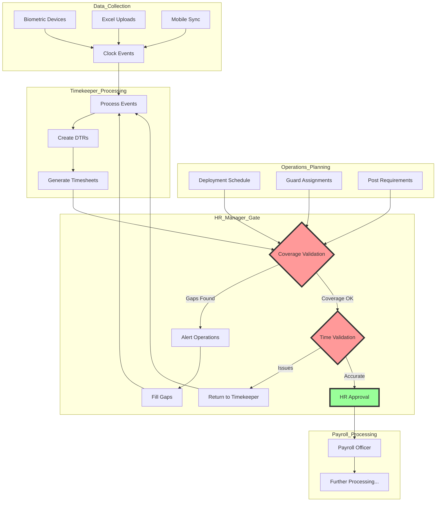
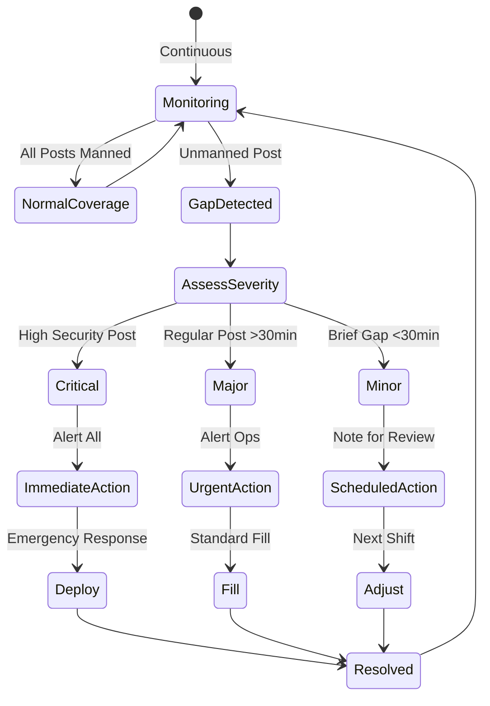
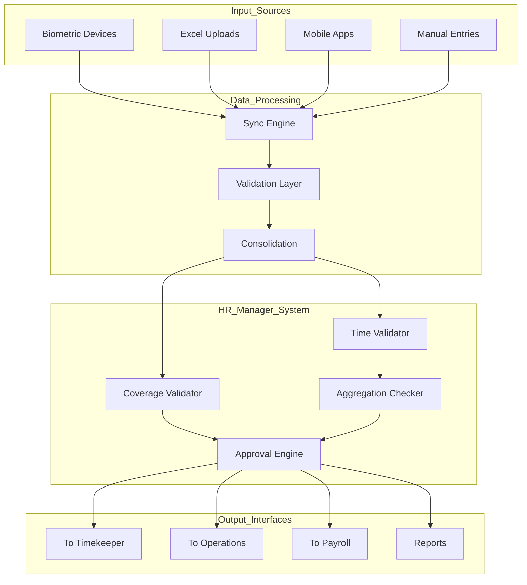

# HR Manager Integration Document

## Executive Summary

This document comprehensively integrates the **HR Manager** role into the
timesheet approval and coverage validation system. The HR Manager serves as the
**first approval gate** for all timesheets, ensuring complete coverage of guard
posts and accurate time aggregation before payroll processing begins. The HR
Manager works closely with Operations (for coverage) and the Timekeeper (for
time accuracy), focusing exclusively on operational aspects rather than
financial considerations.

**Critical Note**: The HR Manager and Payroll Manager roles are performed by the
**same person** at different stages of the process. This document focuses on the
HR Manager responsibilities during the timesheet approval stage.

## Table of Contents

1. [Role Definition and Core Responsibilities](#role-definition-and-core-responsibilities)
2. [Workflow Integration](#workflow-integration)
3. [Database Schema for HR Manager](#database-schema-for-hr-manager)
4. [User Interface Specifications](#user-interface-specifications)
5. [Coverage Validation Process](#coverage-validation-process)
6. [Integration with Other Roles](#integration-with-other-roles)
7. [System Integration Points](#system-integration-points)
8. [Implementation Guidelines](#implementation-guidelines)

## 1. Role Definition and Core Responsibilities

### 1.1 HR Manager Overview

The HR Manager is the **operational-level approval authority** for timesheets
and coverage validation. This role represents the first quality checkpoint
ensuring that:

- All guard posts maintain continuous coverage
- Clock events from all sources are consolidated correctly
- Time aggregations (regular, overtime, night differential) are accurate
- Operational compliance is maintained

#### Key Characteristics:

- **Coverage Guardian**: Ensures no post is left unmanned
- **Time Accuracy Validator**: Confirms clock events are complete and paired
- **Operations Liaison**: Works directly with Ops for gap resolution
- **Timekeeper Collaborator**: Partners for accurate time processing
- **Non-Financial Focus**: No involvement in rates, pay, or costs

### 1.2 Primary Responsibilities

#### Coverage Management:

- Validate all ships and detachments have guards deployed
- Identify coverage gaps in real-time
- Coordinate with Operations for immediate gap filling
- Ensure handover overlaps between shifts
- Monitor critical posts for continuous manning

#### Time Event Validation:

- Review consolidated clock events from all sources
- Ensure complete IN/OUT pairs for all guards
- Validate time aggregations (regular, OT, ND, holiday)
- Identify and flag anomalies or patterns
- Approve or reject timesheets based on completeness

#### Collaboration:

- Real-time communication with Operations Manager
- Direct feedback loop with Timekeeper
- Coordination with HR Officer for leave/schedule impacts
- Escalation to Payroll Manager (same person, different hat) when needed

### 1.3 What HR Manager Does NOT Handle

To maintain clear role boundaries, the HR Manager explicitly does NOT:

- Calculate or review payment amounts
- Process deductions or allowances
- Make financial decisions
- Approve payroll disbursements (Payroll Manager role)
- Handle rate negotiations or changes

## 2. Workflow Integration

### 2.1 HR Manager in the Complete Process



### 2.2 Approval Authority Matrix

| Scenario                          | HR Manager Action      | Collaboration Required       | Escalation Path          |
| --------------------------------- | ---------------------- | ---------------------------- | ------------------------ |
| Complete coverage, accurate times | Approve                | None                         | None                     |
| Minor coverage gap (<30 min)      | Conditional Approval   | Notify Operations            | Document only            |
| Major coverage gap (>30 min)      | Reject                 | Operations immediate action  | Ops Manager              |
| Missing clock events              | Return to Timekeeper   | Timekeeper + Guard           | If unresolved            |
| Excessive overtime                | Review & Flag          | Operations for justification | Note for Payroll Manager |
| System discrepancies              | Hold for investigation | IT + Timekeeper              | Technical team           |

### 2.3 Daily Workflow Timeline

```typescript
interface DailyHRManagerWorkflow {
	'06:00': {
		activity: 'Review night shift coverage'
		focus: 'Overnight gaps or issues'
		action: 'Address critical items'
	}

	'08:00': {
		activity: 'Morning sync with Operations'
		focus: 'Previous day wrap-up'
		action: 'Plan current day coverage'
	}

	'10:00-14:00': {
		activity: 'Process morning shift timesheets'
		focus: 'Validate and approve/reject'
		action: 'Collaborate with Timekeeper'
	}

	'15:00': {
		activity: 'Afternoon Operations check'
		focus: 'Current coverage status'
		action: 'Proactive gap prevention'
	}

	'16:00-18:00': {
		activity: 'Process day shift timesheets'
		focus: 'Complete validations'
		action: 'Prepare for next day'
	}

	'20:00': {
		activity: 'Evening coverage review'
		focus: 'Night shift deployment'
		action: 'Ensure overnight coverage'
	}
}
```

## 3. Database Schema for HR Manager

### 3.1 Coverage Validation Table

```sql
CREATE TABLE CoverageValidation (
    id VARCHAR PRIMARY KEY,
    validationDate DATE NOT NULL,
    shiftId VARCHAR NOT NULL,
    locationId VARCHAR NOT NULL,
    locationType ENUM('SHIP', 'DETACHMENT', 'SPECIAL_POST'),

    -- Coverage Status
    plannedGuards INT NOT NULL,
    actualGuards INT NOT NULL,
    coverageStatus ENUM('FULL', 'PARTIAL', 'CRITICAL_GAP'),
    gapDuration INT, -- in minutes

    -- Validation Details
    hrManagerId VARCHAR NOT NULL,
    validationTime TIMESTAMP,
    validationNotes TEXT,

    -- Resolution
    gapResolved BOOLEAN DEFAULT FALSE,
    resolutionTime TIMESTAMP,
    resolutionMethod TEXT,

    FOREIGN KEY (shiftId) REFERENCES Shift(id),
    FOREIGN KEY (locationId) REFERENCES Location(id),
    FOREIGN KEY (hrManagerId) REFERENCES User(id),
    INDEX idx_coverage_date (validationDate),
    INDEX idx_coverage_status (coverageStatus)
);
```

### 3.2 Timesheet Approval Table

```sql
CREATE TABLE TimesheetApproval (
    id VARCHAR PRIMARY KEY,
    timesheetId VARCHAR NOT NULL,
    guardId VARCHAR NOT NULL,
    payPeriodId VARCHAR NOT NULL,

    -- HR Manager Review
    hrReviewStatus ENUM('PENDING', 'APPROVED', 'REJECTED', 'RETURNED'),
    hrReviewDate TIMESTAMP,
    hrManagerId VARCHAR,

    -- Coverage Validation
    coverageComplete BOOLEAN,
    coverageGaps TEXT,

    -- Time Validation
    clockPairsComplete BOOLEAN,
    regularHours DECIMAL(5,2),
    overtimeHours DECIMAL(5,2),
    nightDiffHours DECIMAL(5,2),
    holidayHours DECIMAL(5,2),

    -- Issues and Corrections
    issuesFound TEXT,
    correctionsRequested TEXT,
    correctionsMade TEXT,

    -- Collaboration Tracking
    timekeeperNotified BOOLEAN DEFAULT FALSE,
    operationsAlerted BOOLEAN DEFAULT FALSE,

    FOREIGN KEY (timesheetId) REFERENCES Timesheet(id),
    FOREIGN KEY (guardId) REFERENCES Guard(id),
    FOREIGN KEY (payPeriodId) REFERENCES PayPeriod(id),
    FOREIGN KEY (hrManagerId) REFERENCES User(id),
    INDEX idx_hr_status (hrReviewStatus),
    INDEX idx_period (payPeriodId)
);
```

### 3.3 HR-Operations Collaboration Table

```sql
CREATE TABLE HROperationsCollaboration (
    id VARCHAR PRIMARY KEY,
    collaborationType ENUM('GAP_ALERT', 'COVERAGE_REQUEST', 'SCHEDULE_CONFLICT', 'EMERGENCY'),
    initiatedBy VARCHAR NOT NULL,
    initiatedDate TIMESTAMP,

    -- Issue Details
    locationId VARCHAR,
    shiftId VARCHAR,
    issueDescription TEXT NOT NULL,
    priority ENUM('CRITICAL', 'HIGH', 'MEDIUM', 'LOW'),

    -- Resolution
    assignedTo VARCHAR,
    resolutionStatus ENUM('OPEN', 'IN_PROGRESS', 'RESOLVED', 'ESCALATED'),
    resolutionNotes TEXT,
    resolvedDate TIMESTAMP,

    -- SLA Tracking
    slaTarget TIMESTAMP,
    slamet BOOLEAN,

    FOREIGN KEY (initiatedBy) REFERENCES User(id),
    FOREIGN KEY (assignedTo) REFERENCES User(id),
    INDEX idx_status (resolutionStatus),
    INDEX idx_priority (priority)
);
```

## 4. User Interface Specifications

### 4.1 HR Manager Coverage Dashboard

```typescript
interface CoverageDashboard {
	header: {
		currentDate: Date
		activeShifts: number
		coverageScore: number // percentage
		criticalAlerts: Alert[]
	}

	coverageMap: {
		ships: {
			total: number
			covered: number
			gaps: ShipGap[]
			status: 'GREEN' | 'YELLOW' | 'RED'
		}
		detachments: {
			total: number
			covered: number
			gaps: DetachmentGap[]
			status: 'GREEN' | 'YELLOW' | 'RED'
		}
		specialPosts: {
			total: number
			covered: number
			critical: CriticalPost[]
			status: 'GREEN' | 'YELLOW' | 'RED'
		}
	}

	timesheetQueue: {
		pending: number
		inReview: number
		approved: number
		rejected: number
		returned: number
	}

	collaborationPanel: {
		activeWithOps: number
		activeWithTimekeeper: number
		pendingResponses: number
		escalations: number
	}

	quickActions: [
		'Review Pending Timesheets',
		'Check Coverage Gaps',
		'Message Operations',
		'View Anomaly Report',
	]
}
```

### 4.2 Timesheet Review Interface

```typescript
interface TimesheetReviewScreen {
	guard: {
		id: string
		name: string
		post: string
		shift: string
		schedule: Schedule
	}

	clockEvents: {
		source: 'BIOMETRIC' | 'MANUAL' | 'MOBILE'
		events: Array<{
			type: 'IN' | 'OUT'
			time: DateTime
			location: string
			device: string
		}>
		pairs: ClockPair[]
		unpaired: ClockEvent[]
	}

	aggregation: {
		regularHours: {
			calculated: number
			scheduled: number
			variance: number
		}
		overtime: {
			hours: number
			authorized: boolean
			justification: string
		}
		nightDifferential: {
			hours: number
			rate: number
		}
		holiday: {
			applicable: boolean
			hours: number
		}
	}

	validationChecks: {
		coverageComplete: CheckResult
		clockPairsValid: CheckResult
		scheduleCompliance: CheckResult
		overtimeAuthorized: CheckResult
		documentationComplete: CheckResult
	}

	actions: {
		approve: () => void
		reject: (reason: string) => void
		returnToTimekeeper: (issues: Issue[]) => void
		alertOperations: (gap: Gap) => void
		requestInfo: (from: Role, query: string) => void
	}
}
```

### 4.3 Gap Management Interface

```typescript
interface GapManagementInterface {
	activeGaps: Array<{
		id: string
		location: string
		post: string
		startTime: DateTime
		duration: number
		severity: 'CRITICAL' | 'HIGH' | 'MEDIUM' | 'LOW'
		status: 'OPEN' | 'FILLING' | 'RESOLVED'
	}>

	availableGuards: Array<{
		id: string
		name: string
		currentLocation: string
		availability: 'IMMEDIATE' | 'SOON' | 'LATER'
		qualifications: string[]
	}>

	fillOptions: {
		reassign: (guardId: string, toPost: string) => void
		callStandby: (standbyList: Guard[]) => void
		authorizeOvertime: (guardId: string) => void
		mergeShifts: (shift1: string, shift2: string) => void
	}

	communication: {
		notifyOps: (message: string, priority: Priority) => void
		updateGuard: (guardId: string, instruction: string) => void
		escalate: (to: Role, issue: string) => void
	}
}
```

## 5. Coverage Validation Process

### 5.1 Real-Time Coverage Monitoring



### 5.2 Coverage Validation Rules

```typescript
interface CoverageValidationRules {
	ships: {
		minimumGuards: 2 // per ship
		handoverOverlap: 15 // minutes
		maxGapAllowed: 0 // zero tolerance
		criticalHours: '18:00-06:00'
		escalationTime: 'Immediate'
	}

	detachments: {
		highSecurity: {
			minimumGuards: 3
			maxGapAllowed: 0
			backupRequired: true
		}
		standard: {
			minimumGuards: 1
			maxGapAllowed: 30 // minutes
			backupRequired: false
		}
	}

	specialPosts: {
		vip: {
			minimumGuards: 4
			rotation: '6 hours'
			overlap: 30 // minutes
		}
		gate: {
			minimumGuards: 2
			continuous: true
			meal_relief: true
		}
	}

	validation: {
		checkFrequency: '15 minutes'
		alertThreshold: 'Any gap detected'
		escalationMatrix: {
			minor: 'Ops Supervisor'
			major: 'Ops Manager'
			critical: 'Ops Manager + Security Chief'
		}
	}
}
```

## 6. Integration with Other Roles

### 6.1 HR Manager ↔ Operations Manager

```typescript
interface HROperationsIntegration {
	communication: {
		channels: ['System Alerts', 'SMS', 'Radio', 'Dashboard']
		frequency: 'Real-time for gaps, hourly for status'
		escalation: 'Automatic after SLA breach'
	}

	sharedResponsibilities: {
		coveragePlanning: {
			ops: 'Create deployment schedule'
			hr: 'Validate actual coverage'
			joint: 'Resolve discrepancies'
		}
		gapManagement: {
			hr: 'Detect and alert'
			ops: 'Fill and resolve'
			joint: 'Document and prevent'
		}
		emergencyResponse: {
			hr: 'Identify critical gap'
			ops: 'Deploy immediate solution'
			joint: 'Post-incident review'
		}
	}

	dataExchange: {
		fromOps: {
			deploymentSchedule: Schedule[]
			guardAssignments: Assignment[]
			leaveApprovals: Leave[]
			standbyList: Guard[]
		}
		toOps: {
			coverageGaps: Gap[]
			overtimeRequests: OTRequest[]
			anomalies: Anomaly[]
			performance: Metrics
		}
	}
}
```

### 6.2 HR Manager ↔ Timekeeper

```typescript
interface HRTimekeeperIntegration {
	collaboration: {
		timesheetReview: {
			timekeeper: 'Prepare and submit'
			hrManager: 'Validate and approve'
			iteration: 'Until accurate'
		}

		corrections: {
			hrIdentifies: 'Specific issues'
			timekeeperCorrects: 'Makes adjustments'
			hrRevalidates: 'Confirms accuracy'
			maxIterations: 3
		}

		aggregationValidation: {
			timekeeper: 'Calculate hours'
			hrManager: 'Verify totals'
			disputes: 'Joint resolution'
		}
	}

	slaAgreement: {
		initialSubmission: '24 hours after period'
		hrReview: '4 hours from receipt'
		corrections: '2 hours turnaround'
		finalApproval: '48 hours total'
	}

	qualityMetrics: {
		firstPassAccuracy: 'Target 95%'
		correctionRate: 'Track patterns'
		processingTime: 'Monitor efficiency'
		collaboration: 'Satisfaction scores'
	}
}
```

### 6.3 HR Manager ↔ HR Officer

```typescript
interface HRManagerOfficerIntegration {
	hrOfficerSupport: {
		scheduleManagement: {
			officer: 'Maintain schedules'
			manager: 'Validate compliance'
		}
		leaveCoordination: {
			officer: 'Process leave requests'
			manager: 'Ensure coverage maintained'
		}
		employeeIssues: {
			officer: 'Initial handling'
			manager: 'Escalated resolution'
		}
	}

	informationFlow: {
		fromOfficer: {
			approvedLeaves: Leave[]
			scheduleChanges: Change[]
			employeeConcerns: Issue[]
			trainingSchedule: Training[]
		}
		toOfficer: {
			coverageRequirements: Requirement[]
			timesheetIssues: Issue[]
			policyGuidance: Policy[]
			performanceData: Metrics[]
		}
	}

	jointResponsibilities: {
		policyImplementation: 'Consistent application'
		employeeRelations: 'Unified approach'
		documentation: 'Comprehensive records'
		compliance: 'Regulatory adherence'
	}
}
```

## 7. System Integration Points

### 7.1 Input Systems Integration



### 7.2 API Specifications

```typescript
interface HRManagerAPIs {
	coverage: {
		endpoint: '/api/coverage/validate'
		method: 'POST'
		payload: {
			date: Date
			shift: string
			location: string
		}
		response: {
			status: CoverageStatus
			gaps: Gap[]
			recommendations: Action[]
		}
	}

	timesheetApproval: {
		endpoint: '/api/timesheets/approve'
		method: 'PUT'
		payload: {
			timesheetId: string
			decision: 'APPROVE' | 'REJECT' | 'RETURN'
			notes: string
			issues?: Issue[]
		}
		response: {
			success: boolean
			nextStep: string
			notifications: Notification[]
		}
	}

	gapAlert: {
		endpoint: '/api/gaps/alert'
		method: 'POST'
		payload: {
			location: string
			severity: Severity
			duration: number
			startTime: DateTime
		}
		response: {
			alertId: string
			notified: Role[]
			eta: DateTime
		}
	}

	collaboration: {
		endpoint: '/api/collaborate'
		method: 'POST'
		payload: {
			to: Role
			type: 'QUERY' | 'ALERT' | 'REQUEST'
			message: string
			priority: Priority
		}
		response: {
			messageId: string
			delivered: boolean
			readReceipt: boolean
		}
	}
}
```

### 7.3 Event-Driven Architecture

```typescript
interface HRManagerEvents {
	published: {
		COVERAGE_GAP_DETECTED: {
			location: string
			severity: Severity
			timestamp: DateTime
		}
		TIMESHEET_APPROVED: {
			timesheetId: string
			guardId: string
			period: string
		}
		TIMESHEET_REJECTED: {
			timesheetId: string
			reason: string
			returnTo: Role
		}
		ANOMALY_DETECTED: {
			type: AnomalyType
			details: string
			action: string
		}
	}

	subscribed: {
		GUARD_DEPLOYED: {
			source: 'Operations'
			handler: 'UpdateCoverage'
		}
		CLOCK_EVENT_RECEIVED: {
			source: 'Biometric'
			handler: 'ProcessEvent'
		}
		TIMESHEET_SUBMITTED: {
			source: 'Timekeeper'
			handler: 'QueueForReview'
		}
		SCHEDULE_CHANGED: {
			source: 'HR Officer'
			handler: 'RecalculateCoverage'
		}
	}

	eventBus: {
		technology: 'Apache Kafka' | 'RabbitMQ'
		retention: '7 days'
		replayable: true
		guaranteed: 'At least once delivery'
	}
}
```

## 8. Implementation Guidelines

### 8.1 System Configuration

```typescript
interface HRManagerConfiguration {
	coverageSettings: {
		checkInterval: 15 // minutes
		gapTolerance: {
			critical: 0 // minutes
			high: 15
			medium: 30
			low: 60
		}
		alertChannels: ['SMS', 'Email', 'Dashboard', 'Push']
		escalationEnabled: true
	}

	approvalSettings: {
		batchProcessing: true
		maxBatchSize: 50
		autoApprovalRules: 'None - all manual'
		returnLimit: 3 // max returns before escalation
	}

	slaConfiguration: {
		coverageValidation: {
			critical: '5 minutes'
			standard: '30 minutes'
		}
		timesheetReview: {
			individual: '10 minutes'
			batch: '2 hours'
		}
		gapResolution: {
			critical: 'Immediate'
			major: '30 minutes'
			minor: '2 hours'
		}
	}

	notificationPreferences: {
		criticalAlerts: {
			channels: ['SMS', 'Phone']
			frequency: 'Immediate'
			escalation: '5 minutes'
		}
		standardAlerts: {
			channels: ['Email', 'Dashboard']
			frequency: 'Batched hourly'
			escalation: '1 hour'
		}
		reports: {
			daily: '08:00'
			weekly: 'Monday 08:00'
			monthly: 'First day 08:00'
		}
	}
}
```

### 8.2 Training Requirements

#### For the HR Manager:

1. **Coverage Management**
   - Understanding deployment requirements
   - Gap detection and severity assessment
   - Escalation procedures
   - Emergency protocols

2. **Timesheet Validation**
   - Clock event processing
   - Time aggregation rules
   - Anomaly detection
   - Approval workflow

3. **System Usage**
   - Dashboard navigation
   - Batch processing
   - Report generation
   - Alert management

4. **Collaboration**
   - Operations coordination
   - Timekeeper partnership
   - Escalation handling
   - Documentation requirements

#### For Supporting Roles:

1. **Operations Team**
   - Understanding HR Manager alerts
   - Gap filling procedures
   - Communication protocols
   - SLA commitments

2. **Timekeeper Team**
   - Submission standards
   - Correction procedures
   - Collaboration expectations
   - Quality metrics

3. **HR Officers**
   - Schedule impact on coverage
   - Leave coordination
   - Information sharing
   - Support procedures

### 8.3 Implementation Phases

#### Phase 1: Foundation (Weeks 1-2)

- Configure HR Manager role in system
- Set up coverage monitoring
- Establish alert mechanisms
- Define validation rules

#### Phase 2: Integration (Weeks 3-4)

- Connect with Operations systems
- Integrate with Timekeeper workflow
- Set up collaboration channels
- Test data flows

#### Phase 3: Training (Weeks 5-6)

- Train HR Manager on all functions
- Train Operations on gap procedures
- Train Timekeeper on quality standards
- Document all procedures

#### Phase 4: Pilot (Weeks 7-8)

- Run parallel validation
- Monitor coverage metrics
- Test escalation procedures
- Gather feedback

#### Phase 5: Go-Live (Week 9+)

- Full implementation
- Monitor performance
- Optimize procedures
- Continuous improvement

### 8.4 Success Metrics

```typescript
interface HRManagerSuccessMetrics {
	coverage: {
		unmannedPostIncidents: 'Target: 0'
		averageGapDuration: 'Target: <15 minutes'
		gapResolutionTime: 'Target: <30 minutes'
		criticalPostCoverage: 'Target: 100%'
	}

	efficiency: {
		timesheetApprovalTime: 'Target: <4 hours'
		firstPassApprovalRate: 'Target: >90%'
		correctionTurnaround: 'Target: <2 hours'
		batchProcessingRate: 'Target: >80%'
	}

	collaboration: {
		opsResponseTime: 'Target: <15 minutes'
		timekeeperAccuracy: 'Target: >95%'
		escalationRate: 'Target: <5%'
		stakeholderSatisfaction: 'Target: >4.5/5'
	}

	compliance: {
		slaAdherence: 'Target: >98%'
		documentationCompleteness: 'Target: 100%'
		auditFindings: 'Target: 0 critical'
		policyCompliance: 'Target: 100%'
	}
}
```

## 9. Business Rules and Policies

### 9.1 Coverage Priority Matrix

| Post Type      | Priority | Min Coverage   | Max Gap | Escalation               |
| -------------- | -------- | -------------- | ------- | ------------------------ |
| VIP Security   | CRITICAL | 100% + backup  | 0 min   | Immediate to all         |
| Ship Bridge    | CRITICAL | 100%           | 0 min   | Immediate to Ops Manager |
| Main Gate      | HIGH     | 100%           | 15 min  | Alert Ops Supervisor     |
| Detachment     | HIGH     | 100%           | 30 min  | Alert Ops Supervisor     |
| Warehouse      | MEDIUM   | Business hours | 1 hour  | Note in report           |
| Admin Building | LOW      | Business hours | 2 hours | Weekly review            |

### 9.2 Validation Rules

```typescript
interface ValidationRules {
	mandatoryChecks: {
		coverageComplete: 'All posts must have guards'
		clockPairsValid: 'Every IN must have OUT'
		scheduleCompliance: 'Match deployment plan'
		documentationPresent: 'All exceptions documented'
	}

	automaticRejection: {
		criticalPostUnmanned: 'Any critical post gap'
		noCLockEvents: 'Guard with no clock data'
		excessiveGaps: 'More than 3 gaps per shift'
		undocumentedOvertime: 'OT without authorization'
	}

	conditionalApproval: {
		minorGaps: 'Note and proceed'
		pendingDocumentation: 'Approve with follow-up'
		systemIssues: 'Manual validation accepted'
	}

	exceptionHandling: {
		powerOutage: 'Accept manual logs'
		deviceFailure: 'Accept supervisor confirmation'
		emergency: 'Expedited approval process'
		naturalDisaster: 'Relaxed validation rules'
	}
}
```

### 9.3 Escalation and Exception Protocols

```typescript
interface EscalationProtocols {
	automaticEscalation: {
		triggers: [
			'Critical post unmanned',
			'Multiple gaps in shift',
			'SLA breach',
			'System failure',
		]
		levels: {
			level1: {
				to: 'Operations Supervisor'
				time: 'Immediate'
				method: 'SMS + System'
			}
			level2: {
				to: 'Operations Manager'
				time: '15 minutes'
				method: 'Phone + SMS'
			}
			level3: {
				to: 'Security Chief + Payroll Manager'
				time: '30 minutes'
				method: 'All channels'
			}
		}
	}

	exceptionProcedures: {
		systemDown: {
			action: 'Switch to manual process'
			authority: 'HR Manager'
			documentation: 'Paper forms'
			recovery: 'Batch upload when restored'
		}
		massAbsence: {
			action: 'Emergency deployment'
			authority: 'Ops Manager + HR Manager'
			protocol: 'Call all standby'
			documentation: 'Incident report'
		}
		disputedTime: {
			action: 'Investigation protocol'
			authority: 'HR Manager'
			evidence: 'CCTV, witness, logs'
			resolution: '48 hours'
		}
	}
}
```

## 10. Conclusion

The HR Manager integration completes the first critical gate in the timesheet
and payroll process. Key aspects of this integration include:

1. **Coverage Focus**: Primary responsibility for ensuring no post is unmanned
2. **Real-Time Monitoring**: Continuous validation of guard deployment
3. **Rapid Response**: Immediate action on coverage gaps
4. **Strong Partnerships**: Close collaboration with Operations and Timekeeper
5. **Clear Boundaries**: No involvement in financial matters
6. **Quality Assurance**: Ensuring accurate data enters payroll system
7. **Efficient Processing**: Streamlined approval workflows
8. **Complete Documentation**: Full audit trail of all decisions

The HR Manager serves as the guardian of operational coverage, working closely
with Operations to ensure continuous protection across all ships, detachments,
and special posts while validating time accuracy with the Timekeeper. This role
is essential for maintaining security service quality and ensuring accurate
timesheet data for payroll processing.

The dual-role approach (same person as Payroll Manager) provides continuity and
comprehensive oversight across the entire payroll process, from initial
timesheet validation to final payment authorization.

## Appendices

### Appendix A: Quick Reference - HR Manager Checklist

Daily Tasks:

- [ ] Morning coverage review
- [ ] Operations sync meeting
- [ ] Process pending timesheets
- [ ] Validate clock events
- [ ] Check aggregations
- [ ] Resolve gaps with Ops
- [ ] Clear corrections with Timekeeper
- [ ] Evening shift verification

### Appendix B: Communication Templates

#### Coverage Gap Alert

```
URGENT: Coverage Gap Detected
Location: [Ship/Detachment/Post]
Duration: [Time]
Severity: [CRITICAL/HIGH/MEDIUM]
Action Required: Deploy guard immediately
Contact: HR Manager at [number]
```

#### Timesheet Return

```
Timesheet Returned for Correction
Guard: [Name]
Period: [Dates]
Issues: [Specific problems]
Required Actions: [Corrections needed]
Deadline: [Time]
Contact: Timekeeper immediately
```

### Appendix C: Emergency Procedures

Critical Coverage Gap:

1. Alert Operations Manager immediately
2. Check standby list
3. Authorize emergency overtime if needed
4. Deploy nearest available guard
5. Document in incident report
6. Review in next day's meeting

---

_Document Version: 1.0_ _Last Updated: [Current Date]_ _Next Review:
[Quarterly]_ _Owner: HR Department - Payroll System Implementation Team_
