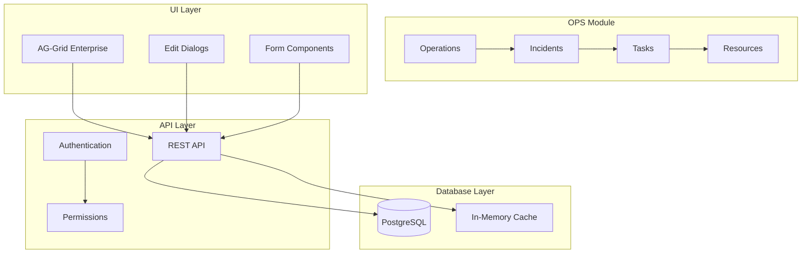
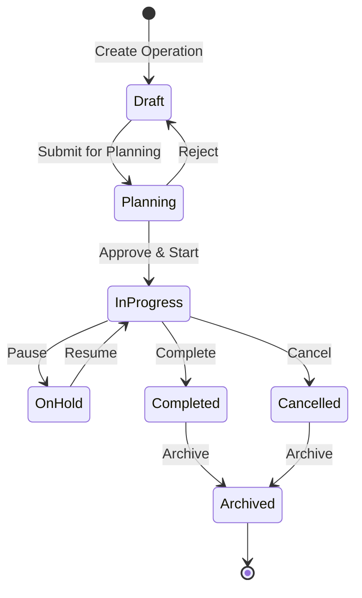
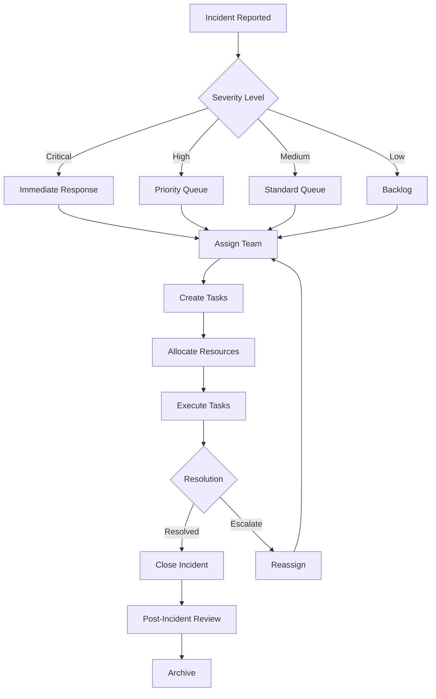
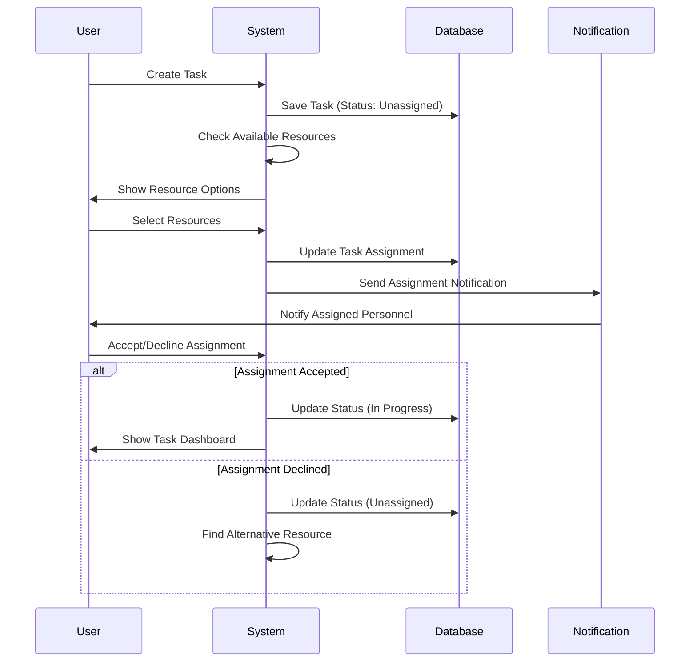
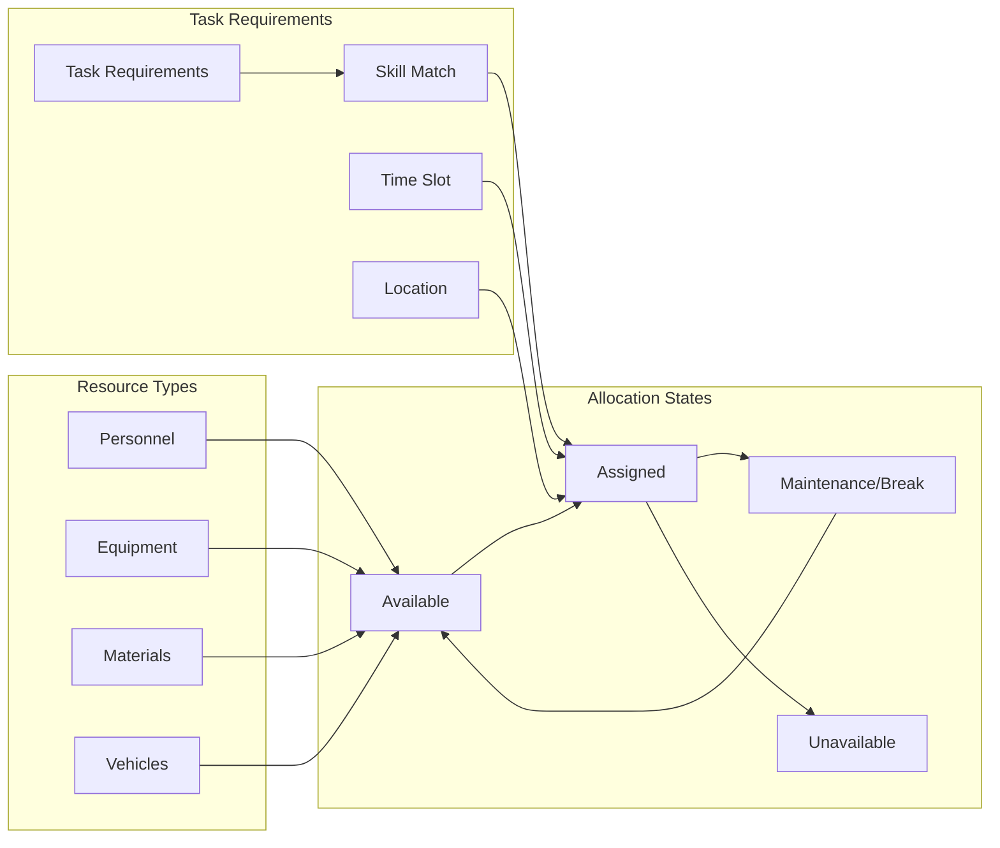

# OPS (Operations) Module Documentation

## Overview

The OPS module provides comprehensive operations management for tracking
operational activities, incidents, tasks, and resources. It follows a
hierarchical structure similar to the timesheet system but focused on
operational workflows.

## Hierarchical Structure

```
Operation (Main Operational Activity)
  └── Incident (Operational Events/Issues)
      └── Task (Specific Actions/Assignments)
          └── Resource (Personnel/Equipment/Materials)
```

## Workflow Diagrams

### 1. OPS Module Architecture



### 2. Operation Lifecycle



### 3. Incident Management Flow



### 4. Task Assignment Workflow



### 5. Resource Allocation Matrix



## Data Model

### Core Entities

#### Operation

- Main operational activity or project
- Contains multiple incidents
- Tracks overall progress and status

#### Incident

- Specific events or issues within an operation
- Can be planned or unplanned
- Contains multiple tasks

#### Task

- Individual work items to resolve incidents
- Assignable to resources
- Trackable with time and progress

#### Resource

- Personnel, equipment, or materials
- Can be assigned to multiple tasks
- Tracks availability and utilization

## UI Components

### 1. Operations Grid (Master)

- Lists all operations with filters
- Expandable to show incidents
- Inline editing capabilities
- Status indicators with colors

### 2. Incidents Grid (Detail Level 1)

- Shows incidents for selected operation
- Severity indicators
- Response time tracking
- Expandable to show tasks

### 3. Tasks Grid (Detail Level 2)

- Lists tasks for selected incident
- Assignment status
- Progress tracking
- Expandable to show resources

### 4. Resources Grid (Detail Level 3)

- Shows resources assigned to task
- Availability status
- Utilization metrics
- Skills and capabilities

## API Endpoints

### Operations

- `GET /api/operations` - List all operations
- `GET /api/operations/:id` - Get operation details
- `POST /api/operations` - Create new operation
- `PUT /api/operations/:id` - Update operation
- `DELETE /api/operations/:id` - Delete operation

### Incidents

- `GET /api/incidents` - List all incidents
- `GET /api/incidents/:id` - Get incident details
- `POST /api/incidents` - Create new incident
- `PUT /api/incidents/:id` - Update incident
- `DELETE /api/incidents/:id` - Delete incident

### Tasks

- `GET /api/tasks` - List all tasks
- `GET /api/tasks/:id` - Get task details
- `POST /api/tasks` - Create new task
- `PUT /api/tasks/:id` - Update task
- `DELETE /api/tasks/:id` - Delete task

### Resources

- `GET /api/resources` - List all resources
- `GET /api/resources/:id` - Get resource details
- `POST /api/resources` - Create new resource
- `PUT /api/resources/:id` - Update resource
- `DELETE /api/resources/:id` - Delete resource

## Features

### Core Features

1. **Operation Management**
   - Create and manage operations
   - Track operation lifecycle
   - Monitor progress and status

2. **Incident Tracking**
   - Log and categorize incidents
   - Set severity levels
   - Track response times

3. **Task Assignment**
   - Create and assign tasks
   - Track task progress
   - Set priorities and deadlines

4. **Resource Management**
   - Manage resource pool
   - Track availability
   - Monitor utilization

### Advanced Features

1. **Real-time Updates**
   - WebSocket connections for live updates
   - Push notifications for critical events

2. **Analytics Dashboard**
   - Operation metrics
   - Incident statistics
   - Resource utilization charts

3. **Reporting**
   - Generate operation reports
   - Export to PDF/Excel
   - Scheduled reports

4. **Integration**
   - Calendar integration
   - Email notifications
   - Mobile app support

## Security & Permissions

### Role-Based Access

- **Admin**: Full access to all operations
- **Manager**: Create/edit operations and incidents
- **Operator**: Create/edit tasks and resources
- **Viewer**: Read-only access

### Data Security

- Audit logging for all changes
- Encrypted sensitive data
- Session-based authentication
- CSRF protection

## Performance Optimization

### Caching Strategy

- In-memory cache for frequently accessed data
- Redis for distributed caching
- Query optimization with indexes

### Data Loading

- Lazy loading for hierarchical data
- Pagination for large datasets
- Virtual scrolling in grids

## Testing Strategy

### Unit Tests

- Model validation
- Business logic
- API endpoints

### Integration Tests

- Database operations
- API workflows
- Authentication flows

### E2E Tests

- User workflows
- Grid interactions
- Form submissions
