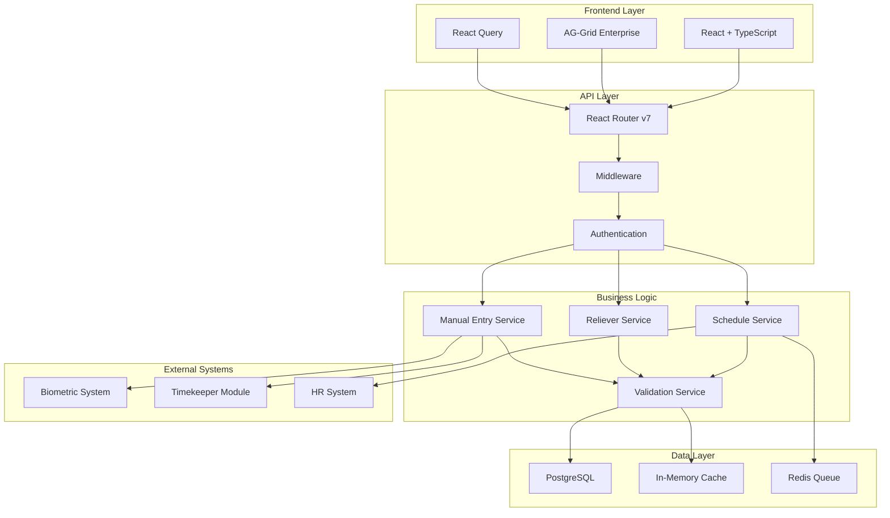
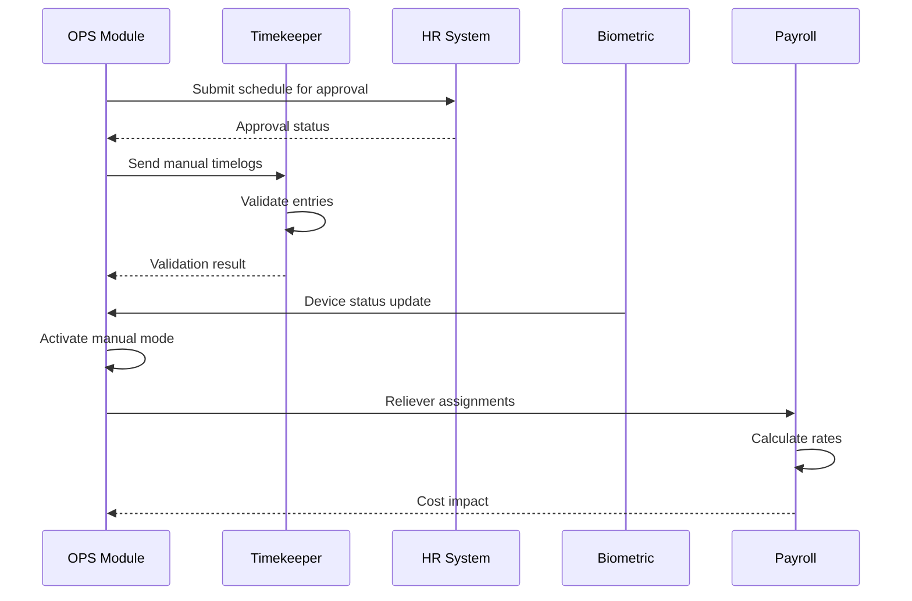
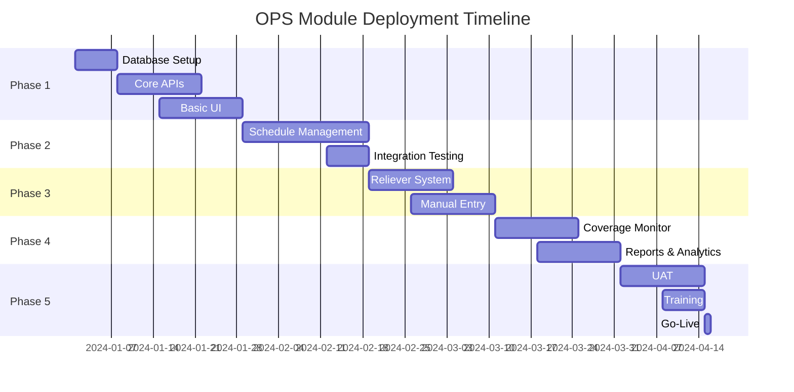

# Operations (OPS) Role - Implementation Plan

## Executive Summary

This document outlines the comprehensive implementation plan for the Operations
Officer role system, including technical architecture, database design, API
specifications, and deployment strategy. The implementation focuses on creating
a robust, scalable system for workforce scheduling, reliever management, and
manual time entry.

## Table of Contents

1. [Technical Architecture](#technical-architecture)
2. [Database Schema Design](#database-schema-design)
3. [API Specifications](#api-specifications)
4. [Frontend Implementation](#frontend-implementation)
5. [Integration Strategy](#integration-strategy)
6. [Security Implementation](#security-implementation)
7. [Testing Strategy](#testing-strategy)
8. [Deployment Plan](#deployment-plan)
9. [Performance Optimization](#performance-optimization)
10. [Monitoring and Maintenance](#monitoring-and-maintenance)

## 1. Technical Architecture

### 1.1 System Architecture Overview



### 1.2 Technology Stack

```typescript
interface TechnologyStack {
	frontend: {
		framework: 'React 18.2'
		language: 'TypeScript 5.0'
		routing: 'React Router v7'
		stateManagement: 'React Query + Context'
		uiComponents: 'Radix UI + Tailwind CSS'
		dataGrid: 'AG-Grid Enterprise'
		formHandling: 'Conform'
		validation: 'Zod'
	}

	backend: {
		runtime: 'Node.js 20 LTS'
		framework: 'React Router v7 (SSR)'
		orm: 'Prisma 5.0'
		database: 'PostgreSQL 15'
		caching: 'Redis + In-Memory LRU'
		queue: 'Bull Queue'
		authentication: 'Session-based + JWT'
	}

	infrastructure: {
		containerization: 'Docker'
		orchestration: 'Kubernetes'
		cicd: 'GitHub Actions'
		monitoring: 'Prometheus + Grafana'
		logging: 'Winston + ELK Stack'
		testing: 'Vitest + Playwright'
	}
}
```

## 2. Database Schema Design

### 2.1 Core Tables

```sql
-- Work Schedule Management
CREATE TABLE work_schedules (
  id VARCHAR(25) PRIMARY KEY DEFAULT cuid(),
  pay_period_id VARCHAR(25) NOT NULL,
  name VARCHAR(255) NOT NULL,
  status VARCHAR(20) DEFAULT 'DRAFT',
  effective_from TIMESTAMP NOT NULL,
  effective_to TIMESTAMP NOT NULL,
  created_by VARCHAR(25) NOT NULL,
  approved_by VARCHAR(25),
  approved_date TIMESTAMP,
  created_at TIMESTAMP DEFAULT CURRENT_TIMESTAMP,
  updated_at TIMESTAMP DEFAULT CURRENT_TIMESTAMP,

  FOREIGN KEY (pay_period_id) REFERENCES pay_periods(id),
  FOREIGN KEY (created_by) REFERENCES users(id),
  FOREIGN KEY (approved_by) REFERENCES users(id),

  INDEX idx_pay_period (pay_period_id),
  INDEX idx_status (status),
  INDEX idx_dates (effective_from, effective_to)
);

-- Schedule Assignments
CREATE TABLE schedule_assignments (
  id VARCHAR(25) PRIMARY KEY DEFAULT cuid(),
  work_schedule_id VARCHAR(25) NOT NULL,
  guard_id VARCHAR(25) NOT NULL,
  location_id VARCHAR(25) NOT NULL,
  shift_id VARCHAR(25) NOT NULL,
  assignment_date DATE NOT NULL,
  status VARCHAR(20) DEFAULT 'SCHEDULED',
  created_at TIMESTAMP DEFAULT CURRENT_TIMESTAMP,
  updated_at TIMESTAMP DEFAULT CURRENT_TIMESTAMP,

  FOREIGN KEY (work_schedule_id) REFERENCES work_schedules(id) ON DELETE CASCADE,
  FOREIGN KEY (guard_id) REFERENCES guards(id),
  FOREIGN KEY (location_id) REFERENCES locations(id),
  FOREIGN KEY (shift_id) REFERENCES shifts(id),

  UNIQUE KEY unique_assignment (guard_id, assignment_date, shift_id),
  INDEX idx_schedule (work_schedule_id),
  INDEX idx_date_location (assignment_date, location_id)
);

-- Reliever Assignments
CREATE TABLE reliever_assignments (
  id VARCHAR(25) PRIMARY KEY DEFAULT cuid(),
  original_assignment_id VARCHAR(25) NOT NULL,
  reliever_guard_id VARCHAR(25) NOT NULL,
  reason VARCHAR(50) NOT NULL,
  reason_details TEXT,
  requested_by VARCHAR(25) NOT NULL,
  approved_by VARCHAR(25),
  approved_date TIMESTAMP,
  status VARCHAR(20) DEFAULT 'PENDING',
  created_at TIMESTAMP DEFAULT CURRENT_TIMESTAMP,
  updated_at TIMESTAMP DEFAULT CURRENT_TIMESTAMP,

  FOREIGN KEY (original_assignment_id) REFERENCES schedule_assignments(id),
  FOREIGN KEY (reliever_guard_id) REFERENCES guards(id),
  FOREIGN KEY (requested_by) REFERENCES users(id),
  FOREIGN KEY (approved_by) REFERENCES users(id),

  INDEX idx_original (original_assignment_id),
  INDEX idx_reliever (reliever_guard_id),
  INDEX idx_status (status)
);

-- Manual Timelogs
CREATE TABLE manual_timelogs (
  id VARCHAR(25) PRIMARY KEY DEFAULT cuid(),
  guard_id VARCHAR(25) NOT NULL,
  location_id VARCHAR(25) NOT NULL,
  shift_id VARCHAR(25) NOT NULL,
  work_date DATE NOT NULL,
  clock_in_time TIMESTAMP NOT NULL,
  clock_out_time TIMESTAMP NOT NULL,
  break_start_time TIMESTAMP,
  break_end_time TIMESTAMP,
  overtime_start TIMESTAMP,
  overtime_end TIMESTAMP,
  reason VARCHAR(50) NOT NULL,
  reason_details TEXT NOT NULL,
  documentation_url VARCHAR(500),
  created_by VARCHAR(25) NOT NULL,
  verified_by VARCHAR(25),
  verified_date TIMESTAMP,
  status VARCHAR(20) DEFAULT 'PENDING',
  created_at TIMESTAMP DEFAULT CURRENT_TIMESTAMP,
  updated_at TIMESTAMP DEFAULT CURRENT_TIMESTAMP,

  FOREIGN KEY (guard_id) REFERENCES guards(id),
  FOREIGN KEY (location_id) REFERENCES locations(id),
  FOREIGN KEY (shift_id) REFERENCES shifts(id),
  FOREIGN KEY (created_by) REFERENCES users(id),
  FOREIGN KEY (verified_by) REFERENCES users(id),

  INDEX idx_guard_date (guard_id, work_date),
  INDEX idx_status (status),
  INDEX idx_location_date (location_id, work_date)
);

-- Generated Clock Events
CREATE TABLE clock_events (
  id VARCHAR(25) PRIMARY KEY DEFAULT cuid(),
  guard_id VARCHAR(25) NOT NULL,
  event_type VARCHAR(20) NOT NULL,
  event_time TIMESTAMP NOT NULL,
  source VARCHAR(20) NOT NULL,
  manual_timelog_id VARCHAR(25),
  device_id VARCHAR(50),
  synced_at TIMESTAMP,
  created_at TIMESTAMP DEFAULT CURRENT_TIMESTAMP,

  FOREIGN KEY (guard_id) REFERENCES guards(id),
  FOREIGN KEY (manual_timelog_id) REFERENCES manual_timelogs(id),

  INDEX idx_guard_time (guard_id, event_time),
  INDEX idx_source (source),
  INDEX idx_manual (manual_timelog_id)
);
```

### 2.2 Supporting Tables

```sql
-- Guards (Security Personnel)
CREATE TABLE guards (
  id VARCHAR(25) PRIMARY KEY DEFAULT cuid(),
  employee_id VARCHAR(50) UNIQUE NOT NULL,
  first_name VARCHAR(100) NOT NULL,
  last_name VARCHAR(100) NOT NULL,
  email VARCHAR(255) UNIQUE,
  phone VARCHAR(20),
  status VARCHAR(20) DEFAULT 'ACTIVE',
  hire_date DATE NOT NULL,
  certifications JSONB,
  created_at TIMESTAMP DEFAULT CURRENT_TIMESTAMP,
  updated_at TIMESTAMP DEFAULT CURRENT_TIMESTAMP,

  INDEX idx_status (status),
  INDEX idx_name (last_name, first_name)
);

-- Locations
CREATE TABLE locations (
  id VARCHAR(25) PRIMARY KEY DEFAULT cuid(),
  code VARCHAR(20) UNIQUE NOT NULL,
  name VARCHAR(255) NOT NULL,
  address TEXT,
  contact_person VARCHAR(255),
  contact_phone VARCHAR(20),
  required_guards INTEGER NOT NULL,
  status VARCHAR(20) DEFAULT 'ACTIVE',
  created_at TIMESTAMP DEFAULT CURRENT_TIMESTAMP,
  updated_at TIMESTAMP DEFAULT CURRENT_TIMESTAMP,

  INDEX idx_status (status)
);

-- Shifts
CREATE TABLE shifts (
  id VARCHAR(25) PRIMARY KEY DEFAULT cuid(),
  name VARCHAR(100) NOT NULL,
  start_time TIME NOT NULL,
  end_time TIME NOT NULL,
  break_duration INTEGER DEFAULT 60,
  differential_rate DECIMAL(5,2) DEFAULT 0,
  created_at TIMESTAMP DEFAULT CURRENT_TIMESTAMP,
  updated_at TIMESTAMP DEFAULT CURRENT_TIMESTAMP,

  UNIQUE KEY unique_shift (name, start_time, end_time)
);
```

## 3. API Specifications

### 3.1 Schedule Management APIs

```typescript
// Schedule CRUD Operations
interface ScheduleAPI {
	// Create new schedule
	POST: {
		endpoint: '/api/schedules'
		body: {
			payPeriodId: string
			name: string
			effectiveFrom: Date
			effectiveTo: Date
			assignments: ScheduleAssignment[]
		}
		response: {
			id: string
			status: 'DRAFT'
			message: string
		}
	}

	// Get schedule details
	GET: {
		endpoint: '/api/schedules/:id'
		params: {
			includeAssignments?: boolean
			includeRelievers?: boolean
		}
		response: Schedule
	}

	// Update schedule
	PUT: {
		endpoint: '/api/schedules/:id'
		body: Partial<Schedule>
		response: {
			success: boolean
			schedule: Schedule
		}
	}

	// Submit for approval
	POST_APPROVAL: {
		endpoint: '/api/schedules/:id/submit'
		response: {
			success: boolean
			approvalId: string
		}
	}
}
```

### 3.2 Reliever Assignment APIs

```typescript
// Reliever Management
interface RelieverAPI {
	// Find available relievers
	GET_AVAILABLE: {
		endpoint: '/api/relievers/available'
		params: {
			date: string
			shiftId: string
			locationId: string
		}
		response: {
			relievers: RelieverCandidate[]
			recommendations: string[]
		}
	}

	// Assign reliever
	POST_ASSIGNMENT: {
		endpoint: '/api/relievers/assign'
		body: {
			originalAssignmentId: string
			relieverGuardId: string
			reason: string
			reasonDetails?: string
		}
		response: {
			success: boolean
			assignmentId: string
			notifications: string[]
		}
	}
}
```

### 3.3 Manual Timelog APIs

```typescript
// Manual Time Entry
interface ManualTimelogAPI {
	// Create manual entry
	POST: {
		endpoint: '/api/manual-timelogs'
		body: {
			guardId: string
			locationId: string
			shiftId: string
			workDate: Date
			times: {
				clockIn: string
				clockOut: string
				breakStart?: string
				breakEnd?: string
				overtimeStart?: string
				overtimeEnd?: string
			}
			reason: string
			reasonDetails: string
			documentation?: File[]
		}
		response: {
			id: string
			status: 'PENDING'
			validationResults: ValidationResult[]
		}
	}

	// Batch create
	POST_BATCH: {
		endpoint: '/api/manual-timelogs/batch'
		body: {
			common: {
				locationId: string
				workDate: Date
				reason: string
			}
			entries: ManualTimelogEntry[]
		}
		response: {
			successful: string[]
			failed: { id: string; error: string }[]
		}
	}
}
```

## 4. Frontend Implementation

### 4.1 Component Architecture

```typescript
// Main OPS Module Component Structure
interface OpsComponentStructure {
	pages: {
		'ops/dashboard': 'Main operations dashboard'
		'ops/schedules': 'Schedule management page'
		'ops/schedules/:id': 'Schedule detail/edit page'
		'ops/relievers': 'Reliever assignment page'
		'ops/manual-entry': 'Manual timelog entry'
		'ops/coverage': 'Real-time coverage monitor'
		'ops/reports': 'Reports and analytics'
	}

	components: {
		// Schedule Components
		ScheduleGrid: 'Interactive schedule grid'
		ScheduleCell: 'Individual assignment cell'
		ScheduleToolbar: 'Schedule actions toolbar'

		// Reliever Components
		RelieverWizard: 'Step-by-step assignment'
		RelieverCard: 'Reliever candidate display'
		RelieverFilters: 'Search and filter panel'

		// Manual Entry Components
		ManualTimelogForm: 'Single entry form'
		BatchEntryGrid: 'Batch entry table'
		TimeCalculator: 'Hours calculation widget'

		// Coverage Components
		CoverageHeatmap: 'Visual coverage map'
		CoverageAlerts: 'Alert notification panel'
		ShiftTimeline: 'Shift transition timeline'
	}

	hooks: {
		useSchedule: 'Schedule data management'
		useRelievers: 'Reliever search and assignment'
		useManualEntry: 'Manual timelog handling'
		useCoverage: 'Real-time coverage monitoring'
		useValidation: 'Form and data validation'
	}
}
```

### 4.2 State Management

```typescript
// Global State Structure
interface OpsGlobalState {
	schedule: {
		current: Schedule | null
		draft: ScheduleDraft | null
		conflicts: Conflict[]
		isLoading: boolean
		error: Error | null
	}

	coverage: {
		realtime: CoverageStatus
		gaps: CoverageGap[]
		predictions: Prediction[]
		lastUpdate: Date
	}

	relievers: {
		available: RelieverCandidate[]
		assigned: RelieverAssignment[]
		pending: PendingAssignment[]
	}

	manualEntries: {
		draft: ManualEntryDraft[]
		submitted: ManualEntry[]
		validation: ValidationResult[]
	}
}

// React Query Configuration
const queryClient = new QueryClient({
	defaultOptions: {
		queries: {
			staleTime: 5 * 60 * 1000, // 5 minutes
			cacheTime: 10 * 60 * 1000, // 10 minutes
			retry: 3,
			refetchOnWindowFocus: true,
		},
		mutations: {
			retry: 2,
			onError: (error) => {
				console.error('Mutation error:', error)
				showErrorNotification(error.message)
			},
		},
	},
})
```

## 5. Integration Strategy

### 5.1 System Integration Points



### 5.2 Data Synchronization

```typescript
interface DataSyncStrategy {
	realtime: {
		coverage: {
			method: 'WebSocket'
			interval: 'immediate'
			events: ['assignment-change', 'clock-event', 'absence']
		}
		alerts: {
			method: 'Server-Sent Events'
			priority: 'high'
			delivery: 'guaranteed'
		}
	}

	batch: {
		schedules: {
			method: 'REST API'
			frequency: 'on-change'
			validation: 'pre-sync'
		}
		timelogs: {
			method: 'Queue'
			processing: 'async'
			retry: 'exponential-backoff'
		}
	}

	cache: {
		strategy: 'write-through'
		invalidation: 'event-based'
		ttl: {
			schedules: 3600 // 1 hour
			coverage: 30 // 30 seconds
			guards: 7200 // 2 hours
		}
	}
}
```

## 6. Security Implementation

### 6.1 Authentication & Authorization

```typescript
interface SecurityImplementation {
	authentication: {
		method: 'Session + JWT'
		mfa: 'TOTP optional'
		sessionTimeout: '8 hours'
		refreshToken: '7 days'
	}

	authorization: {
		model: 'RBAC'
		roles: {
			'ops-officer': [
				'schedule.create',
				'schedule.edit',
				'reliever.assign',
				'manual.create',
				'coverage.view',
			]
			'ops-supervisor': [
				'schedule.approve',
				'reliever.approve',
				'manual.verify',
				'reports.generate',
			]
			'ops-viewer': ['schedule.view', 'coverage.view', 'reports.view']
		}
	}

	dataProtection: {
		encryption: 'AES-256-GCM'
		pii: 'Masked in logs'
		audit: 'All write operations'
		backup: 'Encrypted daily'
	}
}
```

### 6.2 Security Controls

```typescript
// Input Validation
const scheduleValidation = z
	.object({
		payPeriodId: z.string().cuid(),
		name: z.string().min(3).max(255),
		effectiveFrom: z.date(),
		effectiveTo: z.date(),
		assignments: z.array(
			z.object({
				guardId: z.string().cuid(),
				locationId: z.string().cuid(),
				shiftId: z.string().cuid(),
				date: z.date(),
			}),
		),
	})
	.refine((data) => data.effectiveTo > data.effectiveFrom, {
		message: 'End date must be after start date',
	})

// Rate Limiting
const rateLimits = {
	api: {
		read: '100/minute',
		write: '20/minute',
		bulk: '5/minute',
	},
	auth: {
		login: '5/minute',
		refresh: '10/hour',
	},
}
```

## 7. Testing Strategy

### 7.1 Test Coverage Requirements

```typescript
interface TestingStrategy {
	unit: {
		coverage: '80%'
		focus: ['Business logic', 'Validation', 'Calculations']
		tools: ['Vitest', 'React Testing Library']
	}

	integration: {
		coverage: '70%'
		focus: ['API endpoints', 'Database operations', 'External systems']
		tools: ['Supertest', 'Prisma test client']
	}

	e2e: {
		coverage: 'Critical paths'
		scenarios: [
			'Schedule creation workflow',
			'Reliever assignment process',
			'Manual entry validation',
			'Coverage monitoring',
		]
		tools: ['Playwright']
	}

	performance: {
		targets: {
			apiResponse: '< 200ms p95'
			pageLoad: '< 2s'
			gridRender: '< 500ms for 1000 rows'
		}
		tools: ['K6', 'Lighthouse']
	}
}
```

### 7.2 Test Cases

```typescript
// Example Unit Test
describe('Schedule Validation', () => {
	it('should detect schedule conflicts', () => {
		const schedule = createSchedule({
			assignments: [
				{ guardId: 'G001', date: '2024-01-01', shiftId: 'DAY' },
				{ guardId: 'G001', date: '2024-01-01', shiftId: 'NIGHT' },
			],
		})

		const conflicts = validateSchedule(schedule)
		expect(conflicts).toHaveLength(1)
		expect(conflicts[0].type).toBe('DOUBLE_BOOKING')
	})
})

// Example E2E Test
test('Complete reliever assignment workflow', async ({ page }) => {
	await page.goto('/ops/schedules')
	await page.click('[data-testid="vacancy-alert"]')
	await page.click('[data-testid="assign-reliever"]')

	// Select recommended reliever
	await page.click('[data-testid="best-match-reliever"]')
	await page.click('[data-testid="confirm-assignment"]')

	// Verify assignment
	await expect(page.locator('[data-testid="assignment-success"]')).toBeVisible()
	await expect(page.locator('[data-testid="coverage-complete"]')).toBeVisible()
})
```

## 8. Deployment Plan

### 8.1 Deployment Phases



### 8.2 Rollout Strategy

```typescript
interface RolloutStrategy {
	approach: 'Phased by location'

	pilot: {
		locations: ['Location A']
		duration: '2 weeks'
		users: 5
		features: ['Basic scheduling', 'Manual entry']
	}

	phase1: {
		locations: ['Location A', 'Location B']
		duration: '1 month'
		users: 15
		features: ['All core features']
	}

	phase2: {
		locations: ['All locations']
		duration: 'Ongoing'
		users: 50
		features: ['Full system']
	}

	rollback: {
		trigger: 'Critical issue or >10% error rate'
		procedure: 'Automated rollback to previous version'
		dataRecovery: 'Point-in-time restore available'
	}
}
```

## 9. Performance Optimization

### 9.1 Optimization Strategies

```typescript
interface PerformanceOptimization {
	database: {
		indexing: [
			'CREATE INDEX idx_assignments_date ON schedule_assignments(assignment_date)',
			'CREATE INDEX idx_guards_status ON guards(status)',
			'CREATE INDEX idx_coverage ON schedule_assignments(location_id, assignment_date, shift_id)',
		]
		partitioning: 'By month for historical data'
		connectionPooling: {
			min: 10
			max: 50
			idleTimeout: 30000
		}
	}

	caching: {
		redis: {
			schedules: 'Cache for 1 hour'
			guards: 'Cache for 2 hours'
			locations: 'Cache for 24 hours'
		}
		cdn: {
			static: 'CloudFront/Cloudflare'
			api: 'API Gateway caching'
		}
	}

	frontend: {
		lazyLoading: 'Route-based code splitting'
		virtualScrolling: 'AG-Grid for large datasets'
		debouncing: 'Search inputs (300ms)'
		memoization: 'Expensive calculations'
	}
}
```

### 9.2 Performance Monitoring

```typescript
// Performance Metrics Collection
const performanceMetrics = {
	api: {
		responseTime: histogram('api_response_time'),
		errorRate: counter('api_errors_total'),
		throughput: gauge('api_requests_per_second'),
	},

	database: {
		queryTime: histogram('db_query_duration'),
		connectionPool: gauge('db_connections_active'),
		slowQueries: counter('db_slow_queries_total'),
	},

	frontend: {
		pageLoad: timing('page_load_time'),
		interaction: timing('interaction_delay'),
		bundleSize: gauge('bundle_size_bytes'),
	},
}
```

## 10. Monitoring and Maintenance

### 10.1 Monitoring Setup

```yaml
# Prometheus Configuration
scrape_configs:
  - job_name: 'ops-module'
    static_configs:
      - targets: ['ops-api:3000']
    metrics_path: '/metrics'
    scrape_interval: 15s

# Alert Rules
groups:
  - name: ops_alerts
    rules:
      - alert: HighErrorRate
        expr: rate(api_errors_total[5m]) > 0.05
        for: 5m
        annotations:
          summary: 'High error rate detected'

      - alert: SlowAPIResponse
        expr: histogram_quantile(0.95, api_response_time) > 1
        for: 10m
        annotations:
          summary: 'API response time exceeding threshold'
```

### 10.2 Maintenance Procedures

```typescript
interface MaintenanceProcedures {
	daily: {
		tasks: [
			'Check system health dashboard',
			'Review error logs',
			'Verify backup completion',
			'Monitor coverage gaps',
		]
		automation: 'Scheduled health checks'
	}

	weekly: {
		tasks: [
			'Performance report review',
			'Database optimization',
			'Security scan',
			'User feedback review',
		]
		automation: 'Automated reports'
	}

	monthly: {
		tasks: [
			'Capacity planning review',
			'Disaster recovery test',
			'Security audit',
			'Feature usage analytics',
		]
		automation: 'Compliance checks'
	}

	updates: {
		patches: 'Weekly security patches'
		features: 'Bi-weekly feature releases'
		major: 'Quarterly major updates'
	}
}
```

## Success Metrics

### Key Performance Indicators

| Metric                       | Target   | Current | Status  |
| ---------------------------- | -------- | ------- | ------- |
| **Schedule Creation Time**   | < 30 min | -       | Pending |
| **Coverage Achievement**     | > 98%    | -       | Pending |
| **Reliever Assignment Time** | < 5 min  | -       | Pending |
| **Manual Entry Accuracy**    | > 99%    | -       | Pending |
| **System Uptime**            | 99.9%    | -       | Pending |
| **User Satisfaction**        | > 4.5/5  | -       | Pending |

## Risk Mitigation

### Identified Risks and Mitigation Strategies

| Risk                     | Impact | Probability | Mitigation                     |
| ------------------------ | ------ | ----------- | ------------------------------ |
| **Data Loss**            | High   | Low         | Automated backups, replication |
| **System Downtime**      | High   | Medium      | HA deployment, failover        |
| **User Adoption**        | Medium | Medium      | Training, intuitive UI         |
| **Integration Failures** | High   | Low         | Circuit breakers, fallbacks    |
| **Performance Issues**   | Medium | Medium      | Caching, optimization          |

## Conclusion

This implementation plan provides a comprehensive roadmap for deploying the
Operations Officer module. Key success factors include:

1. **Phased deployment** to minimize risk
2. **Robust testing** at all levels
3. **Performance optimization** from day one
4. **Strong security controls** throughout
5. **Comprehensive monitoring** for proactive management
6. **User training** and support

The system will enable Operations Officers to efficiently manage workforce
scheduling, quickly handle coverage gaps through smart reliever assignment, and
maintain accurate time records through controlled manual entry processes.
