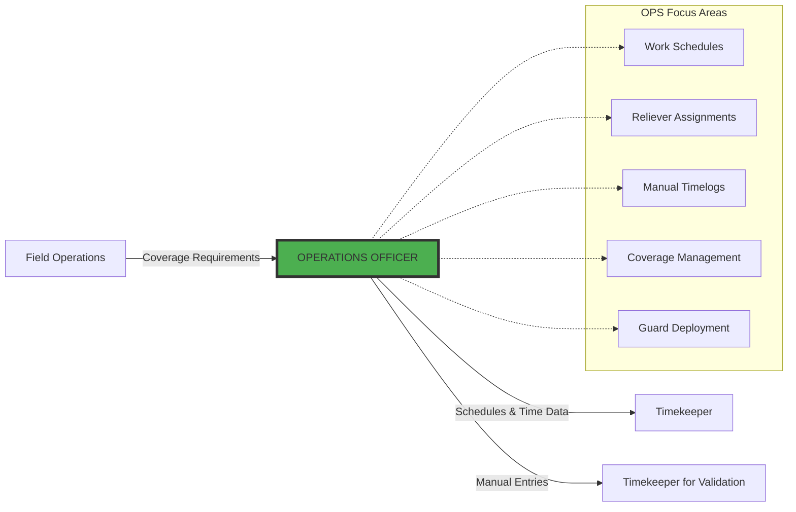
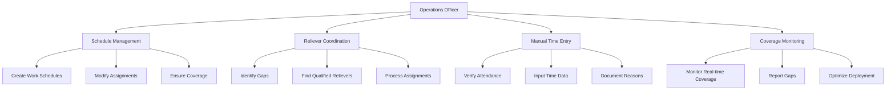
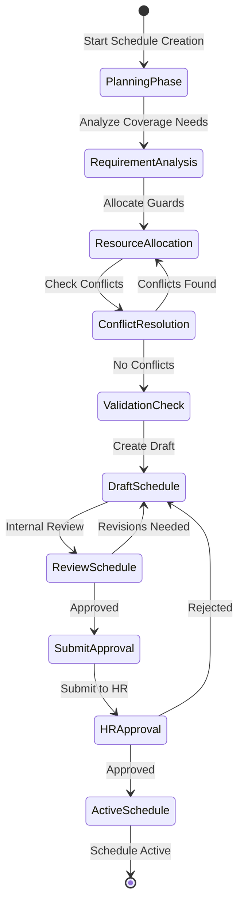
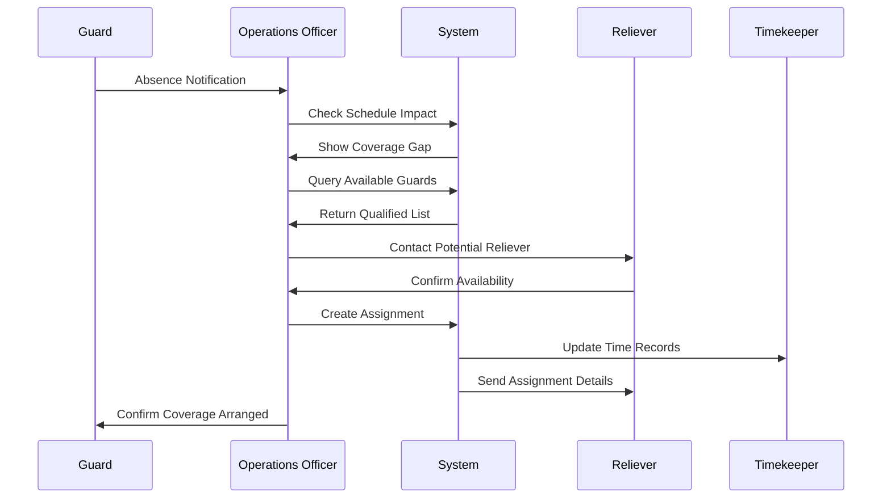
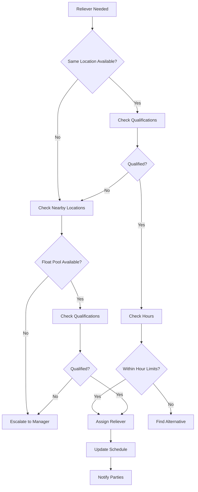
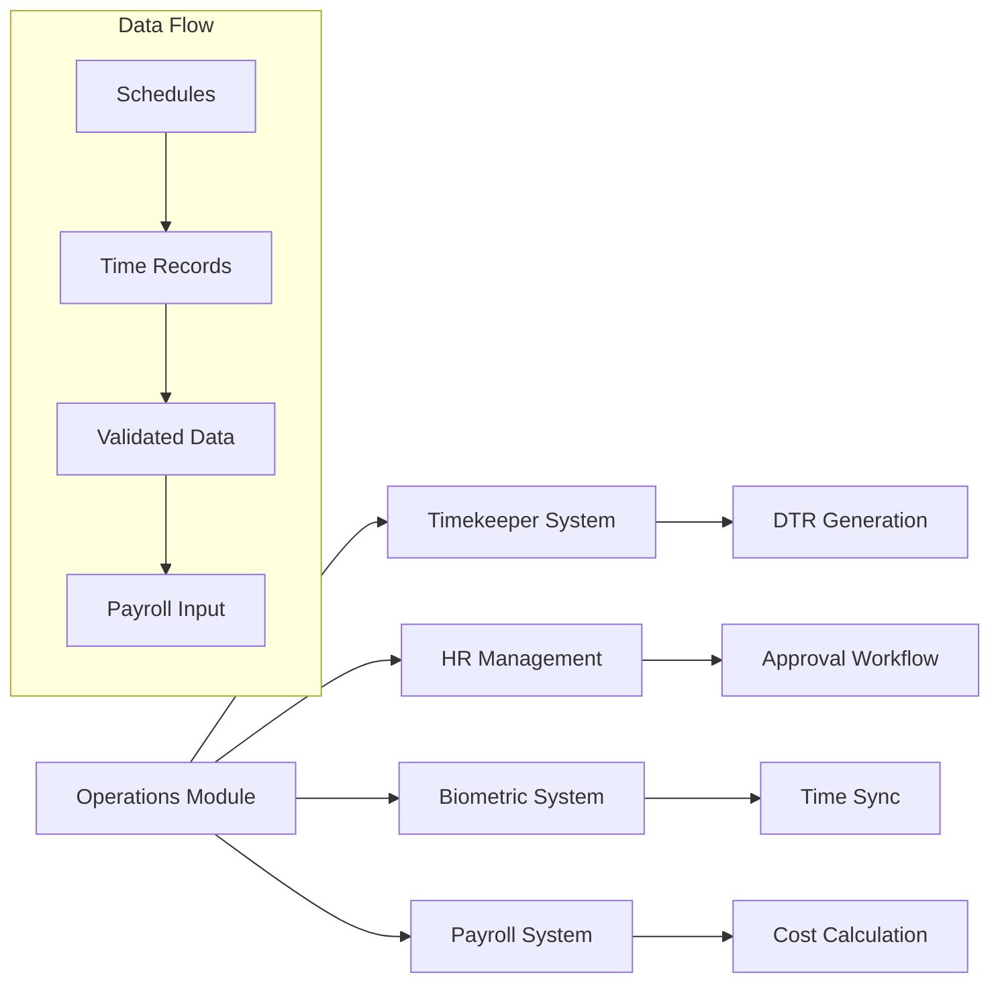
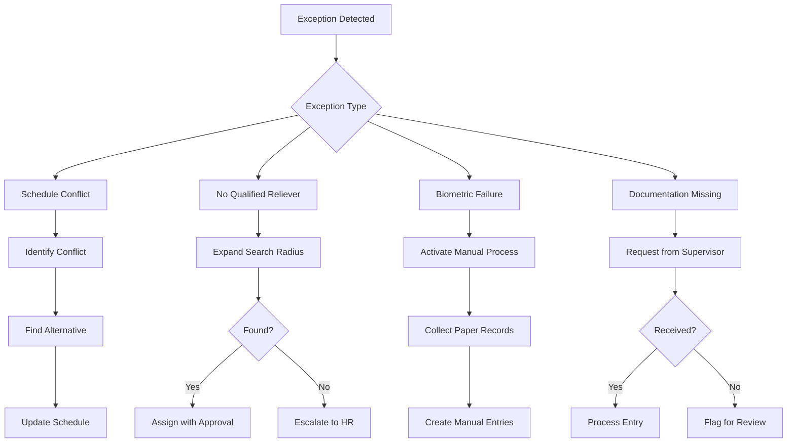

# Operations (OPS) Role - Comprehensive Workflow Documentation

## Executive Summary

The Operations Officer serves as the **primary workforce management layer** in
the payroll system, responsible for creating work schedules, managing reliever
assignments, and handling manual timelog creation when biometric systems are
unavailable. This role acts as the bridge between field operations and the
payroll processing system, ensuring accurate time capture and schedule
compliance.

## Table of Contents

1. [Role Definition](#role-definition)
2. [Workflow Position](#workflow-position)
3. [Core Responsibilities](#core-responsibilities)
4. [Detailed Workflow Process](#detailed-workflow-process)
5. [Schedule Management Criteria](#schedule-management-criteria)
6. [Decision Matrix](#decision-matrix)
7. [Integration Points](#integration-points)
8. [Exception Handling](#exception-handling)

## 1. Role Definition

### 1.1 Operations Officer Overview

```typescript
interface OperationsOfficerRole {
	position: 'Between Field Operations and Timekeeper'
	focus: 'Schedule creation, reliever management, manual time entry'
	authority: 'Create schedules, assign relievers, input manual timelogs'

	primaryFunction: 'Workforce scheduling and time data management'

	keyAttributes: {
		strategic: 'Plans optimal guard deployment'
		responsive: 'Handles real-time coverage gaps'
		detail_oriented: 'Ensures accurate time capture'
		compliant: 'Follows labor regulations'
	}

	scope: {
		creates: ['Work schedules', 'Reliever assignments', 'Manual timelogs']
		manages: ['Coverage gaps', 'Guard availability', 'Schedule conflicts']
		validates: ['Guard qualifications', 'Time entries', 'Documentation']
	}
}
```

### 1.2 Operations Officer Competencies

| Competency              | Description                           | Criticality |
| ----------------------- | ------------------------------------- | ----------- |
| **Schedule Planning**   | Create optimal guard deployment       | Critical    |
| **Resource Management** | Efficiently allocate available guards | Critical    |
| **Time Validation**     | Verify manual time entries            | High        |
| **Conflict Resolution** | Handle schedule conflicts and gaps    | High        |
| **Documentation**       | Maintain clear records of changes     | Medium      |
| **System Proficiency**  | Navigate scheduling and time systems  | High        |

## 2. Workflow Position

### 2.1 Operations Officer in the Payroll Chain



### 2.2 Timing in the Process

```typescript
interface OperationsTiming {
	scheduleCreation: {
		when: 'Before pay period starts'
		deadline: '3 days before period'
		format: 'Complete guard deployment plan'
		approval: 'Requires HR Manager approval'
	}

	relieverAssignment: {
		trigger: 'Guard absence notification'
		response: 'Within 2 hours for critical posts'
		validation: 'Check qualifications and availability'
		notification: 'Immediate to affected parties'
	}

	manualTimelog: {
		creation: 'Same day as occurrence'
		deadline: 'Within 24 hours'
		verification: 'Requires supporting documentation'
		approval: 'Flows to Timekeeper for validation'
	}
}
```

## 3. Core Responsibilities

### 3.1 Primary Functions



### 3.2 Detailed Responsibility Matrix

| Area                    | Responsibility                  | Frequency      | Priority |
| ----------------------- | ------------------------------- | -------------- | -------- |
| **Schedule Creation**   | Design guard deployment plans   | Per pay period | Critical |
| **Coverage Analysis**   | Ensure all posts are covered    | Daily          | Critical |
| **Reliever Assignment** | Fill coverage gaps quickly      | As needed      | High     |
| **Manual Time Entry**   | Input non-biometric time data   | Daily          | High     |
| **Documentation**       | Maintain schedule records       | Ongoing        | Medium   |
| **Reporting**           | Coverage and attendance reports | Weekly         | Medium   |

## 4. Detailed Workflow Process

### 4.1 Schedule Creation Workflow



### 4.2 Reliever Assignment Process



### 4.3 Manual Timelog Creation Process

```typescript
interface ManualTimelogWorkflow {
	trigger: {
		biometricFailure: 'Device not working'
		networkIssue: 'Cannot sync data'
		newGuard: 'Not yet enrolled'
		emergency: 'Immediate deployment'
	}

	process: {
		step1: 'Identify missing clock events'
		step2: 'Verify guard attendance via supervisor'
		step3: 'Collect time information'
		step4: 'Document reason for manual entry'
		step5: 'Input time data into system'
		step6: 'Attach supporting documentation'
		step7: 'Submit to Timekeeper for validation'
	}

	validation: {
		supervisorConfirmation: Required
		documentationCheck: Required
		scheduleAlignment: Required
		reasonCode: Required
	}
}
```

## 5. Schedule Management Criteria

### 5.1 Schedule Creation Standards

| Criterion                 | Requirement                         | Validation                 |
| ------------------------- | ----------------------------------- | -------------------------- |
| **Coverage Completeness** | 100% of posts covered               | System check               |
| **Qualification Match**   | Guards qualified for assigned posts | Certification verification |
| **Hour Compliance**       | Within legal working hours          | Automatic calculation      |
| **Rest Period**           | Minimum rest between shifts         | System enforcement         |
| **Cost Optimization**     | Within budget constraints           | Cost analysis              |

### 5.2 Reliever Selection Criteria



## 6. Decision Matrix

### 6.1 Operations Decision Framework

```typescript
interface OperationsDecisionMatrix {
	scheduleChanges: {
		minorAdjustment: {
			authority: 'Operations Officer'
			approval: 'Not required'
			documentation: 'Log in system'
		}
		majorChange: {
			authority: 'Operations Officer initiates'
			approval: 'HR Manager required'
			documentation: 'Change request form'
		}
	}

	relieverAssignment: {
		sameLocation: {
			decision: 'Automatic'
			criteria: 'Qualified and available'
			approval: 'Not required'
		}
		crossLocation: {
			decision: 'Operations Officer'
			criteria: 'Qualified, available, cost-effective'
			approval: 'Supervisor confirmation'
		}
		overtime: {
			decision: 'Requires analysis'
			criteria: 'Critical need, budget available'
			approval: 'HR Manager required'
		}
	}

	manualTimelog: {
		standard: {
			creation: 'Operations Officer'
			validation: 'Timekeeper'
			approval: 'Automatic if documented'
		}
		exceptional: {
			creation: 'Operations Officer'
			validation: 'Timekeeper + Supervisor'
			approval: 'HR Manager required'
		}
	}
}
```

### 6.2 Escalation Triggers

| Situation                  | Trigger               | Escalation To         | Action Required           |
| -------------------------- | --------------------- | --------------------- | ------------------------- |
| **Coverage Gap > 4 hours** | No reliever found     | HR Manager            | Emergency staffing        |
| **Multiple Absences**      | >20% of shift         | Site Manager          | Contingency plan          |
| **System Failure**         | Biometric down >1 day | IT + HR               | Manual process activation |
| **Schedule Conflict**      | Double booking        | Operations Supervisor | Immediate resolution      |
| **Documentation Missing**  | No supporting docs    | Timekeeper            | Hold processing           |

## 7. Integration Points

### 7.1 System Integration Map



### 7.2 API Integration Requirements

```typescript
interface OperationsIntegrationAPIs {
	timekeeperAPI: {
		endpoint: '/api/timekeeper/manual-entries'
		method: 'POST'
		payload: ManualTimelogData
		response: ValidationResult
	}

	hrAPI: {
		endpoint: '/api/hr/schedule-approval'
		method: 'POST'
		payload: ScheduleData
		response: ApprovalStatus
	}

	biometricAPI: {
		endpoint: '/api/biometric/status'
		method: 'GET'
		response: DeviceStatus[]
	}

	payrollAPI: {
		endpoint: '/api/payroll/reliever-rates'
		method: 'GET'
		response: RelieverRateStructure
	}
}
```

## 8. Exception Handling

### 8.1 Common Exceptions and Resolutions



### 8.2 Error Prevention Strategies

| Strategy                   | Implementation                        | Benefit                    |
| -------------------------- | ------------------------------------- | -------------------------- |
| **Automated Validation**   | Real-time schedule conflict detection | Prevents double booking    |
| **Qualification Database** | Maintained certification records      | Ensures proper assignments |
| **Backup Documentation**   | Multiple verification sources         | Reduces missing data       |
| **Regular System Checks**  | Daily biometric status monitoring     | Early failure detection    |
| **Training Programs**      | Regular operations training           | Reduces human errors       |

## Quality Assurance

### QA Checkpoints

```typescript
interface OperationsQAChecks {
	scheduleQA: {
		coverageCheck: 'All posts covered'
		qualificationVerification: 'Guards certified'
		hourCompliance: 'Within legal limits'
		costValidation: 'Within budget'
	}

	relieverQA: {
		availabilityConfirmation: 'Guard available'
		qualificationMatch: 'Meets requirements'
		notificationSent: 'All parties informed'
		documentationComplete: 'Assignment recorded'
	}

	manualEntryQA: {
		attendanceVerification: 'Supervisor confirmed'
		timeAccuracy: 'Matches actual work'
		reasonDocumented: 'Valid reason provided'
		approvalObtained: 'Proper authorization'
	}
}
```

## Performance Metrics

### Key Performance Indicators

| Metric                         | Target    | Measurement     |
| ------------------------------ | --------- | --------------- |
| **Schedule Completion Time**   | < 4 hours | Per pay period  |
| **Coverage Achievement**       | > 98%     | Daily average   |
| **Reliever Response Time**     | < 2 hours | Critical posts  |
| **Manual Entry Accuracy**      | > 99%     | Monthly audit   |
| **Documentation Completeness** | 100%      | Per transaction |

## Conclusion

The Operations Officer role is critical for maintaining workforce efficiency and
ensuring accurate time capture. Through systematic schedule management,
responsive reliever assignment, and controlled manual time entry, this role
bridges the gap between field operations and payroll processing, ensuring smooth
operations and accurate compensation.
