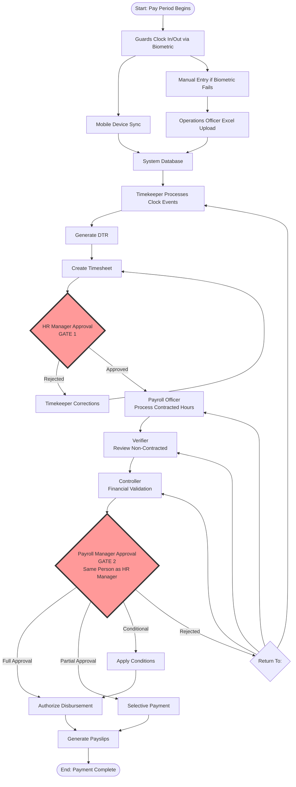
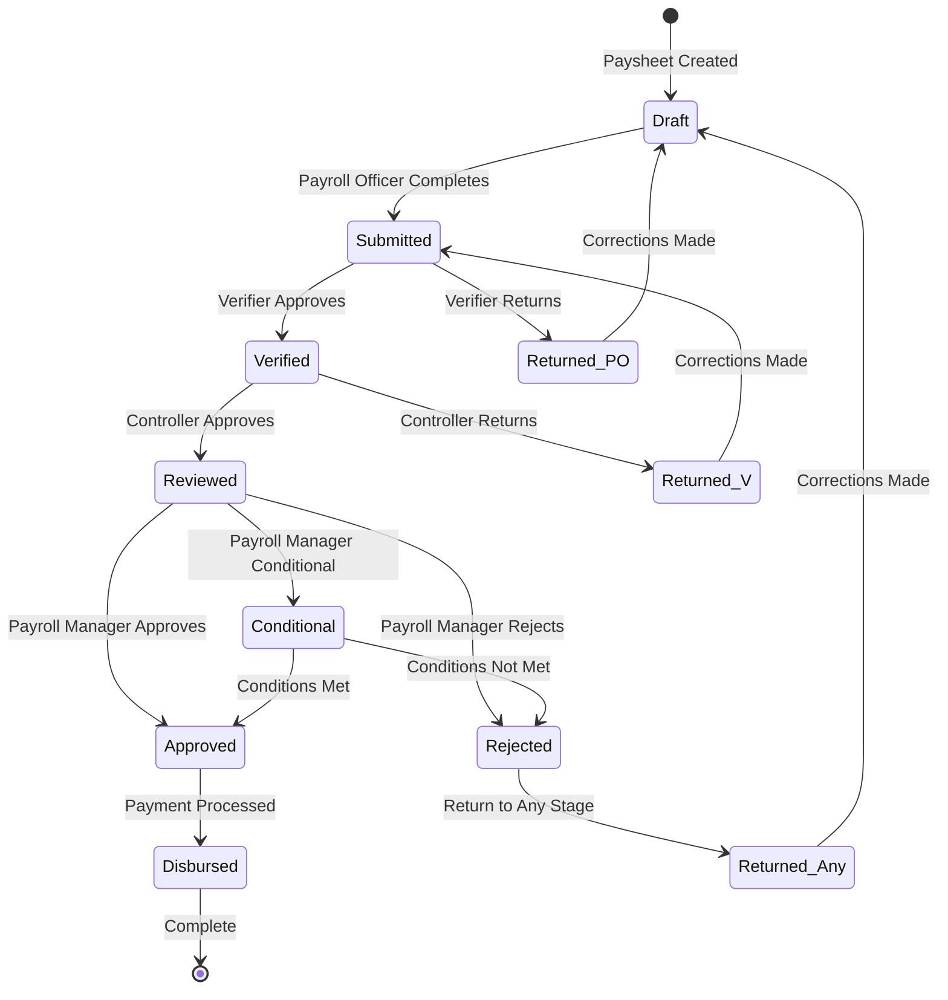
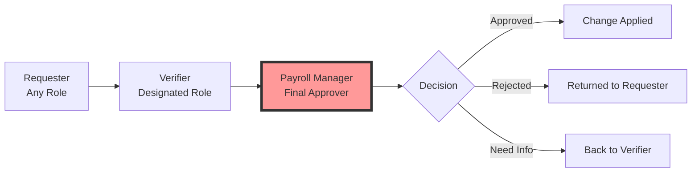
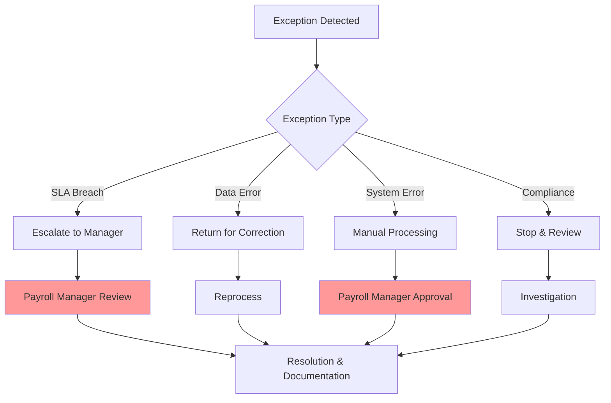
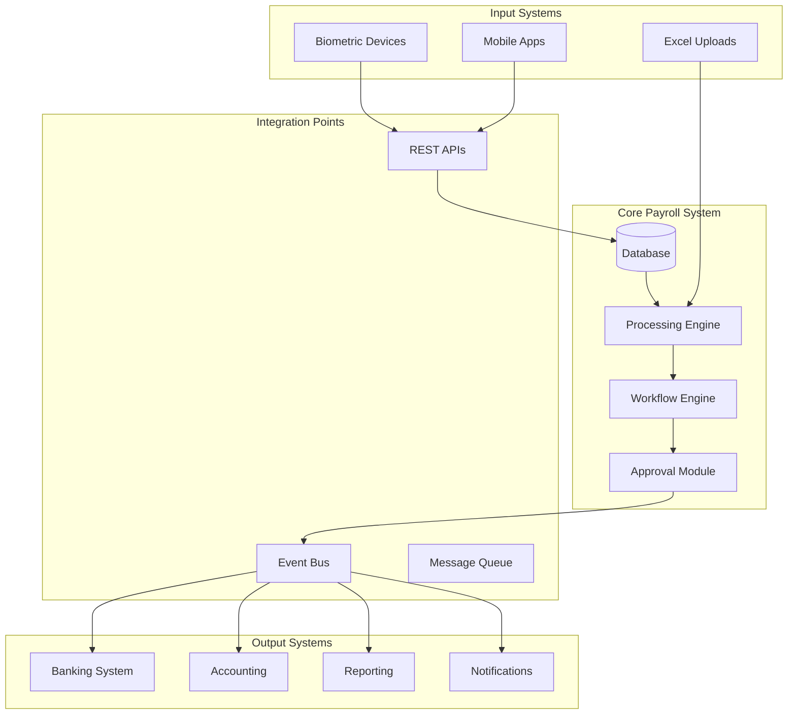

# Comprehensive Payroll Approval Workflow

## Executive Overview

This document defines the complete payroll approval workflow, from initial
timesheet submission through final disbursement authorization. The workflow
incorporates a dual-approval system where the **HR Manager** and **Payroll
Manager** roles are performed by the same person at different stages, ensuring
both detailed operational review and executive financial oversight.

## Table of Contents

1. [Workflow Overview](#workflow-overview)
2. [Stage-by-Stage Process](#stage-by-stage-process)
3. [Approval Gates and Decision Points](#approval-gates-and-decision-points)
4. [Role Responsibilities Matrix](#role-responsibilities-matrix)
5. [Change Request Workflow](#change-request-workflow)
6. [Exception Handling](#exception-handling)
7. [SLA and Performance Metrics](#sla-and-performance-metrics)
8. [System Integration](#system-integration)

## 1. Workflow Overview

### 1.1 Complete Process Flow



### 1.2 Dual Approval Gates

| Gate       | Role            | Stage                    | Focus                                | Authority                          |
| ---------- | --------------- | ------------------------ | ------------------------------------ | ---------------------------------- |
| **Gate 1** | HR Manager      | After Timesheet Creation | Time accuracy, attendance, schedules | Approve/Reject timesheets          |
| **Gate 2** | Payroll Manager | After Financial Review   | Total amounts, budget, compliance    | Approve/Reject/Conditional payroll |

**Note**: Both gates are controlled by the same person wearing different "hats"
at different stages.

## 2. Stage-by-Stage Process

### 2.1 Stage 1: Data Collection

```typescript
interface DataCollectionStage {
	sources: {
		primary: 'Biometric devices at guard posts'
		secondary: 'Manual Excel upload by Operations'
		mobile: 'Android app synchronization'
	}

	validation: {
		duplicateCheck: true
		timeSequenceValidation: true
		locationVerification: true
		deviceAuthentication: true
	}

	output: 'Clock events in system database'
	sla: 'Real-time or within 24 hours for offline sync'
}
```

### 2.2 Stage 2: Timesheet Preparation

```typescript
interface TimesheetPreparation {
	responsible: 'Timekeeper'

	activities: [
		'Process clock events',
		'Create time pairs (IN/OUT)',
		'Calculate hours',
		'Apply schedules',
		'Generate DTR',
		'Create dual timesheets (actual/normalized)',
	]

	validation: {
		scheduleCompliance: true
		overtimeAuthorization: true
		absenceDocumentation: true
	}

	output: 'Complete timesheet ready for approval'
	sla: '24 hours after period end'
}
```

### 2.3 Stage 3: HR Manager Approval (Gate 1)

```typescript
interface HRManagerApproval {
	approver: 'HR/Payroll Manager (wearing HR hat)'

	reviewCriteria: {
		timeAccuracy: 'Verify clock times match reality'
		scheduleAdherence: 'Check against assigned schedules'
		overtimeValidity: 'Confirm overtime authorization'
		absenceJustification: 'Validate leave/absence reasons'
		anomalyDetection: 'Flag unusual patterns'
	}

	actions: {
		approve: {
			individual: 'Review each timesheet'
			batch: 'Bulk approve clean timesheets'
		}
		reject: {
			reason: 'Required specific feedback'
			notification: 'Alert Timekeeper immediately'
			resubmission: 'Track corrections'
		}
	}

	sla: '24 hours from submission'
	escalation: 'Auto-escalate if pending > 24 hours'
}
```

### 2.4 Stage 4: Payroll Processing

```typescript
interface PayrollProcessingChain {
	step1_PayrollOfficer: {
		responsible: 'Payroll Officer'
		tasks: [
			'Apply contract rates',
			'Calculate base pay',
			'Process contracted hours',
			'Handle floor value issues',
			'Defer deductions if needed',
		]
		output: 'Initial paysheet with base calculations'
		sla: '8 hours'
	}

	step2_Verifier: {
		responsible: 'Verifier'
		tasks: [
			'Review non-contracted components',
			'Verify deductions',
			'Check government contributions',
			'Validate allowances',
			'Flag discrepancies',
		]
		output: 'Verified paysheet'
		sla: '4 hours'
	}

	step3_Controller: {
		responsible: 'Controller'
		tasks: [
			'Financial validation',
			'Budget compliance check',
			'Fund availability verification',
			'Cost analysis',
			'Risk assessment',
		]
		output: 'Financially validated paysheet'
		sla: '4 hours'
	}
}
```

### 2.5 Stage 5: Payroll Manager Approval (Gate 2)

```typescript
interface PayrollManagerApproval {
	approver: 'HR/Payroll Manager (wearing Payroll Manager hat)'

	reviewScope: {
		executive: 'High-level financial review'
		comprehensive: 'Leverage knowledge from timesheet stage'
		strategic: 'Consider organizational impact'
	}

	decisionOptions: {
		fullApproval: {
			condition: 'All checks passed'
			action: 'Authorize complete disbursement'
			documentation: 'Digital signature and timestamp'
		}

		partialApproval: {
			condition: 'Minor issues with some payments'
			action: 'Approve subset of payments'
			requirement: 'Document exclusions and reasons'
		}

		conditionalApproval: {
			condition: 'Approval with requirements'
			action: 'Approve pending specific actions'
			tracking: 'Monitor condition compliance'
		}

		rejection: {
			condition: 'Major issues found'
			action: 'Return to appropriate stage'
			options: ['Payroll Officer', 'Verifier', 'Controller', 'Timekeeper']
			requirement: 'Specific correction instructions'
		}
	}

	sla: '48 hours from receipt'
	authority: 'Final and binding for disbursement'
}
```

## 3. Approval Gates and Decision Points

### 3.1 Decision Matrix for HR Manager (Gate 1)

| Scenario                           | Auto-Approve | Individual Review | Reject |
| ---------------------------------- | ------------ | ----------------- | ------ |
| Clean timesheet, no anomalies      | ✓            |                   |        |
| Minor tardiness (<15 min)          | ✓            |                   |        |
| Approved overtime                  |              | ✓                 |        |
| Excessive overtime (>20 hrs)       |              | ✓                 |        |
| Missing punches with documentation |              | ✓                 |        |
| Unexplained absences               |              |                   | ✓      |
| Pattern anomalies                  |              | ✓                 |        |
| No supporting documentation        |              |                   | ✓      |

### 3.2 Decision Matrix for Payroll Manager (Gate 2)

| Criteria              | Full Approval | Partial    | Conditional | Reject          |
| --------------------- | ------------- | ---------- | ----------- | --------------- |
| Budget Compliance     | ≤100%         | 100-105%   | 105-110%    | >110%           |
| Error Rate            | <1%           | 1-2%       | 2-3%        | >3%             |
| Compliance Issues     | None          | Minor      | Correctable | Major           |
| Documentation         | Complete      | Minor gaps | Pending     | Missing         |
| Verifier Flags        | None          | 1-2 minor  | 3-5 medium  | >5 or critical  |
| Controller Assessment | Approved      | Concerns   | Conditional | Not recommended |

### 3.3 Approval Workflow State Diagram



## 4. Role Responsibilities Matrix

### 4.1 Primary Responsibilities

| Role                | Primary Tasks            | Approval Authority | Can Return To             |
| ------------------- | ------------------------ | ------------------ | ------------------------- |
| **Timekeeper**      | Create timesheets        | None               | N/A                       |
| **HR Manager**      | Approve timesheets       | Gate 1             | Timekeeper                |
| **Payroll Officer** | Process contracted hours | None               | N/A                       |
| **Verifier**        | Review non-contracted    | Review stamp       | Payroll Officer           |
| **Controller**      | Financial validation     | Financial approval | Verifier, Payroll Officer |
| **Payroll Manager** | Final approval           | Gate 2             | Any stage                 |

### 4.2 Interaction Matrix

```typescript
interface RoleInteractions {
	hrManager_to_payrollOfficer: {
		handoff: 'Approved timesheets'
		sla: 'Immediate after approval'
		validation: 'No changes to approved data'
	}

	payrollOfficer_to_verifier: {
		handoff: 'Processed paysheet'
		includes: 'Base calculations complete'
		flag: 'Floor value issues'
	}

	verifier_to_controller: {
		handoff: 'Verified paysheet'
		includes: 'All deductions reviewed'
		flag: 'Discrepancies found'
	}

	controller_to_payrollManager: {
		handoff: 'Validated paysheet'
		includes: 'Financial assessment'
		recommendation: 'Approval/concerns'
	}

	payrollManager_decisions: {
		to_disbursement: 'Approval certificate'
		to_anyStage: 'Return with instructions'
		to_employees: 'Payment notification'
	}
}
```

## 5. Change Request Workflow

### 5.1 Three-Tier Approval Structure



### 5.2 Change Request Types and Routing

| Change Type        | Requester             | Verifier              | Final Approver  | SLA    |
| ------------------ | --------------------- | --------------------- | --------------- | ------ |
| Time Adjustment    | Operations/Timekeeper | Timekeeper/Operations | Payroll Manager | 4 hrs  |
| Rate Change        | Finance Officer       | Payroll Officer       | Payroll Manager | 24 hrs |
| Deduction Change   | Payroll Officer       | Verifier              | Payroll Manager | 24 hrs |
| Allowance Change   | Payroll Officer       | Verifier              | Payroll Manager | 24 hrs |
| Gov't Contribution | Payroll Officer       | Controller            | Payroll Manager | 24 hrs |
| Schedule Change    | Operations            | Timekeeper            | Payroll Manager | 4 hrs  |
| Emergency Payment  | Any Manager           | Controller            | Payroll Manager | 2 hrs  |

### 5.3 Change Request Process Flow

```typescript
interface ChangeRequestFlow {
	submission: {
		requester: 'Initiates request'
		requirements: [
			'Justification',
			'Supporting documents',
			'Impact analysis',
			'Effective date',
		]
		validation: 'System checks completeness'
	}

	verification: {
		verifier: 'Reviews request'
		checks: [
			'Documentation complete',
			'Business rules compliance',
			'Impact assessment',
			'Policy adherence',
		]
		actions: ['Verify', 'Return', 'Request Info']
	}

	approval: {
		payrollManager: 'Final decision'
		considerations: [
			'Financial impact',
			'Compliance implications',
			'Precedent setting',
			'Risk assessment',
		]
		decision: ['Approve', 'Reject', 'Conditional']
	}

	implementation: {
		autoApply: 'System applies approved changes'
		notification: 'All parties notified'
		auditTrail: 'Complete documentation'
		rollback: 'Available if needed'
	}
}
```

## 6. Exception Handling

### 6.1 Escalation Triggers

```typescript
interface EscalationTriggers {
	automatic: {
		slaBreBreach: {
			trigger: 'Exceeds defined SLA'
			action: 'Alert next level + Payroll Manager'
			severity: 'Based on time exceeded'
		}

		highValue: {
			trigger: 'Amount > threshold'
			threshold: 100000 // Example
			action: 'Flag for Payroll Manager review'
		}

		compliance: {
			trigger: 'Compliance violation detected'
			action: 'Immediate Payroll Manager alert'
			stopProcessing: true
		}
	}

	manual: {
		employeeGrievance: {
			trigger: 'Formal complaint filed'
			routing: 'Direct to Payroll Manager'
			priority: 'HIGH'
		}

		systemError: {
			trigger: 'Technical malfunction'
			action: 'IT + Payroll Manager alert'
			fallback: 'Manual processing'
		}

		externalAudit: {
			trigger: 'Audit finding'
			action: 'Payroll Manager review'
			documentation: 'Required'
		}
	}
}
```

### 6.2 Exception Resolution Paths



## 7. SLA and Performance Metrics

### 7.1 Service Level Agreements

| Process Stage      | Responsible Role | Standard SLA | Priority SLA | Escalation      |
| ------------------ | ---------------- | ------------ | ------------ | --------------- |
| Timesheet Creation | Timekeeper       | 24 hours     | 12 hours     | HR Manager      |
| Timesheet Approval | HR Manager       | 24 hours     | 8 hours      | Auto-alert      |
| Payroll Processing | Payroll Officer  | 8 hours      | 4 hours      | Verifier        |
| Verification       | Verifier         | 4 hours      | 2 hours      | Controller      |
| Financial Review   | Controller       | 4 hours      | 2 hours      | Payroll Manager |
| Final Approval     | Payroll Manager  | 48 hours     | 24 hours     | Executive       |
| Change Requests    | Varies           | 24 hours     | 4 hours      | Payroll Manager |

### 7.2 Key Performance Indicators

```typescript
interface PayrollKPIs {
	efficiency: {
		cycleTime: 'Total time from period end to disbursement'
		firstPassRate: 'Percentage approved without returns'
		automationRate: 'Percentage processed without manual intervention'
		slaCompliance: 'Percentage meeting SLA targets'
	}

	accuracy: {
		errorRate: 'Errors per 1000 transactions'
		correctionRate: 'Corrections required post-approval'
		auditFindings: 'Issues found in audits'
		employeeQueries: 'Payment-related complaints'
	}

	compliance: {
		regulatoryCompliance: 'Adherence to labor laws'
		taxCompliance: 'Correct tax calculations'
		contributionAccuracy: 'Government contribution accuracy'
		documentationCompleteness: 'Audit trail completeness'
	}

	financial: {
		budgetVariance: 'Actual vs budgeted payroll'
		cashFlowImpact: 'Payment timing optimization'
		deductionRecovery: 'Successful deduction collection'
		costPerTransaction: 'Processing cost per employee'
	}
}
```

### 7.3 Performance Dashboard Metrics

```typescript
interface PerformanceDashboard {
	realTime: {
		pendingApprovals: number
		processingStage: string
		slaStatus: 'GREEN' | 'YELLOW' | 'RED'
		blockers: string[]
	}

	daily: {
		approvalsCompleted: number
		averageProcessingTime: number
		exceptionsHandled: number
		changeRequestsProcessed: number
	}

	weekly: {
		payrollsProcessed: number
		totalDisbursed: number
		complianceScore: number
		employeeSatisfaction: number
	}

	monthly: {
		trendAnalysis: object
		costAnalysis: object
		processImprovement: object
		auditReadiness: number
	}
}
```

## 8. System Integration

### 8.1 Integration Architecture



### 8.2 Data Synchronization

```typescript
interface DataSynchronization {
	inbound: {
		biometricSync: {
			frequency: 'Real-time when online'
			fallback: 'Batch every 5 minutes'
			validation: 'Duplicate check, sequence validation'
		}

		excelImport: {
			frequency: 'On-demand'
			validation: 'Format check, data validation'
			approval: 'Operations Officer required'
		}

		changeRequests: {
			source: 'Web interface'
			routing: 'Workflow engine'
			notification: 'Real-time to approvers'
		}
	}

	outbound: {
		bankingInterface: {
			trigger: 'Payroll Manager approval'
			format: 'Bank-specific format'
			validation: 'Amount and account verification'
		}

		payslipGeneration: {
			trigger: 'Disbursement confirmation'
			delivery: 'Email, portal, print'
			retention: '7 years'
		}

		reporting: {
			schedule: 'Daily, weekly, monthly'
			recipients: 'Management, compliance, audit'
			formats: 'PDF, Excel, dashboard'
		}
	}
}
```

### 8.3 Audit Trail Requirements

```typescript
interface AuditTrail {
	mandatory: {
		who: 'User ID and role'
		what: 'Action performed'
		when: 'Timestamp with timezone'
		where: 'System component/module'
		why: 'Reason/justification'
	}

	dataCapture: {
		before: 'Original value'
		after: 'New value'
		difference: 'Computed change'
		impact: 'Affected entities'
	}

	retention: {
		operational: '1 year online'
		archive: '7 years offline'
		regulatory: 'As per labor laws'
		deletion: 'Never (soft delete only)'
	}

	access: {
		readonly: true
		searchable: true
		exportable: true
		immutable: true
	}
}
```

## Conclusion

This comprehensive payroll approval workflow ensures:

1. **Dual Control**: Two approval gates managed by the same person in different
   capacities
2. **Clear Accountability**: Each role has defined responsibilities and
   authority
3. **Efficient Processing**: Defined SLAs and escalation paths
4. **Complete Audit Trail**: Every action documented and traceable
5. **Flexibility**: Multiple approval options (full, partial, conditional)
6. **Risk Management**: Multiple review layers before disbursement
7. **Compliance**: Adherence to regulatory requirements
8. **Transparency**: Clear visibility throughout the process

The workflow balances control with efficiency, ensuring accurate and timely
payroll processing while maintaining appropriate oversight and compliance.

---

_Document Version: 1.0_ _Last Updated: [Current Date]_ _Process Owner: Payroll
Department_ _Review Cycle: Quarterly_
