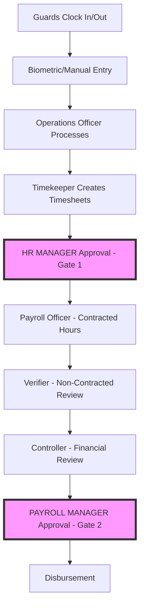
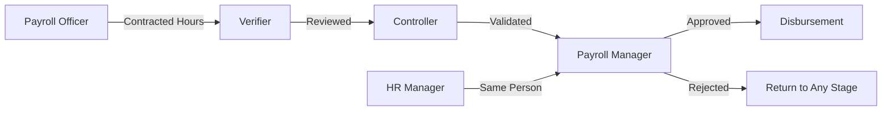
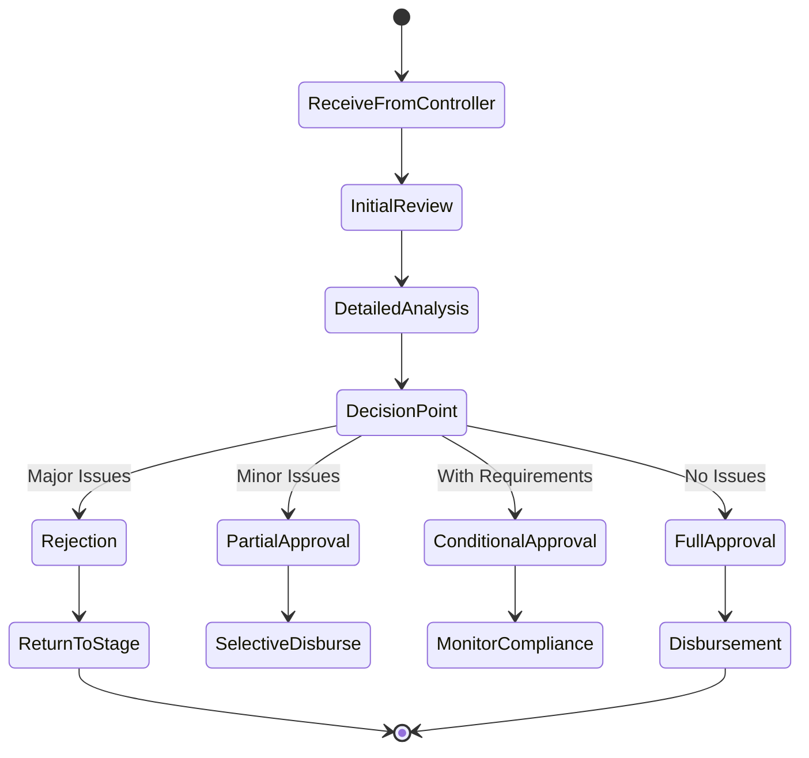
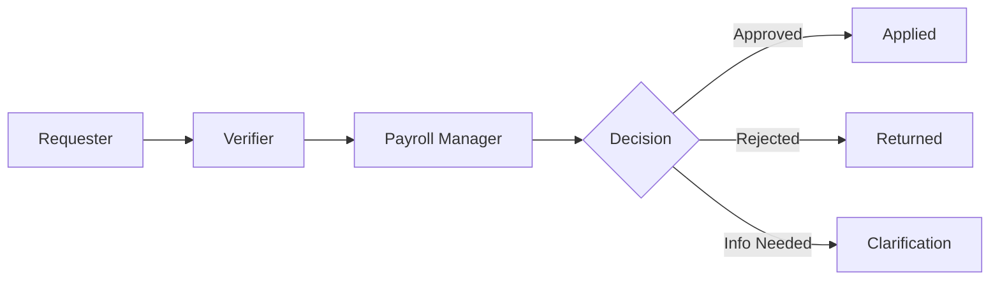
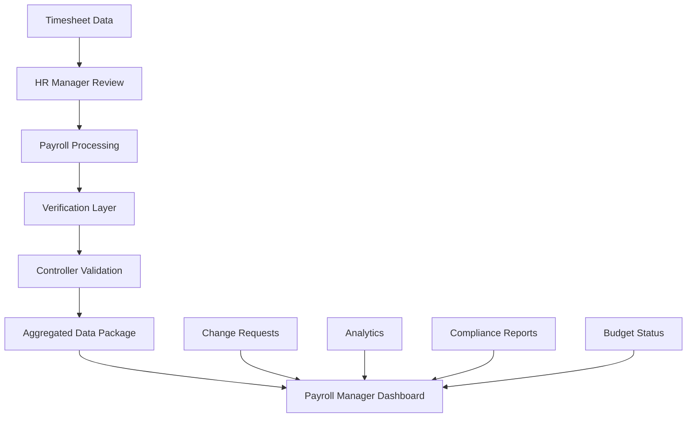

# Payroll Manager Role Integration Document

## Executive Summary

This document comprehensively integrates the **Payroll Manager** role into the
payroll system architecture. The Payroll Manager serves as the **final approval
authority** for all payroll disbursements, providing executive oversight after
all processing, review, and financial validation stages.

**Critical Note**: The Payroll Manager and HR Manager roles are performed by the
**same person** wearing two different hats at different stages of the payroll
process. This dual-role approach provides quality control at both the beginning
(timesheet approval as HR Manager) and end (payroll approval as Payroll Manager)
of the process.

## Table of Contents

1. [Role Definition and Responsibilities](#role-definition-and-responsibilities)
2. [Workflow Integration](#workflow-integration)
3. [Database Schema Updates](#database-schema-updates)
4. [User Interface Specifications](#user-interface-specifications)
5. [Approval Process Flow](#approval-process-flow)
6. [Change Request Management](#change-request-management)
7. [System Integration Points](#system-integration-points)
8. [Implementation Guidelines](#implementation-guidelines)

## 1. Role Definition and Responsibilities

### 1.1 Payroll Manager Overview

The Payroll Manager is the **executive-level approval authority** for payroll
disbursements. This role represents the final checkpoint before funds are
released to employees.

#### Key Characteristics:

- **Same Person as HR Manager**: Provides dual-stage approval
- **Executive Authority**: Final decision maker for payroll release
- **Strategic Oversight**: Reviews aggregated payroll data
- **Risk Management**: Ensures compliance and accuracy
- **Budget Control**: Validates financial impact

### 1.2 Dual-Hat Responsibilities

#### As HR Manager (First Hat - Timesheet Stage):

- Reviews and approves all timesheets before payroll processing
- Ensures time record accuracy and compliance
- Provides detailed feedback on timesheet issues
- Gates the entry of data into payroll system
- **Focus**: Individual time records, attendance patterns, schedule compliance

#### As Payroll Manager (Second Hat - Final Stage):

- Provides final approval of complete payroll
- Reviews total payroll amounts and summaries
- Authorizes fund disbursement
- Makes executive decisions on payroll release
- **Focus**: Aggregate amounts, budget impact, financial compliance

### 1.3 Why One Person, Two Hats?

This approach is both practical and effective:

1. **Cost Efficiency**: Single person manages both HR and payroll oversight
2. **Knowledge Continuity**: Same person understands issues from start to finish
3. **Faster Resolution**: Direct knowledge of both timesheet and payroll stages
4. **Consistent Standards**: Uniform application of policies across process
5. **Clear Accountability**: Single point of responsibility for accuracy
6. **Industry Standard**: Common practice in small to medium organizations

## 2. Workflow Integration

### 2.1 Complete Payroll Process Flow



### 2.2 Approval Gates Detail

#### Gate 1: Timesheet Approval (HR Manager Hat)

- **Timing**: Before payroll processing begins
- **Focus**: Time accuracy, attendance, schedule compliance
- **SLA**: 24 hours
- **Authority**: Approve/Reject individual timesheets
- **Output**: Approved timesheets for payroll processing

#### Gate 2: Payroll Approval (Payroll Manager Hat)

- **Timing**: After all processing and reviews complete
- **Focus**: Total amounts, budget compliance, financial impact
- **SLA**: 48 hours
- **Authority**: Approve/Reject/Conditional approval of entire payroll
- **Output**: Authorization for fund disbursement

### 2.3 Interaction with Other Roles



## 3. Database Schema Updates

### 3.1 Enhanced Paysheet Table

```sql
CREATE TABLE Paysheet (
    id VARCHAR PRIMARY KEY,
    guardId VARCHAR NOT NULL,
    payPeriodId VARCHAR NOT NULL,
    basicPay DECIMAL(10,2),
    overtimePay DECIMAL(10,2),
    nightDifferential DECIMAL(10,2),
    totalAllowances DECIMAL(10,2),
    totalDeductions DECIMAL(10,2),
    taxAmount DECIMAL(10,2),
    netPay DECIMAL(10,2),
    status ENUM('DRAFT', 'VERIFIED', 'REVIEWED', 'APPROVED', 'REJECTED'),

    -- Processing timestamps
    createdDate TIMESTAMP,
    verifiedDate TIMESTAMP,
    verifiedBy VARCHAR,
    reviewedDate TIMESTAMP,
    reviewedBy VARCHAR,

    -- Payroll Manager specific fields
    payrollManagerApprovalDate TIMESTAMP,
    payrollManagerId VARCHAR,
    payrollManagerNotes TEXT,
    approvalType ENUM('FULL', 'PARTIAL', 'CONDITIONAL'),

    -- Financial validation
    controllerReviewDate TIMESTAMP,
    controllerNotes TEXT,
    budgetCompliance BOOLEAN,

    FOREIGN KEY (guardId) REFERENCES Guard(id),
    FOREIGN KEY (payPeriodId) REFERENCES PayPeriod(id),
    INDEX idx_status (status),
    INDEX idx_payroll_approval (payrollManagerApprovalDate)
);
```

### 3.2 Approval Workflow Table

```sql
CREATE TABLE PayrollApprovalWorkflow (
    id VARCHAR PRIMARY KEY,
    paysheetId VARCHAR NOT NULL,
    stage ENUM('TIMESHEET', 'PROCESSING', 'VERIFICATION', 'CONTROL', 'FINAL_APPROVAL'),
    roleId VARCHAR NOT NULL,
    userId VARCHAR NOT NULL,
    action ENUM('APPROVED', 'REJECTED', 'RETURNED', 'CONDITIONAL'),
    actionDate TIMESTAMP,
    comments TEXT,
    nextStage VARCHAR,

    FOREIGN KEY (paysheetId) REFERENCES Paysheet(id),
    INDEX idx_workflow (paysheetId, stage)
);
```

### 3.3 Payroll Manager Decision Table

```sql
CREATE TABLE PayrollManagerDecision (
    id VARCHAR PRIMARY KEY,
    payPeriodId VARCHAR NOT NULL,
    decisionType ENUM('APPROVAL', 'REJECTION', 'PARTIAL', 'EMERGENCY'),
    totalAmount DECIMAL(15,2),
    affectedGuards INT,
    decisionDate TIMESTAMP,
    payrollManagerId VARCHAR,
    justification TEXT,
    conditions TEXT,

    -- Override fields
    overrideBudget BOOLEAN DEFAULT FALSE,
    overrideReason TEXT,
    executiveApproval VARCHAR,

    FOREIGN KEY (payPeriodId) REFERENCES PayPeriod(id),
    INDEX idx_decision_date (decisionDate)
);
```

## 4. User Interface Specifications

### 4.1 Unified Dashboard for HR/Payroll Manager

The dashboard serves as the central hub for all approval activities:

```typescript
interface UnifiedDashboard {
	sections: {
		timesheetApprovals: {
			pending: number
			overdue: number
			resubmissions: number
		}
		payrollApprovals: {
			awaitingReview: number
			inControllerReview: number
			readyForApproval: number
		}
		changeRequests: {
			timeAdjustments: number
			rateChanges: number
			deductionModifications: number
		}
	}
	slaTracking: {
		timesheetSLA: '24 hours'
		payrollSLA: '48 hours'
		changeRequestSLA: 'varies'
	}
	quickActions: [
		'Review Timesheets',
		'Approve Payroll',
		'Process Change Requests',
		'View Analytics',
	]
}
```

### 4.2 Payroll Approval Interface

```typescript
interface PayrollApprovalScreen {
	summary: {
		payPeriod: string
		totalAmount: number
		employeeCount: number
		departmentBreakdown: Record<string, number>
	}

	financialMetrics: {
		budgetUtilization: number
		varianceFromLastPeriod: number
		overtimeCost: number
		deductionsTotal: number
	}

	reviewTrail: {
		verifierNotes: string
		controllerAssessment: string
		flaggedItems: Array<{
			type: string
			description: string
			impact: number
		}>
	}

	approvalOptions: {
		fullApproval: boolean
		partialApproval: {
			enabled: boolean
			excludedItems: string[]
		}
		conditionalApproval: {
			enabled: boolean
			conditions: string[]
		}
		rejection: {
			enabled: boolean
			returnTo: 'VERIFIER' | 'PAYROLL_OFFICER' | 'CONTROLLER'
			reason: string
		}
	}
}
```

### 4.3 Decision Analytics Dashboard

```typescript
interface PayrollManagerAnalytics {
	approvalMetrics: {
		averageApprovalTime: number
		firstPassApprovalRate: number
		rejectionRate: number
		conditionalApprovalRate: number
	}

	financialMetrics: {
		monthlyPayrollTrend: Array<{ month: string; amount: number }>
		budgetVariance: number
		overtimePercentage: number
		deductionCompliance: number
	}

	riskIndicators: {
		highValuePayments: number
		unusualPatterns: string[]
		complianceIssues: string[]
		escalatedItems: number
	}

	historicalComparison: {
		currentVsPrevious: number
		yearOverYear: number
		seasonalAdjustments: boolean
	}
}
```

## 5. Approval Process Flow

### 5.1 Payroll Manager Review Process



### 5.2 Decision Criteria Matrix

| Criteria          | Full Approval | Partial      | Conditional                | Reject               |
| ----------------- | ------------- | ------------ | -------------------------- | -------------------- |
| Budget Compliance | ✓ Within      | ✓ Mostly     | ⚠️ Over with justification | ✗ Significantly over |
| Error Rate        | < 1%          | < 3%         | < 5% with plan             | > 5%                 |
| Documentation     | Complete      | Minor gaps   | Pending items              | Major gaps           |
| Compliance        | Full          | Minor issues | Correctable                | Violations           |
| Timing            | On schedule   | Slight delay | Urgent with conditions     | Major delay          |

### 5.3 Escalation Triggers

```typescript
interface EscalationTriggers {
	automatic: {
		budgetExceeded: 'Amount > 110% of budget'
		highErrorRate: 'Errors > 5%'
		complianceViolation: 'Any major violation'
		unusualPattern: 'Deviation > 20% from normal'
	}

	manual: {
		controllerFlag: 'Controller escalation'
		employeeComplaint: 'Formal grievance'
		auditFinding: 'Internal/External audit issue'
		systemError: 'Technical malfunction'
	}

	response: {
		immediate: 'Within 2 hours'
		urgent: 'Within 4 hours'
		standard: 'Within 24 hours'
	}
}
```

## 6. Change Request Management

### 6.1 Payroll Manager as Final Approver

All change requests follow a three-tier structure with the Payroll Manager as
the final approver:



### 6.2 Change Request Types Requiring Payroll Manager Approval

```typescript
interface PayrollManagerChangeRequests {
	timeAdjustments: {
		clockInCorrections: RequiresApproval
		clockOutCorrections: RequiresApproval
		missingPunches: RequiresApproval
		wholeDayAdjustments: RequiresApproval
	}

	rateChanges: {
		contractRates: RequiresApproval
		specialRates: RequiresApproval
		overtimeRates: RequiresApproval
		retroactiveRates: RequiresApproval
	}

	payrollCorrections: {
		deductionChanges: RequiresApproval
		allowanceAdjustments: RequiresApproval
		governmentContributions: RequiresApproval
		taxCorrections: RequiresApproval
	}

	policyOverrides: {
		floorValueWaivers: RequiresApproval
		paymentScheduleChanges: RequiresApproval
		emergencyPayments: RequiresApproval
		specialDisbursements: RequiresApproval
	}
}
```

## 7. System Integration Points

### 7.1 Role Interaction Matrix

```typescript
interface RoleInteractions {
	withPayrollOfficer: {
		receives: 'Processed payroll data'
		reviews: 'Contracted hours calculations'
		returns: 'Corrections if needed'
	}

	withVerifier: {
		receives: 'Reviewed non-contracted components'
		validates: 'Deduction accuracy'
		feedback: 'Review quality assessment'
	}

	withController: {
		receives: 'Financial validation report'
		discusses: 'Budget implications'
		collaborates: 'Risk mitigation strategies'
	}

	withHRManager: {
		identity: 'Same person, different stage'
		leverages: 'Knowledge from timesheet approval'
		ensures: 'Consistency across process'
	}

	withOperations: {
		queries: 'Unusual patterns'
		validates: 'Operational compliance'
		addresses: 'Field concerns'
	}
}
```

### 7.2 Data Flow to Payroll Manager



### 7.3 Output from Payroll Manager

```typescript
interface PayrollManagerOutputs {
	approvalDecisions: {
		payrollApproval: ApprovalDocument
		changeRequestDecisions: ChangeDecision[]
		policyDirectives: PolicyUpdate[]
	}

	communications: {
		toFinance: 'Disbursement authorization'
		toEmployees: 'Payment notifications'
		toManagement: 'Executive summary'
		toAuditors: 'Compliance documentation'
	}

	reports: {
		monthlyPayrollSummary: Report
		exceptionReport: Report
		complianceReport: Report
		trendAnalysis: Report
	}

	systemUpdates: {
		approvalStatus: StatusUpdate
		workflowProgress: WorkflowUpdate
		auditTrail: AuditEntry[]
	}
}
```

## 8. Implementation Guidelines

### 8.1 System Configuration

```typescript
interface PayrollManagerConfiguration {
	approvalThresholds: {
		autoApproval: 'None - all require manual review'
		fastTrack: 'Clean payrolls with no flags'
		detailedReview: 'Any flagged items'
		escalation: 'Budget > 105% or errors > 3%'
	}

	slaSettings: {
		timesheetReview: '24 hours'
		payrollApproval: '48 hours'
		emergencyApproval: '4 hours'
		changeRequests: {
			high: '4 hours'
			medium: '24 hours'
			low: '48 hours'
		}
	}

	notificationPreferences: {
		channels: ['email', 'sms', 'dashboard']
		frequency: 'immediate' | 'batch' | 'daily'
		escalationAlerts: true
		summaryReports: 'daily'
	}
}
```

### 8.2 Training Requirements

#### For the HR/Payroll Manager:

1. **Dual Role Understanding**
   - Clear differentiation between HR and Payroll Manager responsibilities
   - When to wear which "hat"
   - Different focus areas for each role

2. **System Navigation**
   - Unified dashboard usage
   - Switching between approval interfaces
   - Accessing analytics and reports

3. **Decision Making**
   - Approval criteria application
   - When to use partial vs conditional approval
   - Escalation handling

4. **Change Request Management**
   - Final approval process
   - Documentation requirements
   - Audit trail maintenance

#### For Other Roles:

1. **Understanding Dual Approval**
   - Why same person approves twice
   - Different stages and focus
   - Importance of both gates

2. **Interaction Protocols**
   - When to escalate to Payroll Manager
   - Required documentation
   - Communication channels

### 8.3 Implementation Phases

#### Phase 1: Foundation (Weeks 1-2)

- Configure Payroll Manager role in system
- Set up unified dashboard
- Establish approval workflows
- Define SLAs and thresholds

#### Phase 2: Integration (Weeks 3-4)

- Connect with existing roles
- Test approval chains
- Implement change request routing
- Validate data flows

#### Phase 3: Training (Weeks 5-6)

- Train HR/Payroll Manager on dual role
- Train other roles on interaction
- Document procedures
- Create quick reference guides

#### Phase 4: Pilot (Weeks 7-8)

- Run parallel with existing process
- Monitor approval times
- Gather feedback
- Adjust configurations

#### Phase 5: Go-Live (Week 9+)

- Full implementation
- Monitor performance
- Continuous improvement
- Regular reviews

### 8.4 Success Metrics

```typescript
interface PayrollManagerMetrics {
	efficiency: {
		approvalTurnaround: 'Average time to approve'
		firstPassRate: 'Approvals without returns'
		batchProcessing: 'Multiple approvals per session'
	}

	accuracy: {
		errorReduction: 'Decrease in payment errors'
		complianceRate: 'Regulatory compliance score'
		auditFindings: 'Reduction in audit issues'
	}

	satisfaction: {
		employeeSatisfaction: 'Payment accuracy feedback'
		roleEffectiveness: 'Other roles satisfaction'
		managementConfidence: 'Executive satisfaction'
	}

	financial: {
		budgetAdherence: 'Staying within budget'
		costSavings: 'Efficiency improvements'
		riskMitigation: 'Avoided penalties/errors'
	}
}
```

## 9. Business Rules and Policies

### 9.1 Approval Authority Matrix

| Scenario               | HR Manager (Timesheets)  | Payroll Manager (Final) |
| ---------------------- | ------------------------ | ----------------------- |
| Regular Payroll        | Required                 | Required                |
| Emergency Payment      | Not Required             | Required                |
| Retroactive Adjustment | Required if affects time | Required                |
| Advance Payment        | Not Applicable           | Required                |
| Bonus/Incentive        | Not Required             | Required                |
| Deduction Override     | Not Applicable           | Required                |

### 9.2 Decision Documentation Requirements

```typescript
interface DecisionDocumentation {
	required: {
		decisionType: string
		justification: string
		timestamp: Date
		affectedEmployees: number
		financialImpact: number
	}

	conditional: {
		budgetOverride: 'Executive approval needed'
		policyException: 'Detailed explanation required'
		emergencyPayment: 'Crisis documentation'
		retroactiveChange: 'Authorization and reason'
	}

	auditTrail: {
		preserveOriginal: true
		trackChanges: true
		reasonCodes: true
		approverIdentity: true
		cannotDelete: true
	}
}
```

### 9.3 Escalation and Exception Handling

```typescript
interface ExceptionHandling {
	automaticEscalation: {
		trigger: 'SLA breach or high-value exception'
		notification: 'Immediate alert to Payroll Manager'
		action: 'Priority queue placement'
	}

	manualEscalation: {
		initiator: 'Any role with justification'
		process: 'Direct to Payroll Manager queue'
		response: 'Within 4 hours'
	}

	emergencyProcedure: {
		activation: 'Critical payment needed'
		approval: 'Payroll Manager only'
		documentation: 'Full justification required'
		audit: 'Automatic flag for review'
	}
}
```

## 10. Conclusion

The integration of the Payroll Manager role completes the payroll system's
approval hierarchy. By having the same person serve as both HR Manager and
Payroll Manager:

1. **Ensures Consistency**: Same standards applied throughout
2. **Improves Efficiency**: Faster decision-making with full context
3. **Reduces Errors**: Knowledge continuity from timesheet to payment
4. **Maintains Control**: Two distinct approval gates for security
5. **Provides Accountability**: Clear ownership of payroll accuracy

This dual-role approach is both practical and effective, providing comprehensive
oversight while maintaining operational efficiency. The system ensures proper
controls through:

- Distinct approval stages with different focus areas
- Comprehensive audit trails
- Clear escalation paths
- Robust change management
- Strong financial controls

The Payroll Manager, working in conjunction with the Payroll Officer, Verifier,
and Controller, ensures accurate, timely, and compliant payroll processing for
all guards.

## Appendices

### Appendix A: Quick Reference - Dual Role Responsibilities

| Stage              | Role                        | Focus                   | Key Decisions              |
| ------------------ | --------------------------- | ----------------------- | -------------------------- |
| Timesheet Review   | HR Manager                  | Individual time records | Approve/Reject timesheets  |
| Payroll Processing | (Processing by other roles) | -                       | -                          |
| Final Approval     | Payroll Manager             | Total payroll amounts   | Approve/Reject/Conditional |
| Change Requests    | Payroll Manager             | All modifications       | Final approval authority   |

### Appendix B: Communication Templates

#### Payroll Approval Communication

```
Subject: Payroll Approved - [Pay Period]
Total Amount: [Amount]
Employees: [Count]
Status: APPROVED
Conditions: [If any]
Next Step: Proceed with disbursement
```

#### Rejection Communication

```
Subject: Payroll Returned for Correction
Issue: [Specific problem]
Return To: [Role]
Required Action: [Specific corrections needed]
Deadline: [Timeframe]
```

### Appendix C: Compliance Checklist

- [ ] All timesheets approved (HR Manager)
- [ ] Contracted hours verified (Payroll Officer)
- [ ] Non-contracted components reviewed (Verifier)
- [ ] Financial validation complete (Controller)
- [ ] Budget compliance checked
- [ ] Government contributions verified
- [ ] Deductions validated
- [ ] Change requests processed
- [ ] Audit trail documented
- [ ] Final approval granted (Payroll Manager)

---

_Document Version: 1.0_ _Last Updated: [Current Date]_ _Next Review:
[Quarterly]_ _Owner: Payroll System Implementation Team_
