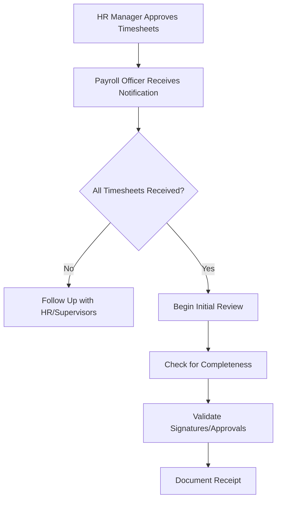
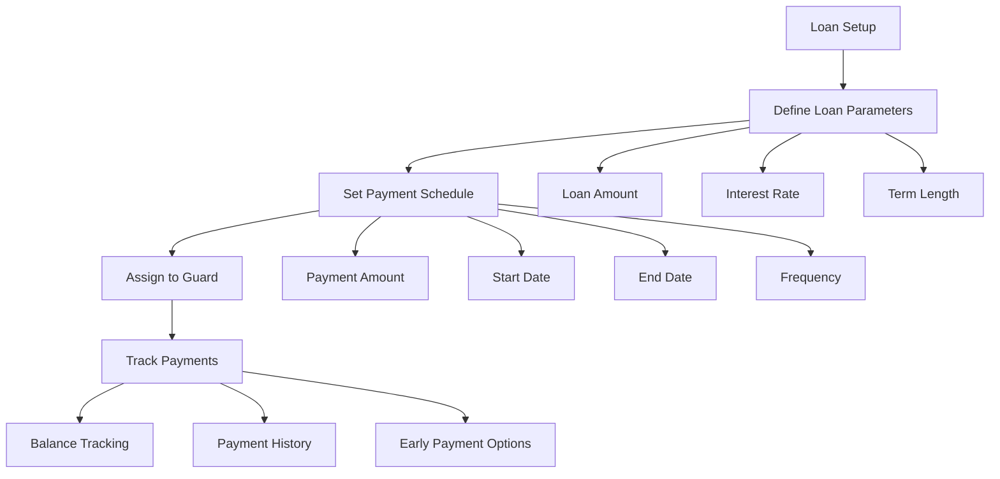
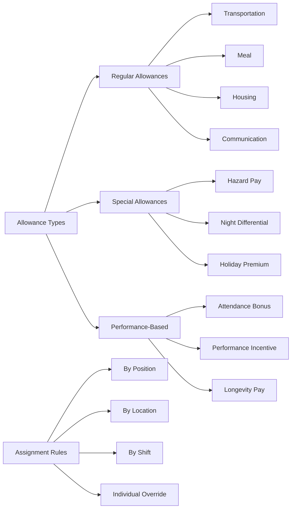
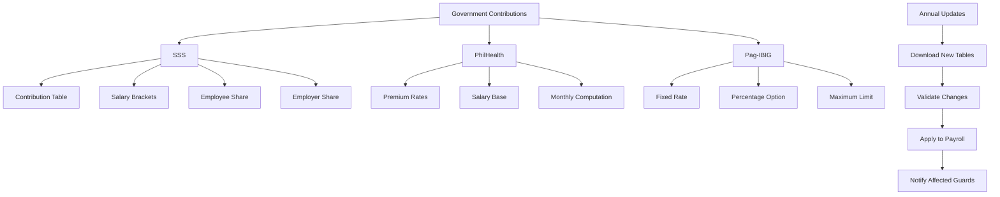
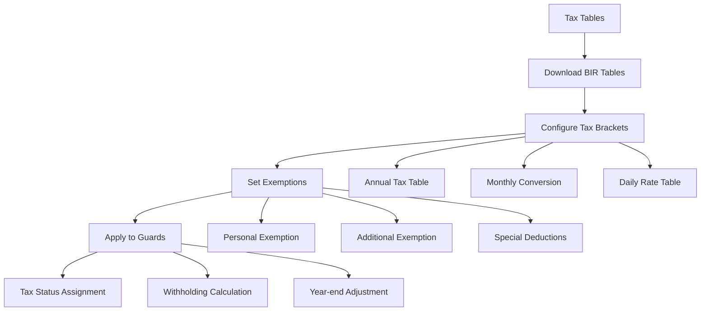
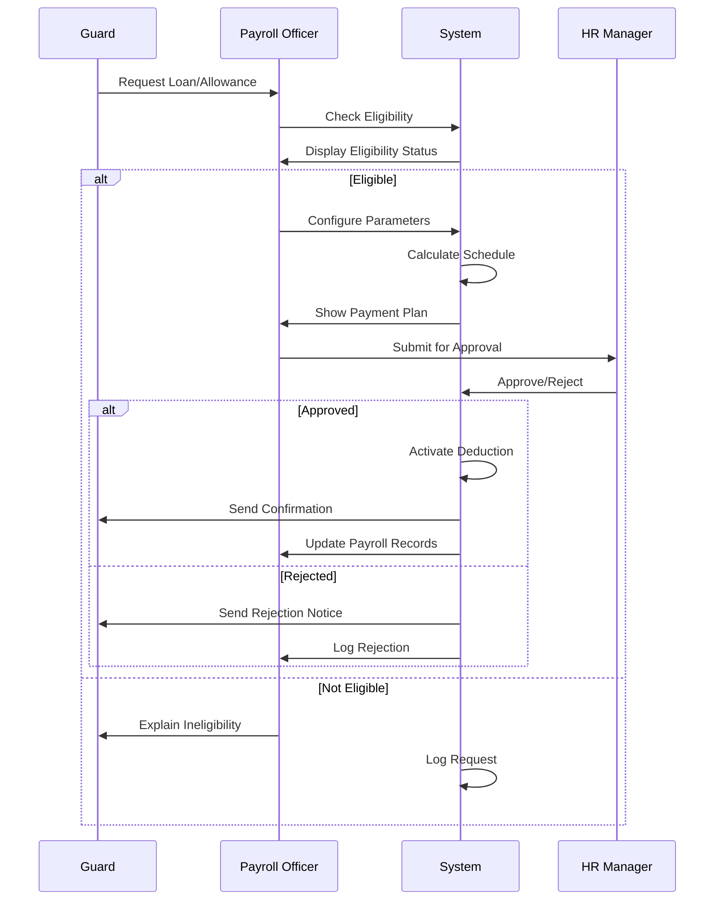

# Payroll Officer Workflow Documentation

## Role Overview

The Payroll Officer serves as the primary data entry and initial processing
point in the payroll system. This role has extensive responsibilities including:

1. **Configuration Management**: Setting up and maintaining tax tables,
   government contribution rates, loan programs, and allowance structures
2. **Guard Benefits Administration**: Associating guards with appropriate
   benefit programs, loan schedules, and allowances
3. **Timesheet Processing**: Collecting and validating timesheet data,
   calculating base payroll components
4. **Deductions Management**: Processing loan payments, applying scheduled
   deductions, and managing payment schedules per pay period
5. **Compliance**: Ensuring all government contributions and tax withholdings
   are correctly calculated and applied
6. **Package Preparation**: Compiling comprehensive payroll packages for
   verification

The Payroll Officer acts as the foundation of the payroll processing chain,
managing both the configuration of payroll components and the actual processing
of payroll data, ensuring accuracy and completeness before escalation to the
Verifier.

## Core Responsibilities

### 1. Timesheet Collection & Validation

- Receive approved timesheets from HR Manager
- Validate timesheet completeness and accuracy
- Flag discrepancies for resolution
- Ensure all guards are accounted for
- Track submission deadlines

### 2. Payroll Calculation

- Calculate regular hours and rates
- Process overtime calculations
- Apply shift differentials
- Calculate gross pay
- Prepare initial payroll summaries

### 3. Deductions & Benefits Setup

- Configure and maintain loan schedules
- Set up allowance structures
- Manage government contribution tables
- Update tax tables and brackets
- Associate guards with benefit programs
- Schedule recurring deductions
- Track loan balances and payments

### 4. Data Entry & Management

- Input timesheet data into payroll system
- Maintain guard employment records
- Update rate changes and adjustments
- Track attendance and leave balances
- Document special circumstances
- Manage deduction schedules

### 5. Quality Assurance

- Perform initial data validation
- Cross-reference with previous periods
- Identify anomalies and outliers
- Prepare variance reports
- Document calculation methodology
- Verify deduction accuracy

## Detailed Workflow

### Complete Payroll Officer Process Flow

```mermaid
graph TB
    Start([Start Payroll Process])

    subgraph "Phase 1: Setup & Configuration"
        A1[Configure Tax Tables]
        A2[Update Gov't Contributions]
        A3[Setup Loan Programs]
        A4[Define Allowances]
        A5[Assign to Guards]
    end

    subgraph "Phase 2: Timesheet Processing"
        B1[Receive Timesheets]
        B2[Validate Data]
        B3[Calculate Base Pay]
        B4[Apply Overtime]
    end

    subgraph "Phase 3: Deductions & Benefits"
        C1[Process Loans]
        C2[Apply Allowances]
        C3[Calculate Gov't Contributions]
        C4[Compute Tax Withholding]
        C5[Schedule Payments]
    end

    subgraph "Phase 4: Quality Control"
        D1[Review Calculations]
        D2[Validate Totals]
        D3[Check Compliance]
    end

    subgraph "Phase 5: Package Preparation"
        E1[Compile Reports]
        E2[Prepare Documentation]
        E3[Create Summary]
    end

    subgraph "Phase 6: Submission"
        F1[Final Validation]
        F2[Submit to Verifier]
    end

    Start --> A1
    A1 --> A2 --> A3 --> A4 --> A5
    A5 --> B1
    B1 --> B2 --> B3 --> B4
    B4 --> C1
    C1 --> C2 --> C3 --> C4 --> C5
    C5 --> D1
    D1 --> D2 --> D3
    D3 --> E1
    E1 --> E2 --> E3
    E3 --> F1 --> F2
    F2 --> End([End - To Verifier])
```



## Detailed Workflow

### Phase 1: Timesheet Reception



#### Acceptance Criteria

- All timesheets have HR Manager approval
- Total hours are within expected ranges
- Required fields are complete
- Digital signatures are valid
- Pay period dates match

#### Validation Rules

```typescript
interface TimesheetValidation {
	requiredFields: [
		'employeeId',
		'payPeriod',
		'regularHours',
		'overtimeHours',
		'supervisorApproval',
		'hrApproval',
	]

	hourLimits: {
		regularMax: 96 // Bi-weekly max
		overtimeMax: 40 // Bi-weekly max
		dailyMax: 24 // Physical limit
		weeklyMax: 84 // 7 days × 12 hours
	}

	rateValidation: {
		minimumRate: 7.25 // Federal minimum
		maximumRate: 100.0 // Reasonableness check
		allowedIncrements: 0.01
	}
}
```

### Phase 2: Data Entry & Base Calculation

#### Data Entry Process

```typescript
interface PayrollDataEntry {
	// Guard Information
	guardDetails: {
		id: string
		name: string
		employeeNumber: string
		department: string
		position: string
		payGrade: string
	}

	// Time Records
	timeRecords: {
		regularHours: number
		overtimeHours: number
		holidayHours: number
		sickLeave: number
		vacation: number
		otherLeave: number
	}

	// Rate Information
	rates: {
		baseRate: number
		overtimeMultiplier: 1.5 | 2.0
		shiftDifferential: number
		holidayRate: number
	}

	// Calculations
	calculations: {
		regularPay: number
		overtimePay: number
		shiftPay: number
		holidayPay: number
		grossPay: number
	}
}
```

#### Calculation Methodology

```typescript
class PayrollCalculator {
	calculateRegularPay(hours: number, rate: number): number {
		return hours * rate
	}

	calculateOvertimePay(
		hours: number,
		rate: number,
		multiplier: number,
	): number {
		return hours * rate * multiplier
	}

	calculateShiftDifferential(hours: number, differential: number): number {
		return hours * differential
	}

	calculateGrossPay(components: PayComponents): number {
		return (
			components.regular +
			components.overtime +
			components.shift +
			components.holiday +
			components.other
		)
	}

	validateCalculations(data: PayrollData): ValidationResult {
		const recalculated = this.recalculate(data)
		const tolerance = 0.01 // Penny tolerance for rounding

		return {
			valid: Math.abs(recalculated - data.total) <= tolerance,
			discrepancy: recalculated - data.total,
			details: this.getValidationDetails(data, recalculated),
		}
	}
}
```

#### Comprehensive Payroll Calculation Example

```typescript
class PayrollCalculationEngine {
	calculateCompletePayroll(guard: Guard, period: PayPeriod): PayrollResult {
		// Step 1: Base Pay Calculation
		const basePay = {
			regularHours: guard.hours.regular * guard.rate.hourly,
			overtime: guard.hours.overtime * guard.rate.overtime,
			nightDiff: guard.hours.night * guard.rate.nightDifferential,
			holiday: guard.hours.holiday * guard.rate.holiday,
		}

		const grossPay = Object.values(basePay).reduce((sum, val) => sum + val, 0)

		// Step 2: Add Allowances
		const allowances = {
			transportation: this.calculateTransportAllowance(guard, period),
			meal: this.calculateMealAllowance(guard, period),
			housing: guard.allowances.housing || 0,
			hazardPay: this.calculateHazardPay(guard, basePay.regularHours),
			performanceBonus: this.calculatePerformanceBonus(guard, period),
		}

		const totalAllowances = Object.values(allowances).reduce(
			(sum, val) => sum + val,
			0,
		)

		// Step 3: Calculate Government Contributions (Employee Share)
		const govtContributions = {
			sss: this.lookupSSSContribution(grossPay).employeeShare,
			philhealth: grossPay * 0.02, // 2% employee share
			pagibig: grossPay > 1500 ? grossPay * 0.02 : grossPay * 0.01,
		}

		const totalGovtDeductions = Object.values(govtContributions).reduce(
			(sum, val) => sum + val,
			0,
		)

		// Step 4: Calculate Tax
		const taxableIncome = grossPay + totalAllowances - totalGovtDeductions
		const tax = this.calculateWithholdingTax(taxableIncome, guard.taxStatus)

		// Step 5: Apply Loan Deductions
		const loanDeductions = {
			salaryLoan: this.getCurrentLoanPayment(guard.loans.salary, period),
			emergencyLoan: this.getCurrentLoanPayment(guard.loans.emergency, period),
			educationalLoan: this.getCurrentLoanPayment(
				guard.loans.educational,
				period,
			),
		}

		const totalLoanDeductions = Object.values(loanDeductions).reduce(
			(sum, val) => sum + val,
			0,
		)

		// Step 6: Other Deductions
		const otherDeductions = {
			uniform: guard.deductions.uniform || 0,
			insurance: guard.deductions.insurance || 0,
			union: guard.deductions.union || 0,
		}

		const totalOtherDeductions = Object.values(otherDeductions).reduce(
			(sum, val) => sum + val,
			0,
		)

		// Step 7: Calculate Net Pay
		const totalDeductions =
			totalGovtDeductions + tax + totalLoanDeductions + totalOtherDeductions
		const netPay = grossPay + totalAllowances - totalDeductions

		return {
			guardId: guard.id,
			payPeriod: period,
			earnings: {
				basic: basePay,
				allowances: allowances,
				gross: grossPay,
				totalEarnings: grossPay + totalAllowances,
			},
			deductions: {
				government: govtContributions,
				tax: tax,
				loans: loanDeductions,
				other: otherDeductions,
				totalDeductions: totalDeductions,
			},
			netPay: netPay,
			metadata: {
				calculatedAt: new Date(),
				calculatedBy: this.currentUser,
				version: this.calculationVersion,
			},
		}
	}
}
```

### Phase 3: Deductions, Benefits & Tax Configuration

#### Loan Management System



#### Loan Configuration Process

```typescript
interface LoanSetup {
	loanTypes: {
		salary: {
			maxAmount: 'Up to 3 months salary'
			interestRate: 0.05 // 5% per annum
			maxTerm: 12 // months
			minTerm: 3 // months
		}
		emergency: {
			maxAmount: 5000
			interestRate: 0.03 // 3% per annum
			maxTerm: 6 // months
			approval: 'Immediate'
		}
		educational: {
			maxAmount: 10000
			interestRate: 0.02 // 2% per annum
			maxTerm: 24 // months
			documentation: 'Required'
		}
	}

	paymentSchedule: {
		frequency: 'PER_PAYPERIOD' | 'MONTHLY' | 'CUSTOM'
		calculation: {
			principal: number
			interest: number
			totalPayment: number
			remainingBalance: number
		}
		automation: {
			autoDeduct: boolean
			skipOnLeave: boolean
			adjustForPartialPeriod: boolean
		}
	}

	guardAssignment: {
		eligibilityCheck: {
			employmentLength: '>= 6 months'
			goodStanding: boolean
			existingLoans: '< 2 active'
			debtRatio: '< 40% of salary'
		}
		approvalWorkflow: {
			request: 'Guard submits'
			review: 'Payroll Officer validates'
			approval: 'HR Manager approves'
			setup: 'Payroll Officer configures'
		}
	}
}
```

#### Allowance Management



#### Allowance Configuration

```typescript
interface AllowanceSetup {
	regularAllowances: {
		transportation: {
			amount: number | 'DISTANCE_BASED'
			frequency: 'DAILY' | 'PER_PAYPERIOD'
			taxable: boolean
			conditions: 'Present at work'
		}
		meal: {
			amount: number
			frequency: 'PER_SHIFT'
			taxable: false
			autoCalculate: 'Based on days worked'
		}
		housing: {
			amount: number | 'PERCENTAGE_OF_BASIC'
			frequency: 'MONTHLY'
			eligibility: 'Distance > 50km from home'
		}
	}

	specialAllowances: {
		hazardPay: {
			rate: 'PERCENTAGE_OF_HOURLY'
			percentage: 0.25 // 25% additional
			locations: ['High-risk sites']
			autoApply: true
		}
		nightDifferential: {
			rate: 0.1 // 10% of hourly
			hours: '22:00 to 06:00'
			autoCalculate: true
		}
	}

	scheduleManagement: {
		recurringSetup: {
			pattern: 'EVERY_PAYPERIOD' | 'MONTHLY' | 'CUSTOM'
			startDate: Date
			endDate: Date | null
			skipConditions: ['On leave', 'Suspended']
		}
		bulkAssignment: {
			byDepartment: boolean
			byPosition: boolean
			byLocation: boolean
			exceptions: GuardId[]
		}
	}
}
```

#### Government Contributions Management



#### Government Contribution Tables

```typescript
interface GovernmentContributions {
	sss: {
		table: {
			brackets: Array<{
				rangeMin: number
				rangeMax: number
				monthlyCredit: number
				employeeShare: number
				employerShare: number
				totalContribution: number
			}>
			effectiveDate: Date
			source: 'SSS Circular'
		}
		calculation: {
			method: 'BRACKET_LOOKUP'
			basis: 'MONTHLY_SALARY'
			proration: 'For partial months'
		}
	}

	philhealth: {
		premiumRate: {
			percentage: 0.04 // 4% as of 2024
			split: {
				employee: 0.02
				employer: 0.02
			}
			ceiling: 100000 // Maximum salary base
			floor: 10000 // Minimum salary base
		}
		calculation: {
			formula: 'SALARY * RATE / 2'
			frequency: 'MONTHLY'
		}
	}

	pagibig: {
		contribution: {
			employeeRate: {
				below1500: 0.01 // 1%
				above1500: 0.02 // 2%
			}
			employerRate: 0.02 // 2%
			maximumSalaryBase: 5000
			voluntaryAdditional: 'Allowed'
		}
	}

	maintenanceWorkflow: {
		updateFrequency: 'ANNUAL' | 'AS_ANNOUNCED'
		validationSteps: [
			'Download official tables',
			'Compare with current',
			'Test calculations',
			'Approve changes',
			'Deploy to production',
		]
		auditTrail: {
			updatedBy: string
			updatedDate: Date
			approvedBy: string
			source: string
		}
	}
}
```

#### Tax Table Configuration



#### Tax Configuration System

```typescript
interface TaxConfiguration {
	taxTables: {
		annual: Array<{
			bracketMin: number
			bracketMax: number
			baseTax: number
			percentageOver: number
			effectiveYear: number
		}>

		conversion: {
			toMonthly: 'ANNUAL / 12'
			toSemiMonthly: 'ANNUAL / 24'
			toDaily: 'ANNUAL / 261' // Working days
		}
	}

	taxStatus: {
		categories: {
			S: 'Single'
			ME: 'Married'
			ME1: 'Married with 1 dependent'
			ME2: 'Married with 2 dependents'
			ME3: 'Married with 3 dependents'
			ME4: 'Married with 4 dependents'
		}

		exemptions: {
			personal: 50000
			additional: 25000 // per qualified dependent
			maximum: 4 // Maximum dependents
		}
	}

	guardTaxSetup: {
		assignment: {
			guardId: string
			taxStatus: string
			dependents: number
			additionalExemptions: Array<{
				type: string
				amount: number
				documentation: string
			}>
		}

		computation: {
			method: 'TRAIN_LAW_2018' | 'CUSTOM'
			specialConsiderations: [
				'Minimum wage earner exemption',
				'De minimis benefits',
				'13th month pay exemption',
			]
		}
	}

	maintenanceSchedule: {
		birUpdates: {
			frequency: 'ANNUAL'
			effectiveDate: 'January 1'
			notification: '30 days advance'
		}

		validation: {
			testCalculations: true
			compareWithBIRCalculator: true
			auditCompliance: true
		}
	}
}
```

#### Deduction Assignment Workflow



#### Pay Period Schedule Management

```typescript
interface PayPeriodScheduling {
	loanPayments: {
		scheduling: {
			method: 'AUTO_DEDUCT' | 'MANUAL_ENTRY'
			timing: 'START_OF_PERIOD' | 'END_OF_PERIOD'
			priority: number // Order of deduction
		}

		tracking: {
			paymentNumber: number
			totalPayments: number
			remainingBalance: number
			nextPaymentDate: Date
			paymentHistory: Array<{
				date: Date
				amount: number
				principal: number
				interest: number
				balance: number
			}>
		}

		adjustments: {
			skipPayment: {
				reason: string
				approvedBy: string
				makeupDate: Date
			}
			earlyPayoff: {
				amount: number
				date: Date
				finalBalance: 0
			}
			restructure: {
				newTerms: LoanTerms
				reason: string
				approvalRequired: true
			}
		}
	}

	allowanceScheduling: {
		recurring: {
			pattern: 'EVERY_PERIOD' | 'CONDITIONAL'
			conditions: [
				'Attendance >= 90%',
				'No disciplinary action',
				'Active status',
			]
			calculation: {
				method: 'FIXED' | 'PRORATED' | 'PERFORMANCE_BASED'
				formula: string
			}
		}

		oneTime: {
			payPeriod: string
			amount: number
			reason: string
			taxTreatment: 'TAXABLE' | 'NON_TAXABLE'
		}
	}

	bulkOperations: {
		assignAllowance: {
			recipients: 'BY_CRITERIA' | 'SELECTED_LIST'
			criteria: {
				department?: string
				position?: string
				location?: string
				yearsOfService?: number
			}
			effectivePeriod: string
			endPeriod?: string
		}

		modifyDeductions: {
			type: 'SUSPEND' | 'ADJUST' | 'TERMINATE'
			selection: Guard[]
			reason: string
			effectiveDate: Date
		}
	}
}
```

### Phase 4: Quality Control

#### Self-Review Checklist

```typescript
interface QualityChecklist {
	dataCompleteness: {
		allGuardsIncluded: boolean
		allFieldsPopulated: boolean
		supportingDocsAttached: boolean
	}

	calculationAccuracy: {
		regularPayVerified: boolean
		overtimeCorrect: boolean
		deductionsApplied: boolean
		totalsReconciled: boolean
	}

	complianceCheck: {
		minimumWageMet: boolean
		overtimeRulesFollowed: boolean
		maxHoursRespected: boolean
		breakComplianceVerified: boolean
	}

	anomalyDetection: {
		unusualOvertimeFlag: boolean
		duplicateEntryCheck: boolean
		rateChangeVerified: boolean
		terminationProcessed: boolean
	}
}
```

#### Variance Analysis

```typescript
interface VarianceAnalysis {
	compareWithPrevious: {
		period: string
		totalVariance: number
		percentageChange: number
		flaggedItems: VarianceItem[]
	}

	departmentAnalysis: {
		department: string
		expectedRange: Range
		actualAmount: number
		variance: number
		explanation?: string
	}

	individualAnalysis: {
		guardId: string
		previousAverage: number
		currentAmount: number
		percentageChange: number
		requiresReview: boolean
	}
}
```

### Phase 5: Package Preparation

#### Payroll Package Components

```typescript
interface PayrollPackage {
	metadata: {
		payPeriodId: string
		preparedBy: string
		preparedAt: DateTime
		totalAmount: number
		guardCount: number
		status: 'DRAFT' | 'READY_FOR_REVIEW'
	}

	summaryReport: {
		departmentTotals: DepartmentSummary[]
		payrollTotals: PayrollTotals
		deductionSummary: DeductionSummary
		netPaySummary: NetPaySummary
	}

	detailReports: {
		guardDetails: GuardPayrollDetail[]
		overtimeReport: OvertimeDetail[]
		exceptionReport: Exception[]
		adjustmentReport: Adjustment[]
	}

	supportingDocuments: {
		timesheets: Document[]
		approvals: Approval[]
		calculations: CalculationSheet[]
		notes: ProcessingNote[]
	}

	validationResults: {
		checksPerformed: ValidationCheck[]
		issuesFound: Issue[]
		resolutions: Resolution[]
		signoff: QualitySignoff
	}
}
```

### Phase 6: Submission to Verifier

#### Pre-Submission Validation

```typescript
interface PreSubmissionValidation {
	mandatoryChecks: {
		allCalculationsComplete: boolean
		noMissingData: boolean
		approvalsInPlace: boolean
		documentationComplete: boolean
	}

	qualityMetrics: {
		accuracyScore: number // Target: > 99.5%
		completenessScore: number // Target: 100%
		timelinessScore: number // Target: On schedule
	}

	readinessIndicators: {
		dataLocked: boolean
		auditTrailComplete: boolean
		backupCreated: boolean
		notificationReady: boolean
	}
}
```

#### Submission Process

```typescript
async function submitToVerifier(packageId: string): Promise<SubmissionResult> {
	// Final validation
	const validation = await validatePackage(packageId)
	if (!validation.passed) {
		return {
			success: false,
			errors: validation.errors,
		}
	}

	// Lock the package
	await lockPackage(packageId)

	// Create submission record
	const submission = await createSubmission({
		packageId,
		submittedBy: currentUser.id,
		submittedAt: new Date(),
		targetRole: 'VERIFIER',
	})

	// Notify Verifier
	await notifyVerifier({
		type: 'PAYROLL_READY_FOR_VERIFICATION',
		packageId,
		urgency: getPeriodUrgency(),
		summary: getPackageSummary(packageId),
	})

	// Log submission
	await logAuditEvent({
		action: 'PAYROLL_SUBMITTED_TO_VERIFIER',
		packageId,
		userId: currentUser.id,
		timestamp: new Date(),
	})

	return {
		success: true,
		submissionId: submission.id,
	}
}
```

## Decision Matrix

### Escalation Triggers

| Condition                      | Action                    | Escalation Level |
| ------------------------------ | ------------------------- | ---------------- |
| Missing timesheets             | Request from HR           | Supervisor       |
| Calculation discrepancy > $100 | Re-calculate and document | Verifier         |
| Overtime > 30% of regular      | Flag for review           | Verifier         |
| New guard setup                | Verify all details        | HR Manager       |
| Rate change mid-period         | Apply pro-rata, document  | Verifier         |
| System error                   | Document and retry        | IT Support       |
| Unusual pattern detected       | Investigate and document  | Verifier         |

### Authority Limits

| Action                        | Payroll Officer Authority | Requires Escalation |
| ----------------------------- | ------------------------- | ------------------- |
| Data entry                    | Full authority            | No                  |
| Calculation adjustments < $50 | Can approve               | No                  |
| Calculation adjustments > $50 | Document only             | Yes - Verifier      |
| Rate changes                  | Input only                | Yes - HR Manager    |
| Timesheet corrections         | Flag only                 | Yes - HR Manager    |
| Payment method changes        | Input with approval       | Yes - Verifier      |
| Special deductions            | Input with documentation  | Yes - Verifier      |

## Integration Points

### Input Sources

```typescript
interface PayrollInputs {
	timesheets: {
		source: 'HR Manager Approval System'
		format: 'Digital/Scanned'
		frequency: 'Bi-weekly'
		validation: 'Required signatures'
	}

	employeeData: {
		source: 'HRIS Database'
		format: 'API/Database'
		frequency: 'Real-time sync'
		validation: 'Active status check'
	}

	ratesTables: {
		source: 'Compensation Management'
		format: 'Database'
		frequency: 'On change'
		validation: 'Effective date check'
	}

	deductions: {
		source: 'Benefits System'
		format: 'API'
		frequency: 'Per pay period'
		validation: 'Authorization check'
	}
}
```

### Output Destinations

```typescript
interface PayrollOutputs {
	toVerifier: {
		destination: 'Verification Queue'
		format: 'Structured Package'
		trigger: 'Manual submission'
		notification: 'System alert + Email'
	}

	toReporting: {
		destination: 'Reporting Database'
		format: 'Summary data'
		trigger: 'On save'
		notification: 'None'
	}

	toAudit: {
		destination: 'Audit Log'
		format: 'Detailed log entries'
		trigger: 'All actions'
		notification: 'None'
	}
}
```

## Error Handling

### Common Error Scenarios

```typescript
interface ErrorHandling {
	dataEntryErrors: {
		detection: 'Real-time validation'
		handling: 'Prevent save, show error'
		resolution: 'Correct and retry'
		logging: 'Track error frequency'
	}

	calculationErrors: {
		detection: 'Automated checks'
		handling: 'Flag for review'
		resolution: 'Recalculate with verification'
		logging: 'Detailed error log'
	}

	systemErrors: {
		detection: 'Exception handling'
		handling: 'Save draft, alert IT'
		resolution: 'Restore from draft'
		logging: 'System error log'
	}

	validationErrors: {
		detection: 'Pre-submission check'
		handling: 'Block submission'
		resolution: 'Fix and revalidate'
		logging: 'Validation report'
	}
}
```

### Recovery Procedures

```typescript
class PayrollRecovery {
	async recoverFromError(errorType: string, context: any) {
		switch (errorType) {
			case 'CALCULATION_ERROR':
				return this.recalculateFromSource(context)

			case 'DATA_LOSS':
				return this.restoreFromBackup(context)

			case 'SUBMISSION_FAILURE':
				return this.retrySubmission(context)

			case 'VALIDATION_FAILURE':
				return this.revalidateWithCorrections(context)

			default:
				return this.escalateToSupport(errorType, context)
		}
	}

	async createRecoveryPoint() {
		return {
			timestamp: new Date(),
			data: await this.captureCurrentState(),
			checksum: await this.calculateChecksum(),
			userId: this.currentUser.id,
		}
	}
}
```

## Performance Metrics

### Key Performance Indicators

| Metric                | Target               | Measurement                      |
| --------------------- | -------------------- | -------------------------------- |
| Data Entry Accuracy   | > 99.5%              | Errors per 1000 entries          |
| Processing Time       | < 4 hours per period | Start to submission              |
| First-Time-Right Rate | > 95%                | Packages accepted without rework |
| Deadline Compliance   | 100%                 | On-time submissions              |
| Error Detection Rate  | > 98%                | Caught before submission         |

### Quality Metrics

```typescript
interface QualityMetrics {
  accuracy: {
    target: 99.5,
    calculation: 'correctEntries / totalEntries * 100',
    frequency: 'Per payroll'
  }

  completeness: {
    target: 100,
    calculation: 'completedFields / requiredFields * 100',
    frequency: 'Per submission'
  }

  timeliness: {
    target: 100,
    calculation: 'onTimeSubmissions / totalSubmissions * 100',
    frequency: 'Monthly'
  }

  rework: {
    target: < 5,
    calculation: 'rejectedPackages / totalPackages * 100',
    frequency: 'Monthly'
  }
}
```

## Training Requirements

### Core Competencies

1. **Payroll Processing**
   - Understanding of payroll cycles
   - Knowledge of pay components
   - Calculation methodologies
   - Compliance requirements

2. **System Proficiency**
   - Data entry skills
   - Navigation efficiency
   - Report generation
   - Error resolution

3. **Quality Assurance**
   - Attention to detail
   - Validation techniques
   - Anomaly detection
   - Documentation standards

4. **Communication**
   - Status reporting
   - Issue escalation
   - Stakeholder interaction
   - Written documentation

### Training Program

```typescript
interface TrainingProgram {
	initial: {
		duration: '2 weeks'
		components: [
			'System overview',
			'Payroll fundamentals',
			'Hands-on practice',
			'Quality procedures',
			'Compliance training',
		]
		assessment: 'Practical test + Quiz'
	}

	ongoing: {
		frequency: 'Quarterly'
		topics: [
			'System updates',
			'Process improvements',
			'Regulatory changes',
			'Best practices',
		]
		delivery: 'Workshops + E-learning'
	}

	certification: {
		required: true
		validity: '1 year'
		renewal: 'Annual assessment'
		tracking: 'HR system'
	}
}
```

## Best Practices

### Data Entry Guidelines

1. **Verify Before Entry**
   - Check source documents
   - Confirm calculations
   - Validate rates
   - Review previous periods

2. **Maintain Consistency**
   - Use standard formats
   - Follow naming conventions
   - Apply uniform procedures
   - Document exceptions

3. **Ensure Traceability**
   - Keep audit trails
   - Document changes
   - Note assumptions
   - Preserve source documents

### Quality Assurance Tips

1. **Double-Check Critical Items**
   - High-value payments
   - New employees
   - Terminations
   - Rate changes

2. **Use Validation Tools**
   - Automated calculators
   - Comparison reports
   - Exception reports
   - Trend analysis

3. **Maintain Documentation**
   - Processing notes
   - Exception explanations
   - Approval records
   - Communication logs

## Compliance Requirements

### Regulatory Compliance

```typescript
interface ComplianceRequirements {
	wageLaws: {
		minimumWage: 'Federal and State requirements'
		overtime: 'FLSA regulations'
		recordKeeping: '3-year retention minimum'
		reporting: 'Government submissions'
	}

	taxCompliance: {
		withholdingAccuracy: 'IRS guidelines'
		reportingDeadlines: 'Quarterly and annual'
		documentationRequirements: 'W-2, 1099 forms'
		auditReadiness: 'Supporting documentation'
	}

	internalPolicies: {
		approvalHierarchy: 'Follow authorization matrix'
		documentationStandards: 'Company procedures'
		confidentiality: 'Data protection policies'
		segregationOfDuties: 'Prevent conflicts'
	}
}
```

## System Architecture

### Technical Integration

```typescript
interface SystemArchitecture {
	database: {
		tables: [
			'payroll_entries',
			'calculation_details',
			'validation_results',
			'submission_records',
		]
		relationships: 'Normalized schema'
		indexing: 'Optimized for queries'
		backup: 'Hourly snapshots'
	}

	apis: {
		input: [
			'GET /timesheets/approved',
			'GET /employees/active',
			'GET /rates/current',
		]
		output: [
			'POST /payroll/submit',
			'POST /notifications/send',
			'POST /audit/log',
		]
	}

	security: {
		authentication: 'SSO integration'
		authorization: 'Role-based access'
		encryption: 'Data at rest and transit'
		audit: 'All actions logged'
	}
}
```

## Contingency Planning

### Business Continuity

```typescript
interface ContinuityPlan {
	scenarios: {
		systemOutage: {
			detection: 'Monitoring alerts'
			response: 'Switch to manual process'
			recovery: 'Restore from backup'
			communication: 'Notify stakeholders'
		}

		staffAbsence: {
			detection: 'Attendance tracking'
			response: 'Activate backup personnel'
			recovery: 'Knowledge transfer'
			communication: 'Adjust deadlines'
		}

		dataCorruption: {
			detection: 'Validation failures'
			response: 'Isolate affected data'
			recovery: 'Restore from clean backup'
			communication: 'Impact assessment'
		}
	}

	backupProcedures: {
		frequency: 'After each major step'
		storage: 'Secure cloud storage'
		retention: '30 days minimum'
		testing: 'Monthly restore test'
	}
}
```
