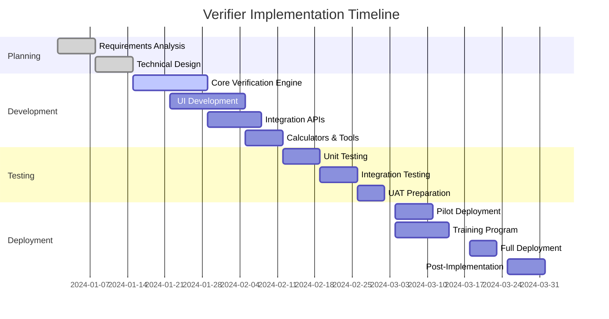
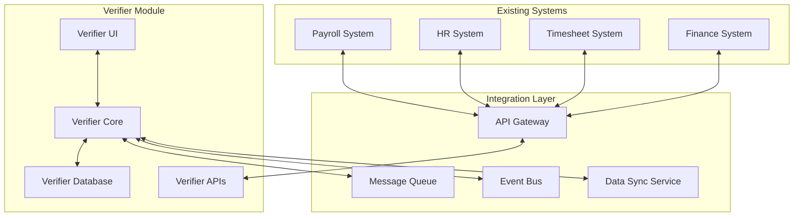
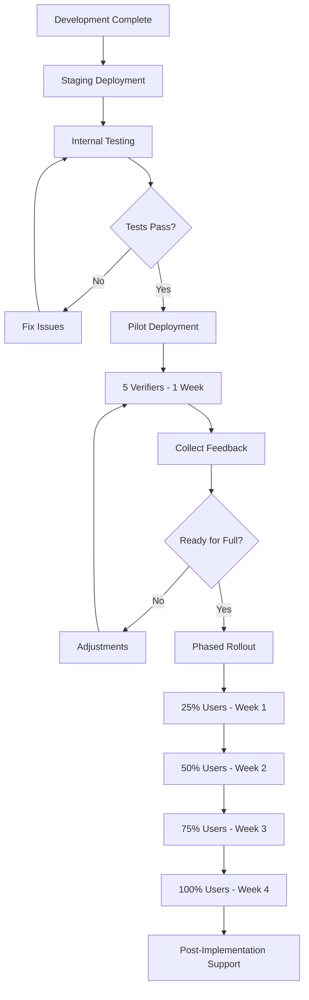
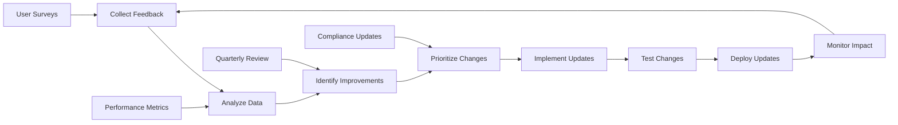

# Verifier Role - Implementation Plan

## Executive Summary

This document provides a detailed implementation plan for deploying the Verifier
role within the payroll system. The plan covers technical architecture,
development phases, training requirements, deployment strategy, and success
metrics. The implementation is designed to be completed in 12 weeks with minimal
disruption to existing payroll operations.

## Table of Contents

1. [Implementation Overview](#implementation-overview)
2. [Technical Architecture](#technical-architecture)
3. [Development Phases](#development-phases)
4. [System Integration Plan](#system-integration-plan)
5. [Data Migration Strategy](#data-migration-strategy)
6. [Training Program](#training-program)
7. [Deployment Strategy](#deployment-strategy)
8. [Risk Management](#risk-management)
9. [Success Metrics and KPIs](#success-metrics-and-kpis)
10. [Post-Implementation Support](#post-implementation-support)

## 1. Implementation Overview

### 1.1 Project Scope

```typescript
interface VerifierImplementationScope {
	objectives: {
		primary: 'Deploy Verifier role for payroll quality assurance'
		secondary: [
			'Reduce payroll errors by 80%',
			'Improve compliance rate to 99%',
			'Decrease processing time by 30%',
			'Establish clear audit trail',
		]
	}

	deliverables: {
		system: [
			'Verifier dashboard and UI',
			'Verification workflow engine',
			'Calculation validation tools',
			'Issue management system',
			'Change request verification module',
		]

		documentation: [
			'User manual',
			'Process documentation',
			'API documentation',
			'Training materials',
			'SOP guidelines',
		]

		training: [
			'Verifier role training',
			'Integration training for other roles',
			'System administration training',
		]
	}

	timeline: '12 weeks'
	budget: 'PHP 2,500,000'
	resources: {
		development: '4 developers'
		design: '1 UI/UX designer'
		testing: '2 QA engineers'
		training: '1 training specialist'
		projectManagement: '1 project manager'
	}
}
```

### 1.2 Implementation Timeline



## 2. Technical Architecture

### 2.1 System Architecture

```typescript
interface VerifierSystemArchitecture {
	frontend: {
		framework: 'React 18'
		stateManagement: 'Redux Toolkit'
		uiLibrary: 'Material-UI v5'
		styling: 'Tailwind CSS'
		formHandling: 'React Hook Form'
		validation: 'Yup'
	}

	backend: {
		runtime: 'Node.js 20 LTS'
		framework: 'Express.js'
		database: 'PostgreSQL 15'
		orm: 'Prisma'
		cache: 'Redis'
		queue: 'Bull Queue'
	}

	infrastructure: {
		hosting: 'AWS/Azure'
		containerization: 'Docker'
		orchestration: 'Kubernetes'
		cicd: 'GitHub Actions'
		monitoring: 'DataDog/New Relic'
	}

	security: {
		authentication: 'JWT + Refresh Tokens'
		authorization: 'RBAC'
		encryption: 'AES-256'
		audit: 'Comprehensive logging'
		compliance: 'GDPR, Data Privacy Act'
	}
}
```

### 2.2 Database Schema Updates

```sql
-- Verifier-specific tables
CREATE TABLE verification_sessions (
    id UUID PRIMARY KEY DEFAULT gen_random_uuid(),
    verifier_id UUID NOT NULL REFERENCES users(id),
    paysheet_id UUID NOT NULL REFERENCES paysheets(id),
    start_time TIMESTAMP NOT NULL DEFAULT NOW(),
    end_time TIMESTAMP,
    status VARCHAR(50) NOT NULL,
    total_issues_found INT DEFAULT 0,
    notes TEXT,
    created_at TIMESTAMP DEFAULT NOW(),
    updated_at TIMESTAMP DEFAULT NOW()
);

CREATE TABLE verification_issues (
    id UUID PRIMARY KEY DEFAULT gen_random_uuid(),
    session_id UUID NOT NULL REFERENCES verification_sessions(id),
    issue_type VARCHAR(100) NOT NULL,
    component VARCHAR(100) NOT NULL,
    severity VARCHAR(20) NOT NULL,
    description TEXT NOT NULL,
    expected_value DECIMAL(15,2),
    actual_value DECIMAL(15,2),
    resolution_status VARCHAR(50) DEFAULT 'OPEN',
    resolved_by UUID REFERENCES users(id),
    resolved_at TIMESTAMP,
    created_at TIMESTAMP DEFAULT NOW()
);

CREATE TABLE verification_checkpoints (
    id UUID PRIMARY KEY DEFAULT gen_random_uuid(),
    session_id UUID NOT NULL REFERENCES verification_sessions(id),
    checkpoint_name VARCHAR(100) NOT NULL,
    status VARCHAR(20) NOT NULL,
    checked_at TIMESTAMP NOT NULL,
    checked_by UUID NOT NULL REFERENCES users(id),
    comments TEXT
);

-- Indexes for performance
CREATE INDEX idx_verification_sessions_verifier ON verification_sessions(verifier_id);
CREATE INDEX idx_verification_sessions_status ON verification_sessions(status);
CREATE INDEX idx_verification_issues_severity ON verification_issues(severity);
CREATE INDEX idx_verification_issues_resolution ON verification_issues(resolution_status);
```

### 2.3 API Endpoints

```typescript
interface VerifierAPIEndpoints {
	authentication: {
		POST: '/api/auth/verifier/login'
		POST: '/api/auth/verifier/logout'
		POST: '/api/auth/verifier/refresh'
	}

	verification: {
		GET: '/api/verification/queue' // Get pending paysheets
		GET: '/api/verification/paysheet/:id' // Get specific paysheet
		POST: '/api/verification/start/:id' // Start verification session
		PUT: '/api/verification/checkpoint' // Update checkpoint
		POST: '/api/verification/issue' // Flag an issue
		POST: '/api/verification/complete/:id' // Complete verification
		POST: '/api/verification/return/:id' // Return to Payroll Officer
	}

	calculations: {
		POST: '/api/calc/sss' // SSS calculation
		POST: '/api/calc/philhealth' // PhilHealth calculation
		POST: '/api/calc/pagibig' // Pag-IBIG calculation
		POST: '/api/calc/tax' // Tax calculation
		GET: '/api/calc/tables/:type' // Get reference tables
	}

	changeRequests: {
		GET: '/api/change-requests/pending' // Get pending requests
		GET: '/api/change-requests/:id' // Get specific request
		POST: '/api/change-requests/verify/:id' // Verify request
		POST: '/api/change-requests/reject/:id' // Reject request
	}

	reports: {
		GET: '/api/reports/verification/daily' // Daily report
		GET: '/api/reports/verification/summary' // Summary report
		GET: '/api/reports/verification/issues' // Issues report
		POST: '/api/reports/verification/export' // Export report
	}
}
```

## 3. Development Phases

### 3.1 Phase 1: Core Engine Development (Weeks 1-3)

```typescript
interface Phase1Development {
	week1: {
		tasks: [
			'Set up development environment',
			'Initialize database schema',
			'Create Verifier role and permissions',
			'Implement authentication system',
		]
		deliverables: [
			'Development environment ready',
			'Base authentication working',
			'Database migrations complete',
		]
	}

	week2: {
		tasks: [
			'Build verification workflow engine',
			'Implement calculation validators',
			'Create issue flagging system',
			'Develop checkpoint tracking',
		]
		deliverables: [
			'Verification engine functional',
			'Basic validation working',
			'Issue management system ready',
		]
	}

	week3: {
		tasks: [
			'Integrate with payroll system',
			'Implement queue management',
			'Create notification system',
			'Build audit logging',
		]
		deliverables: [
			'Integration points established',
			'Queue system operational',
			'Audit trail functioning',
		]
	}
}
```

### 3.2 Phase 2: UI Development (Weeks 4-6)

```typescript
interface Phase2UIDevevelopment {
	week4: {
		tasks: [
			'Design component library',
			'Build dashboard layout',
			'Create verification workspace',
			'Implement responsive design',
		]
		deliverables: [
			'Component library complete',
			'Dashboard functional',
			'Mobile responsive',
		]
	}

	week5: {
		tasks: [
			'Build calculator widgets',
			'Create issue management UI',
			'Implement reference tables',
			'Add keyboard shortcuts',
		]
		deliverables: [
			'All tools integrated',
			'Issue UI complete',
			'Shortcuts working',
		]
	}

	week6: {
		tasks: [
			'Polish UI/UX',
			'Add animations/transitions',
			'Implement dark mode',
			'Optimize performance',
		]
		deliverables: [
			'Polished UI',
			'Performance optimized',
			'Accessibility compliant',
		]
	}
}
```

### 3.3 Phase 3: Testing & Refinement (Weeks 7-9)

```typescript
interface Phase3Testing {
	week7_unitTesting: {
		coverage: '>90%'
		focus: [
			'Calculation accuracy',
			'Validation rules',
			'API endpoints',
			'Error handling',
		]
		tools: ['Jest', 'React Testing Library', 'Supertest']
	}

	week8_integrationTesting: {
		scenarios: [
			'End-to-end verification flow',
			'Integration with payroll system',
			'Change request processing',
			'Report generation',
		]
		tools: ['Cypress', 'Postman', 'JMeter']
	}

	week9_UAT: {
		participants: [
			'3 experienced verifiers',
			'2 payroll officers',
			'1 controller',
			'1 payroll manager',
		]
		testCases: 150
		acceptanceCriteria: '95% pass rate'
	}
}
```

## 4. System Integration Plan

### 4.1 Integration Points



### 4.2 Integration Implementation

```typescript
interface IntegrationImplementation {
	payrollSystemIntegration: {
		method: 'REST API + Webhooks'
		dataFlow: {
			inbound: ['Paysheet data', 'Calculation details', 'Employee information']
			outbound: ['Verification status', 'Issue flags', 'Corrected values']
		}
		syncFrequency: 'Real-time'
		errorHandling: 'Retry with exponential backoff'
	}

	changeRequestIntegration: {
		method: 'Event-driven'
		events: [
			'CHANGE_REQUEST_CREATED',
			'VERIFICATION_REQUIRED',
			'VERIFICATION_COMPLETED',
			'REQUEST_REJECTED',
		]
		queue: 'RabbitMQ/AWS SQS'
		reliability: 'At-least-once delivery'
	}

	reportingIntegration: {
		method: 'Scheduled batch'
		schedule: 'Daily at 6 AM, 12 PM, 6 PM'
		format: 'JSON, CSV, PDF'
		storage: 'S3/Azure Blob'
		retention: '7 years'
	}
}
```

## 5. Data Migration Strategy

### 5.1 Migration Plan

```typescript
interface DataMigrationPlan {
	scope: {
		historicalData: '6 months of payroll data'
		referenceData: 'All government tables and policies'
		userAccounts: 'Create Verifier role accounts'
		configurations: 'System settings and thresholds'
	}

	phases: {
		phase1_preparation: {
			duration: '2 days'
			tasks: [
				'Data backup',
				'Schema mapping',
				'Validation scripts',
				'Rollback plan',
			]
		}

		phase2_migration: {
			duration: '1 day'
			tasks: [
				'Reference data migration',
				'User account creation',
				'Configuration setup',
				'Historical data import',
			]
		}

		phase3_validation: {
			duration: '1 day'
			tasks: [
				'Data integrity checks',
				'Calculation verification',
				'Access testing',
				'Performance testing',
			]
		}
	}

	rollbackStrategy: {
		trigger: 'Critical error or data corruption'
		procedure: 'Restore from backup within 2 hours'
		testing: 'Rollback tested in staging'
	}
}
```

## 6. Training Program

### 6.1 Training Curriculum

```typescript
interface VerifierTrainingProgram {
	module1_systemOverview: {
		duration: '4 hours'
		topics: [
			'Role of Verifier in payroll process',
			'System architecture overview',
			'Key responsibilities',
			'Performance expectations',
		]
		format: 'Classroom + presentation'
	}

	module2_technicalTraining: {
		duration: '8 hours'
		topics: [
			'Dashboard navigation',
			'Verification workflow',
			'Using calculators and tools',
			'Issue flagging process',
			'Change request verification',
		]
		format: 'Hands-on lab exercises'
	}

	module3_calculations: {
		duration: '6 hours'
		topics: [
			'Government contribution calculations',
			'Deduction verification',
			'Allowance validation',
			'Tax computation',
		]
		format: 'Workshop with real scenarios'
	}

	module4_compliance: {
		duration: '4 hours'
		topics: [
			'Labor law requirements',
			'Company policies',
			'Audit requirements',
			'Documentation standards',
		]
		format: 'Case studies + discussion'
	}

	module5_practicalExercise: {
		duration: '8 hours'
		topics: [
			'Process 50 sample paysheets',
			'Handle various issue types',
			'Complete verification reports',
			'Performance evaluation',
		]
		format: 'Supervised practice'
	}

	certification: {
		requirement: '85% score on assessment'
		validity: '1 year'
		refresher: 'Annual 4-hour session'
	}
}
```

### 6.2 Training Materials

```typescript
interface TrainingMaterials {
	documentation: [
		'Verifier User Manual (PDF, 150 pages)',
		'Quick Reference Guide (PDF, 10 pages)',
		'Calculation Handbook (PDF, 50 pages)',
		'Troubleshooting Guide (PDF, 30 pages)',
	]

	videos: [
		'System Overview (30 minutes)',
		'Dashboard Tutorial (45 minutes)',
		'Common Scenarios (60 minutes)',
		'Best Practices (30 minutes)',
	]

	interactiveLearning: {
		sandbox: 'Training environment with sample data'
		scenarios: '100 practice cases'
		quizzes: '10 modules with 20 questions each'
		certification: 'Online assessment platform'
	}

	supportResources: {
		helpDesk: '24/7 during first month'
		mentorship: 'Experienced verifier buddy system'
		forumAccess: 'Internal knowledge base'
		updates: 'Monthly tips and updates newsletter'
	}
}
```

## 7. Deployment Strategy

### 7.1 Deployment Phases



### 7.2 Deployment Checklist

```typescript
interface DeploymentChecklist {
	preDeployment: {
		infrastructure: [
			'□ Servers provisioned',
			'□ Database configured',
			'□ Load balancer setup',
			'□ SSL certificates installed',
			'□ Backup systems verified',
		]

		security: [
			'□ Security scan completed',
			'□ Penetration testing done',
			'□ Access controls configured',
			'□ Audit logging enabled',
			'□ Data encryption verified',
		]

		performance: [
			'□ Load testing completed',
			'□ Response time < 2 seconds',
			'□ Concurrent users tested (500+)',
			'□ Database optimized',
			'□ Caching configured',
		]
	}

	deployment: {
		steps: [
			'□ Backup current system',
			'□ Deploy database changes',
			'□ Deploy application',
			'□ Configure integrations',
			'□ Smoke test all features',
			'□ Verify data flow',
			'□ Enable monitoring',
		]

		rollback: [
			'□ Rollback plan documented',
			'□ Rollback tested',
			'□ Team briefed on procedure',
			'□ Backup restoration verified',
		]
	}

	postDeployment: {
		validation: [
			'□ All endpoints responding',
			'□ Integration points working',
			'□ Reports generating',
			'□ Notifications sending',
			'□ Performance acceptable',
		]

		monitoring: [
			'□ Alerts configured',
			'□ Dashboards setup',
			'□ Log aggregation working',
			'□ Error tracking enabled',
			'□ Performance metrics collecting',
		]
	}
}
```

## 8. Risk Management

### 8.1 Risk Assessment Matrix

| Risk                      | Probability | Impact   | Mitigation Strategy                       | Contingency Plan              |
| ------------------------- | ----------- | -------- | ----------------------------------------- | ----------------------------- |
| **Integration Failure**   | Medium      | High     | Thorough testing, gradual rollout         | Manual verification fallback  |
| **User Resistance**       | Medium      | Medium   | Comprehensive training, change management | Extended support, incentives  |
| **Data Migration Issues** | Low         | High     | Multiple test runs, validation scripts    | Rollback procedure ready      |
| **Performance Problems**  | Medium      | High     | Load testing, optimization                | Scale infrastructure, caching |
| **Security Breach**       | Low         | Critical | Security audit, encryption                | Incident response plan        |
| **Calculation Errors**    | Low         | High     | Extensive testing, validation             | Manual override capability    |

### 8.2 Risk Mitigation Plan

```typescript
interface RiskMitigationStrategies {
	technicalRisks: {
		prevention: [
			'Code reviews for all changes',
			'Automated testing coverage >90%',
			'Performance benchmarking',
			'Security scanning',
		]
		monitoring: [
			'Real-time system monitoring',
			'Alert thresholds configured',
			'Daily health checks',
			'Weekly performance reviews',
		]
	}

	operationalRisks: {
		training: [
			'Comprehensive training program',
			'Certification requirement',
			'Ongoing support desk',
			'Knowledge base maintained',
		]
		processChange: [
			'Gradual transition plan',
			'Parallel run period',
			'Clear communication',
			'Feedback mechanisms',
		]
	}

	businessContinuity: {
		backup: [
			'Daily automated backups',
			'Off-site backup storage',
			'Recovery time < 4 hours',
			'Regular restoration tests',
		]
		fallback: [
			'Manual verification process documented',
			'Paper-based backup forms',
			'Emergency contact list',
			'Escalation procedures',
		]
	}
}
```

## 9. Success Metrics and KPIs

### 9.1 Implementation Success Metrics

```typescript
interface ImplementationMetrics {
	technicalMetrics: {
		systemUptime: '>99.9%'
		responseTime: '<2 seconds'
		errorRate: '<0.1%'
		integrationSuccess: '100%'
		dataAccuracy: '>99.99%'
	}

	businessMetrics: {
		errorReduction: '80% reduction in payroll errors'
		processingTime: '30% faster verification'
		complianceRate: '99% regulatory compliance'
		costSavings: '₱500,000/month in error corrections'
	}

	userMetrics: {
		adoptionRate: '100% within 4 weeks'
		userSatisfaction: '>4.5/5 rating'
		trainingCompletion: '100% certified'
		supportTickets: '<5 per day after month 1'
	}

	qualityMetrics: {
		verificationAccuracy: '>99%'
		issueDetectionRate: '>95%'
		falsePositiveRate: '<5%'
		firstPassRate: '>90%'
	}
}
```

### 9.2 Monitoring Dashboard

```typescript
interface MonitoringDashboard {
  realTimeMetrics: {
    activeVerifiers: number
    paysheetsInQueue: number
    averageProcessingTime: number
    issuesFoundToday: number
    systemHealth: 'GREEN' | 'YELLOW' | 'RED'
  }

  dailyReports: {
    verificationCompleted: number
    issuesIdentified: number
    moneyS saved: number
    complianceScore: number
    userPerformance: Array<{user: string, metrics: object}>
  }

  alerts: {
    criticalErrors: 'Immediate notification'
    performanceDegradation: '15-minute threshold'
    highErrorRate: 'When >5%'
    queueBacklog: 'When >100 pending'
  }

  trends: {
    weeklyComparison: 'Line charts'
    monthlyAnalysis: 'Detailed reports'
    quarterlyReview: 'Executive summary'
    annualAssessment: 'ROI analysis'
  }
}
```

## 10. Post-Implementation Support

### 10.1 Support Structure

```typescript
interface PostImplementationSupport {
	month1_hypercare: {
		support: '24/7 dedicated team'
		monitoring: 'Real-time system monitoring'
		response: '<30 minutes for critical issues'
		adjustments: 'Daily fine-tuning based on feedback'
		reporting: 'Daily status reports to management'
	}

	month2_3_stabilization: {
		support: 'Business hours + on-call'
		monitoring: 'Automated with alerts'
		response: '<2 hours for critical issues'
		optimization: 'Weekly performance reviews'
		training: 'Refresher sessions as needed'
	}

	ongoing_support: {
		helpDesk: 'Tier 1 & 2 support'
		documentation: 'Continuously updated'
		userGroup: 'Monthly meetings'
		feedback: 'Quarterly surveys'
		improvements: 'Bi-annual feature updates'
	}

	knowledgeTransfer: {
		documentation: [
			'Complete technical documentation',
			'Runbook for common issues',
			'Architecture diagrams',
			'API documentation',
		]
		training: [
			'Admin training for IT team',
			'Train-the-trainer program',
			'Video library creation',
		]
	}
}
```

### 10.2 Continuous Improvement Plan



## Implementation Success Factors

### Critical Success Factors

1. **Executive Sponsorship**: Full support from Payroll Manager and leadership
2. **User Buy-in**: Early involvement of Verifiers in design and testing
3. **Robust Training**: Comprehensive training before go-live
4. **Gradual Rollout**: Phased approach to minimize risk
5. **Strong Integration**: Seamless connection with existing systems
6. **Continuous Support**: Dedicated support during initial months
7. **Performance Monitoring**: Real-time tracking of system health
8. **Feedback Loop**: Regular collection and action on user feedback

### Expected Outcomes

- **Immediate** (Month 1):
  - System operational
  - Users trained and working
  - Basic error reduction visible

- **Short-term** (Months 2-3):
  - 50% error reduction achieved
  - Processing time improved
  - User confidence established

- **Medium-term** (Months 4-6):
  - 80% error reduction achieved
  - Full compliance achieved
  - ROI becoming visible

- **Long-term** (Year 1):
  - System fully optimized
  - Consistent high performance
  - Positive ROI demonstrated
  - Ready for expansion

## Conclusion

The Verifier role implementation represents a critical enhancement to the
payroll system's accuracy and compliance capabilities. This comprehensive plan
ensures a structured, low-risk deployment with clear success metrics and robust
support mechanisms. The 12-week timeline provides adequate time for development,
testing, training, and gradual rollout while maintaining business continuity.

Key to success will be strong project management, stakeholder engagement, and a
commitment to the training and support programs outlined in this plan. With
proper execution, the Verifier role will significantly improve payroll accuracy,
reduce compliance risks, and generate substantial cost savings through error
prevention.

---

_Document Version: 1.0_ _Implementation Plan: Verifier Role_ _Project Code:
VER-IMPL-2024_ _Last Updated: [Current Date]_ _Next Review: [Quarterly]_
