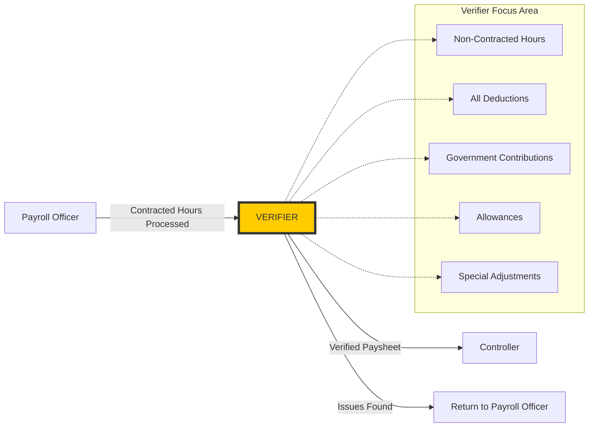
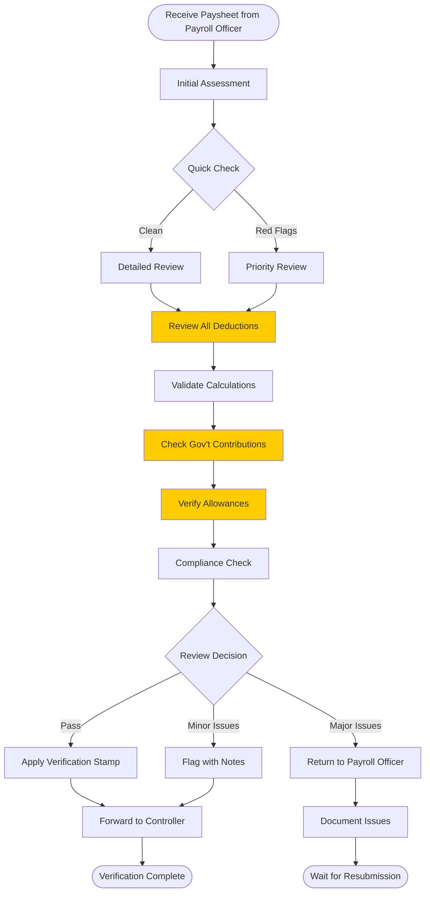
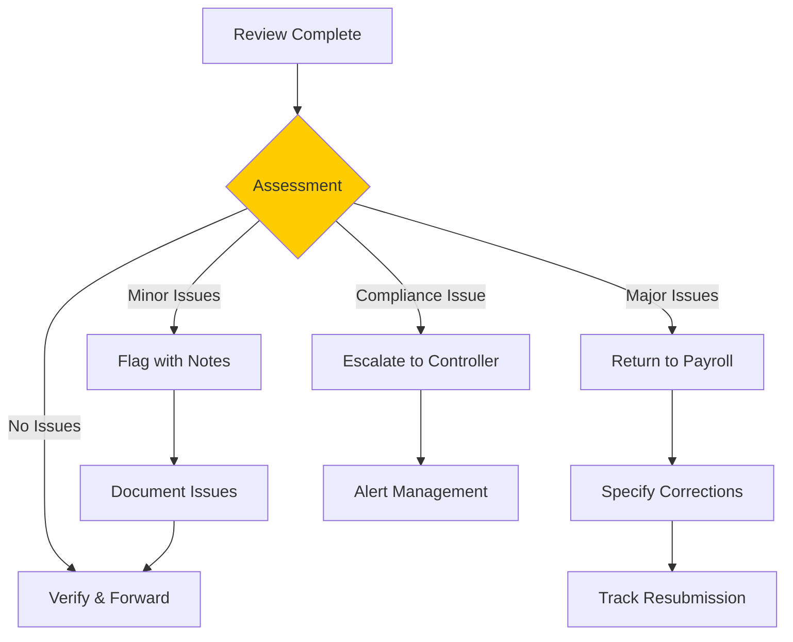
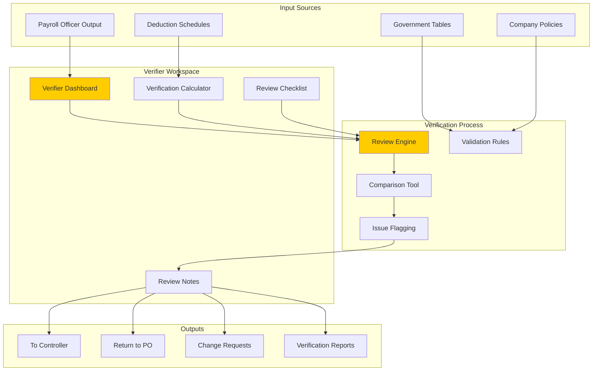
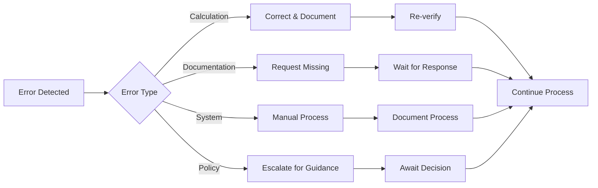

# Verifier Role - Comprehensive Workflow Documentation

## Executive Summary

The Verifier serves as the **critical quality assurance layer** in the payroll
process, positioned between the Payroll Officer and Controller. This role
focuses specifically on reviewing and validating **non-contracted hours,
deductions, allowances, and government contributions**, ensuring accuracy before
financial review. The Verifier acts as the detailed reviewer who catches errors
and discrepancies that could impact payment accuracy.

## Table of Contents

1. [Role Definition](#role-definition)
2. [Workflow Position](#workflow-position)
3. [Core Responsibilities](#core-responsibilities)
4. [Detailed Workflow Process](#detailed-workflow-process)
5. [Review Criteria and Standards](#review-criteria-and-standards)
6. [Decision Matrix](#decision-matrix)
7. [Integration Points](#integration-points)
8. [Exception Handling](#exception-handling)

## 1. Role Definition

### 1.1 Verifier Overview

```typescript
interface VerifierRole {
	position: 'Between Payroll Officer and Controller'
	focus: 'Non-contracted components and deductions'
	authority: 'Review and verification stamp'

	primaryFunction: 'Quality assurance for payroll accuracy'

	keyAttributes: {
		detailOriented: 'Catches calculation errors'
		systematic: 'Follows standardized review process'
		analytical: 'Identifies patterns and anomalies'
		compliant: 'Ensures regulatory adherence'
	}

	scope: {
		reviews: [
			'Deductions',
			'Allowances',
			'Government contributions',
			'Special adjustments',
		]
		validates: ['Calculations', 'Schedules', 'Compliance', 'Documentation']
		flags: ['Discrepancies', 'Policy violations', 'Unusual patterns']
	}
}
```

### 1.2 Verifier Competencies

| Competency                | Description                              | Criticality |
| ------------------------- | ---------------------------------------- | ----------- |
| **Mathematical Accuracy** | Verify all calculations                  | Critical    |
| **Regulatory Knowledge**  | Understand government contribution rules | Critical    |
| **Policy Compliance**     | Know company deduction policies          | High        |
| **Pattern Recognition**   | Identify anomalies and trends            | High        |
| **Documentation Skills**  | Maintain clear review notes              | Medium      |
| **System Proficiency**    | Navigate payroll systems efficiently     | High        |

## 2. Workflow Position

### 2.1 Verifier in the Payroll Chain



### 2.2 Timing in the Process

```typescript
interface VerifierTiming {
	receives: {
		from: 'Payroll Officer'
		when: 'After contracted hours calculation'
		format: 'Processed paysheet with base pay computed'
		sla: 'Within 2 hours of Payroll Officer completion'
	}

	processes: {
		duration: '4 hours standard, 2 hours priority'
		batchSize: 'Up to 50 paysheets per batch'
		peakPeriod: 'Days 1-3 after pay period end'
	}

	delivers: {
		to: 'Controller'
		when: 'After verification complete'
		format: 'Verified paysheet with review notes'
		sla: 'Within 4 hours of receipt'
	}
}
```

## 3. Core Responsibilities

### 3.1 Primary Review Areas

```typescript
interface VerifierResponsibilities {
	deductionReview: {
		loans: {
			validate: 'Scheduled payment amounts'
			check: 'Remaining balances'
			flag: 'Overdue or waived payments'
			verify: 'Authorization for changes'
		}

		mandatoryDeductions: {
			tax: 'Correct tax bracket application'
			courtOrders: 'Garnishment calculations'
			unionDues: 'Membership verification'
			insurance: 'Premium accuracy'
		}

		voluntaryDeductions: {
			savings: 'Contribution amounts'
			investments: 'Allocation percentages'
			advances: 'Recovery schedules'
			others: 'Authorized deductions'
		}
	}

	governmentContributions: {
		sss: {
			employeeShare: 'Verify against salary bracket'
			employerShare: 'Confirm matching contribution'
			ceiling: 'Check maximum limits'
		}

		philHealth: {
			percentage: 'Validate contribution rate'
			splitting: 'Verify 50-50 split'
			updates: 'Apply latest rates'
		}

		pagIbig: {
			standard: 'Check standard contribution'
			voluntary: 'Additional contributions'
			maximum: 'Verify ceiling amounts'
		}
	}

	allowanceValidation: {
		regular: {
			transportation: 'Daily rate × days worked'
			meal: 'Meal allowance calculation'
			communication: 'Fixed or variable rates'
		}

		special: {
			hazard: 'Applicable positions only'
			overtime: 'Meal allowance for OT'
			nightDifferential: 'Additional allowances'
		}

		conditional: {
			performance: 'Based on metrics'
			attendance: 'Perfect attendance bonus'
			project: 'Project-specific allowances'
		}
	}
}
```

### 3.2 Change Request Verification

```typescript
interface ChangeRequestVerification {
	asVerifier: {
		receives: [
			'Deduction change requests from Payroll Officer',
			'Allowance adjustments',
			'Government contribution corrections',
		]

		validates: {
			documentation: 'Supporting documents complete'
			calculations: 'Mathematical accuracy'
			authorization: 'Proper approvals obtained'
			impact: 'Effect on net pay'
		}

		actions: {
			verify: 'Forward to Payroll Manager'
			clarify: 'Request additional information'
			reject: 'Return with specific issues'
		}
	}

	changeTypes: {
		deductionChanges: {
			add: 'New deduction setup'
			modify: 'Amount or schedule change'
			waive: 'Temporary suspension'
			remove: 'Permanent removal'
		}

		allowanceAdjustments: {
			increase: 'Rate adjustments'
			decrease: 'Reductions'
			backpay: 'Retroactive payments'
			recovery: 'Overpayment recovery'
		}
	}
}
```

## 4. Detailed Workflow Process

### 4.1 Verification Workflow



### 4.2 Step-by-Step Process

```typescript
interface VerificationSteps {
	step1_InitialAssessment: {
		duration: '5 minutes'
		checks: [
			'Paysheet completeness',
			'Employee status active',
			'Pay period correct',
			'Base pay calculated',
		]
		outcome: 'Proceed or flag for priority'
	}

	step2_DeductionReview: {
		duration: '15 minutes per paysheet'
		tasks: [
			'Open deduction schedule',
			'Compare scheduled vs applied',
			'Check authorization for changes',
			'Verify waiver documentation',
			'Calculate total deductions',
			'Ensure floor value compliance',
		]
		tools: ['Deduction calculator', 'Schedule tracker', 'Authorization log']
	}

	step3_GovernmentContributions: {
		duration: '10 minutes per paysheet'
		tasks: [
			'Verify SSS bracket and calculation',
			'Check PhilHealth percentage',
			'Validate Pag-IBIG contribution',
			'Confirm employer matching',
			'Check for ceiling breaches',
			'Apply latest government rates',
		]
		references: ['SSS table', 'PhilHealth circulars', 'Pag-IBIG guidelines']
	}

	step4_AllowanceValidation: {
		duration: '10 minutes per paysheet'
		tasks: [
			'Check regular allowances',
			'Verify special allowances eligibility',
			'Calculate pro-rated amounts',
			'Validate supporting documents',
			'Check taxability status',
		]
		validation: ['Attendance records', 'Position matrix', 'Allowance policy']
	}

	step5_ComplianceCheck: {
		duration: '5 minutes per paysheet'
		verifies: [
			'Minimum wage compliance',
			'Maximum deduction limits',
			'Government contribution compliance',
			'Tax calculation accuracy',
			'Company policy adherence',
		]
		flags: 'Any violations for escalation'
	}

	step6_Documentation: {
		duration: '5 minutes per paysheet'
		documents: [
			'Review findings',
			'Calculations verified',
			'Discrepancies found',
			'Recommendations',
			'Verification stamp',
		]
		output: 'Verified paysheet with notes'
	}
}
```

### 4.3 Batch Processing Workflow

```typescript
interface BatchProcessing {
	grouping: {
		criteria: 'By department, location, or employee type'
		optimal: '20-30 paysheets per batch'
		priority: 'High-value or flagged employees first'
	}

	efficiencyTechniques: {
		templates: 'Use review checklists'
		automation: 'Auto-calculate common items'
		comparison: 'Side-by-side previous period'
		highlighting: 'Auto-flag anomalies'
	}

	qualityControl: {
		sampling: 'Detailed review of 10% sample'
		crossCheck: 'Peer review for high-value'
		spotCheck: 'Random verification by Controller'
	}
}
```

## 5. Review Criteria and Standards

### 5.1 Verification Standards

| Component                | Standard        | Tolerance     | Action if Exceeded    |
| ------------------------ | --------------- | ------------- | --------------------- |
| **Calculation Accuracy** | 100%            | 0%            | Return for correction |
| **Deduction Schedule**   | Match schedule  | ±₱1.00        | Flag for review       |
| **Gov't Contributions**  | Exact per table | 0%            | Correct immediately   |
| **Allowances**           | Per policy      | 0%            | Verify documentation  |
| **Documentation**        | Complete        | Minor gaps OK | Request missing docs  |
| **Compliance**           | Full compliance | 0%            | Escalate violations   |

### 5.2 Review Checklist

```typescript
interface VerifierChecklist {
  mandatory: {
    calculations: {
      □ 'Total deductions sum correctly'
      □ 'Government contributions per bracket'
      □ 'Allowances match authorization'
      □ 'Net pay calculation accurate'
      □ 'YTD accumulations updated'
    }

    compliance: {
      □ 'Minimum wage maintained'
      □ 'Maximum deduction limit observed'
      □ 'Tax calculation correct'
      □ 'Government rates current'
      □ 'Company policy followed'
    }

    documentation: {
      □ 'Loan schedules attached'
      □ 'Waiver forms present'
      □ 'Special allowance approval'
      □ 'Change authorizations'
      □ 'Supporting documents'
    }
  }

  conditional: {
    ifLoans: {
      □ 'Payment schedule current'
      □ 'Balance sufficient'
      □ 'Interest calculated'
      □ 'Waiver justified'
    }

    ifAdjustments: {
      □ 'Retroactive calculation'
      □ 'Authorization present'
      □ 'Impact documented'
      □ 'Recovery scheduled'
    }

    ifNewEmployee: {
      □ 'Pro-rated correctly'
      □ 'Benefits enrolled'
      □ 'Deductions set up'
      □ 'Government numbers valid'
    }
  }
}
```

## 6. Decision Matrix

### 6.1 Verification Decisions



### 6.2 Issue Classification

| Issue Type     | Examples                 | Severity | Action                | SLA      |
| -------------- | ------------------------ | -------- | --------------------- | -------- |
| **Minor**      | Rounding difference <₱10 | Low      | Flag & proceed        | Continue |
| **Moderate**   | Missing supporting doc   | Medium   | Request & proceed     | 24 hrs   |
| **Major**      | Wrong calculation        | High     | Return for correction | 4 hrs    |
| **Critical**   | Compliance violation     | Critical | Escalate immediately  | 1 hr     |
| **Systematic** | Pattern across multiple  | High     | Alert Controller      | 2 hrs    |

### 6.3 Return Criteria

```typescript
interface ReturnCriteria {
	mustReturn: {
		calculations: 'Mathematical errors > ₱10'
		missing: 'Required deductions not applied'
		unauthorized: 'Changes without approval'
		compliance: 'Violation of labor laws'
		documentation: 'Critical documents missing'
	}

	canProceed: {
		minor: 'Small rounding differences'
		pending: 'Documentation in process'
		noted: 'Known issues flagged'
		approved: 'Exceptions authorized'
	}

	escalate: {
		pattern: 'Same error multiple times'
		systematic: 'System calculation issue'
		policy: 'Policy clarification needed'
		legal: 'Legal compliance question'
	}
}
```

## 7. Integration Points

### 7.1 System Integration



### 7.2 Data Flow

```typescript
interface VerifierDataFlow {
	inputs: {
		fromPayrollOfficer: {
			paysheet: 'Processed with base pay'
			calculations: 'Contracted hours computed'
			flags: 'Issues identified by PO'
			notes: 'Special considerations'
		}

		fromSystem: {
			schedules: 'Current deduction schedules'
			rates: 'Government contribution tables'
			policies: 'Company policies and limits'
			history: 'Previous period for comparison'
		}

		fromChangeRequests: {
			pending: 'Changes awaiting verification'
			approved: 'Recently approved changes'
			documentation: 'Supporting documents'
		}
	}

	processing: {
		validation: 'Apply verification rules'
		calculation: 'Recompute for verification'
		comparison: 'Check against standards'
		documentation: 'Record all findings'
	}

	outputs: {
		toController: {
			verifiedPaysheet: 'With verification stamp'
			reviewNotes: 'Detailed findings'
			flags: 'Issues requiring attention'
			recommendations: 'Suggested actions'
		}

		toPayrollOfficer: {
			corrections: 'Required changes'
			clarifications: 'Information needed'
			rejections: 'Items to reprocess'
		}

		toPayrollManager: {
			changeRequests: 'Verified for approval'
			escalations: 'Critical issues'
			patterns: 'Systematic problems'
		}
	}
}
```

## 8. Exception Handling

### 8.1 Common Exceptions

```typescript
interface VerifierExceptions {
	calculationErrors: {
		detection: 'Automated calculation check'
		response: 'Return to Payroll Officer'
		documentation: 'Specify exact error'
		prevention: 'Training and templates'
	}

	missingDocumentation: {
		detection: 'Document checklist'
		response: 'Request from source'
		timeline: '24 hour follow-up'
		escalation: 'If not received'
	}

	policyViolations: {
		detection: 'Policy rule engine'
		response: 'Flag and escalate'
		notification: 'Alert Controller'
		resolution: 'Policy clarification'
	}

	systemDiscrepancies: {
		detection: 'System vs manual check'
		response: 'Investigation required'
		escalation: 'IT and Controller'
		workaround: 'Manual verification'
	}

	timeConstraints: {
		detection: 'SLA monitoring'
		response: 'Prioritize critical'
		escalation: 'Request assistance'
		communication: 'Update stakeholders'
	}
}
```

### 8.2 Escalation Matrix

| Issue             | First Level       | Second Level    | Final Level     | Timeline  |
| ----------------- | ----------------- | --------------- | --------------- | --------- |
| Calculation Error | Payroll Officer   | Verifier Lead   | Controller      | 4 hours   |
| Missing Documents | Source Department | HR Officer      | Payroll Manager | 24 hours  |
| Policy Violation  | Controller        | Payroll Manager | Executive       | 2 hours   |
| System Issue      | IT Support        | System Admin    | Vendor          | 1 hour    |
| Time Constraint   | Verifier Lead     | Controller      | Payroll Manager | Immediate |

### 8.3 Error Recovery



## 9. Quality Metrics

### 9.1 Performance Indicators

```typescript
interface VerifierKPIs {
	accuracy: {
		errorDetectionRate: 'Errors caught / Total errors'
		falsePositiveRate: 'Incorrect flags / Total flags'
		calculationAccuracy: 'Correct verifications / Total'
	}

	efficiency: {
		averageReviewTime: 'Minutes per paysheet'
		batchProcessingRate: 'Paysheets per hour'
		reworkRate: 'Returns from Controller / Total'
		slaCompliance: 'Met SLA / Total reviews'
	}

	quality: {
		documentationCompleteness: 'Complete notes / Total'
		issueResolutionTime: 'Average time to resolve'
		escalationRate: 'Escalations / Total reviews'
		firstPassRate: 'Approved first time / Total'
	}

	compliance: {
		regulatoryAccuracy: 'Compliant / Total'
		policyAdherence: 'Following policy / Total'
		auditFindings: 'Issues in audit / Total'
	}
}
```

### 9.2 Daily Metrics Dashboard

```typescript
interface DailyMetrics {
	workload: {
		received: number
		processed: number
		pending: number
		returned: number
		escalated: number
	}

	performance: {
		averageTime: number // minutes
		accuracy: number // percentage
		slaStatus: 'GREEN' | 'YELLOW' | 'RED'
		bottlenecks: string[]
	}

	issues: {
		calculationErrors: number
		missingDocuments: number
		policyViolations: number
		systemIssues: number
	}

	trends: {
		dailyComparison: number // vs yesterday
		weeklyTrend: 'UP' | 'DOWN' | 'STABLE'
		commonIssues: string[]
		improvements: string[]
	}
}
```

## Conclusion

The Verifier role is essential for maintaining payroll accuracy and compliance.
By focusing on non-contracted components, deductions, and government
contributions, the Verifier ensures that all payments are correct before
financial review. This systematic approach to verification reduces errors,
ensures compliance, and maintains the integrity of the payroll process.

Key success factors for the Verifier include:

- Attention to detail in reviewing calculations
- Strong knowledge of regulations and policies
- Systematic approach to verification
- Clear documentation of findings
- Effective communication with other roles
- Timely escalation of issues

The Verifier serves as the quality gate that protects both the organization and
employees from payroll errors.

---

_Document Version: 1.0_ _Role: Verifier (Payroll Context)_ _Last Updated:
[Current Date]_ _Process Owner: Payroll Department_
